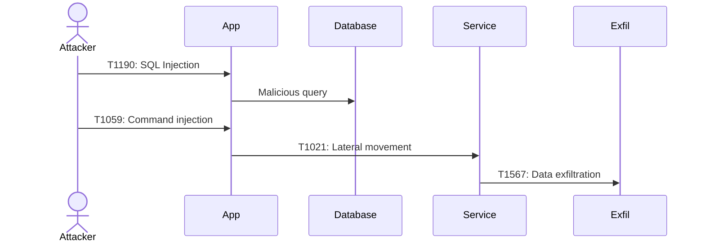
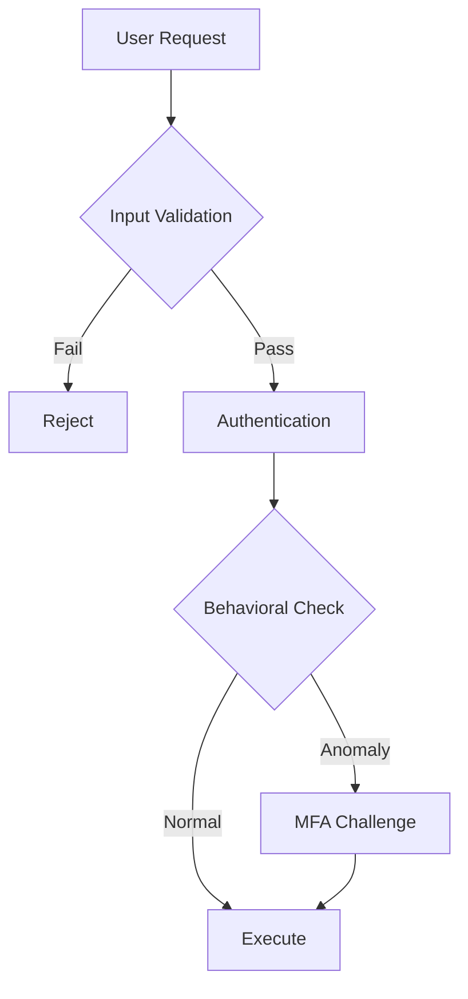
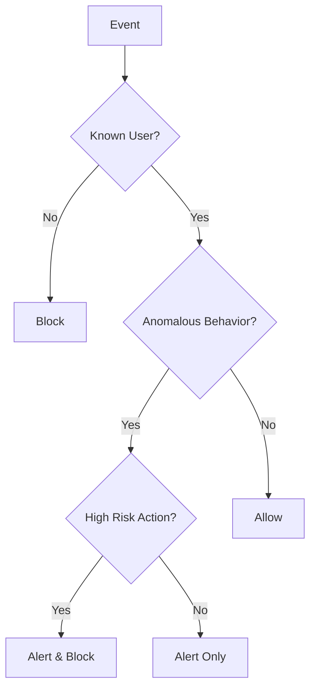

# Skill: ATT&CK Framework Research & Content Architecture

**Owner:** Kobayashi  
**Created:** 2026-02-22  
**Domain:** Security research, threat modeling, technical content creation

---

## Purpose

This skill provides a structured methodology for conducting deep-dive research into the MITRE ATT&CK framework and creating developer-focused educational content. Use this skill when expanding security training materials, auditing technique coverage, or building realistic attack chain scenarios.

---

## When to Use This Skill

✅ **Use when:**
- Auditing existing ATT&CK content for coverage gaps
- Planning expansion of security research materials
- Mapping real-world attack chains to ATT&CK techniques
- Creating code examples for adversary techniques
- Building threat modeling training content
- Prioritizing security research work

❌ **Don't use when:**
- Implementing specific security controls (that's implementation work)
- Conducting actual penetration testing (use pen-testing methodology)
- Writing production security code (use secure coding practices)

---

## Methodology

### Phase 1: Coverage Audit (Week 1)

**Goal:** Understand current state comprehensively before planning changes.

**Steps:**
1. **Tactic Enumeration**: List all 14 ATT&CK tactics against existing content
   - Count slides per tactic
   - Identify which tactics have code samples
   - Note diagram coverage
   
2. **Technique-Level Analysis**: For each covered tactic, list techniques
   - Create matrix: Technique × (Slides | Python | .NET | JavaScript | Diagrams)
   - Mark: ✅ Full | 🟡 Partial | ❌ Missing
   
3. **Code Sample Inventory**: Count samples per language, map to techniques
   - Identify language imbalance (some tactics only 1 language)
   - Note which samples include both vulnerable + defended code
   
4. **Content Quality Check**:
   - Do examples include ATT&CK IDs in comments?
   - Are detection patterns included, not just prevention?
   - Is there vulnerable code → defended code → detection flow?

**Deliverables:**
- Coverage matrix (technique × language × artifact type)
- Gap analysis document (Full | Partial | Missing tactics)
- Quality scorecard

---

### Phase 2: Gap Prioritization (Week 1)

**Goal:** Create actionable work backlog with clear priorities.

**Prioritization Framework:**

**P0 (Critical)** — Must complete for framework completeness:
- Missing entire tactics (e.g., Reconnaissance, C2, Resource Development)
- Incomplete high-impact tactics (e.g., Impact section ends abruptly)
- Techniques with slides but zero code examples

**P1 (Important)** — Significantly improves quality:
- Attack chain scenarios (techniques in isolation → realistic multi-stage attacks)
- Advanced technique variants (e.g., GraphQL-specific, serverless-specific)
- Language balance (ensure 2+ languages per P0/P1 technique)

**P2 (Nice-to-Have)** — Ecosystem expansion:
- New languages (Go, Rust)
- Platform-specific content (mobile, IoT)
- Advanced topics (ML-based detection, deception tech)

**Work Item Template:**
```
ID: P0-1
Task: Complete Impact Section
Techniques: T1486, T1485, T1499
Deliverables:
- 3-4 slides with vulnerable/defended code
- Code samples: python/ransomware_defense.py, dotnet/RansomwareDefense.cs
- Mermaid diagram: Backup/recovery workflow
Estimated effort: 1 week
```

---

### Phase 3: Attack Chain Mapping (Week 2)

**Goal:** Move from isolated techniques to realistic adversary behavior.

**Attack Chain Selection Criteria:**
1. **Prevalence**: Common in real-world incidents (MITRE CTI, threat reports)
2. **Developer Relevance**: Techniques developers can actually influence
3. **Technique Diversity**: Use different tactics in each chain
4. **Code Reuse**: Leverage existing samples where possible
5. **Narrative Clarity**: Tell a coherent story

**Attack Chain Template:**
```markdown
### Attack Chain: [Name]
**Narrative**: [One-sentence story of attacker progression]

| Stage | Tactic | Technique | Code Example | Detection Point |
|-------|--------|-----------|--------------|-----------------|
| 1. [Action] | [Tactic] | T#### | [File path] | [Detection logic] |
| 2. [Action] | [Tactic] | T#### | [File path] | [Detection logic] |
...

**Mermaid Diagram**: sequenceDiagram showing attacker → app → services → exfil
```

**Recommended Attack Chains:**
1. **Web App Takeover**: T1190 → T1059 → T1505.003 → T1021 → T1213
2. **Credential Compromise**: T1566 → T1078 → T1098 → T1087 → T1550
3. **Supply Chain Attack**: T1195.001 → T1203 → T1070 → T1027 → T1567
4. **Session Hijacking to Exfil**: T1185 → T1068 → T1213 → T1020
5. **Ransomware Kill Chain**: T1190 → T1059 → T1552 → T1486 → T1499

---

### Phase 4: Content Architecture Design (Week 2)

**Goal:** Define structure before writing content.

**Slide Deck Structure:**
```
1. Introduction (unchanged)
2. Tactic Coverage (expanded)
   ├── [Existing 11 tactics]
   ├── [New P0 tactics: Recon, C2, Resource Dev]
   └── [Complete partial tactics: Impact, Collection]
3. Attack Chain Scenarios (NEW)
   ├── Chain 1: [Name]
   ├── Chain 2: [Name]
   ...
4. Practical Implementation (expanded)
   ├── [Existing content]
   ├── ATT&CK Technique Coverage Matrix
   ├── Detection Engineering Patterns
   └── Testing & Validation
5. Conclusion (unchanged)
```

**Code Sample Organization:**
```
samples/
├── python/
│   ├── [existing]
│   └── [new P0 samples]
├── dotnet/
│   ├── [existing]
│   └── [new P0 samples]
├── javascript/
│   ├── [existing]
│   └── [new P0 samples]
└── [future: go/, rust/]
```

**Diagram Strategy:**
- **Flowcharts**: Decision trees, defense-in-depth layers
- **Sequence Diagrams**: Attack chains, multi-service interactions
- **Architecture Diagrams**: System-level defenses (egress monitoring, logging pipelines)

---

### Phase 5: Execution Planning (Week 3)

**Goal:** Define timeline, milestones, and success criteria.

**Phased Approach:**
- **Phase 1 (Weeks 1-3)**: P0 gap closure
- **Phase 2 (Weeks 4-7)**: P1 attack chains + advanced techniques
- **Phase 3 (Weeks 8-12)**: P2 ecosystem expansion (optional)

**Milestone Markers:**
- P0 complete: 14/14 tactics with full coverage
- P1 complete: 5 attack chains + 50+ techniques covered
- P2 complete: 4+ languages, mobile/CI-CD content

**Success Metrics:**
- **Coverage**: Tactic coverage (14/14), technique count (50+)
- **Quality**: Every technique has vulnerable + defended + detection code
- **Balance**: All P0/P1 techniques in 2+ languages
- **Diagrams**: 15+ Mermaid diagrams across tactics

---

## Artifacts to Produce

### 1. Coverage Matrix (`coverage-matrix.md`)
- Tactic × Technique table with status (✅ 🟡 ❌)
- Language coverage per technique
- Diagram inventory
- Code sample inventory

### 2. Research Plan (`research-plan.md`)
- Gap analysis (A-B sections)
- Prioritized backlog (C section)
- Content architecture (D section)
- Attack chain mapping (E section)
- Timeline and milestones (F section)

### 3. Decision Document (`decisions/inbox/[slug].md`)
- Short summary of architecture decisions
- Rationale for prioritization choices
- Risk assessment
- Next steps

### 4. History Update (`agents/[agent]/history.md`)
- Key findings from audit
- Important file paths
- Architecture decisions made

---

## Code Sample Standards

Every code sample MUST include:

1. **ATT&CK ID in comments**: `# T1059: Command & Scripting Interpreter`
2. **Vulnerable version**: Show how the technique works
3. **Defended version**: Show proper defense
4. **Detection logic**: Show how to detect the attack
5. **Language-appropriate patterns**: Pythonic/C#-idiomatic/JS-conventional

**Template:**
```python
# T1059: Command & Scripting Interpreter Prevention
# VULNERABLE - Direct shell execution enables T1059
def vulnerable_backup(filename):
    os.system(f"tar -czf backup.tar.gz {filename}")  # Attacker injects: "file; rm -rf /"

# DEFENDED - Allowlisting and parameterization prevent T1059
def defended_backup(filename):
    if not re.match(r'^[a-zA-Z0-9_.-]+$', filename):
        raise ValueError("Invalid filename")
    subprocess.run(['tar', '-czf', 'backup.tar.gz', filename], check=True)

# DETECTION - Monitor shell executions with unusual patterns
def detect_command_injection():
    log_suspicious_chars = [';', '|', '&&', '>', '<', '`', '$']
    if any(char in user_input for char in log_suspicious_chars):
        alert("T1059", "Potential command injection detected")
```

---

## Mermaid Diagram Patterns

### Attack Chain (Sequence Diagram)


### Defense Architecture (Flowchart)


### Detection Decision Tree (Flowchart)


---

## Common Pitfalls to Avoid

❌ **Scope Creep**: Attack chains can expand infinitely
   - **Fix**: Cap at 5 scenarios, limit to 5 stages each

❌ **Language Imbalance**: All examples in one language
   - **Fix**: Ensure 2+ languages for P0/P1 techniques

❌ **Theory-Heavy**: Slides without runnable code
   - **Fix**: Every technique needs vulnerable + defended code

❌ **Isolated Techniques**: No connection to real attacks
   - **Fix**: Build attack chain narratives

❌ **Actual Exploits**: Working exploit code in repo
   - **Fix**: Use simulation code, mark clearly as educational

❌ **Version Lock-In**: Code tied to specific library versions
   - **Fix**: Focus on patterns, not API-specific code

---

## Example: Applying This Skill

**Scenario:** "We have slides on Credential Access but no Supply Chain Compromise section."

**Apply Skill:**

1. **Audit** (Phase 1):
   - Check: Is T1195/T1195.001 mentioned? → Found brief mention, no code
   - Gap: Missing vulnerable/defended examples, no package verification code

2. **Prioritize** (Phase 2):
   - Priority: **P0** (missing entire sub-tactic under Initial Access)
   - Work item: "Build Supply Chain Compromise section"
   - Techniques: T1195, T1195.001, T1195.002

3. **Attack Chain** (Phase 3):
   - Map to real attack: event-stream NPM attack (2018)
   - Chain: T1195.001 → T1203 → T1070 → T1027 → T1567

4. **Architect** (Phase 4):
   - Slides: 4-5 slides (examples, verification code, supply chain flow diagram)
   - Code: `javascript/supply-chain-verification.js` (package integrity check)
   - Diagram: Supply chain with verification checkpoints

5. **Execute** (Phase 5):
   - Week 1: Research real attacks, outline slides
   - Week 2: Write code samples (NPM, PyPI, NuGet examples)
   - Week 3: Create Mermaid diagram, integrate into deck

---

## References

- **MITRE ATT&CK Enterprise Matrix**: https://attack.mitre.org/matrices/enterprise/
- **ATT&CK Navigator**: https://mitre-attack.github.io/attack-navigator/
- **MITRE CTI**: https://github.com/mitre-attack/attack-stix-data
- **D3FEND**: https://d3fend.mitre.org/ (defensive countermeasures)
- **Marp Documentation**: https://marp.app/

---

**Skill Maturity:** Established (proven in 2026-02-22 research audit)  
**Reusability:** High (applicable to any ATT&CK-based content expansion)
