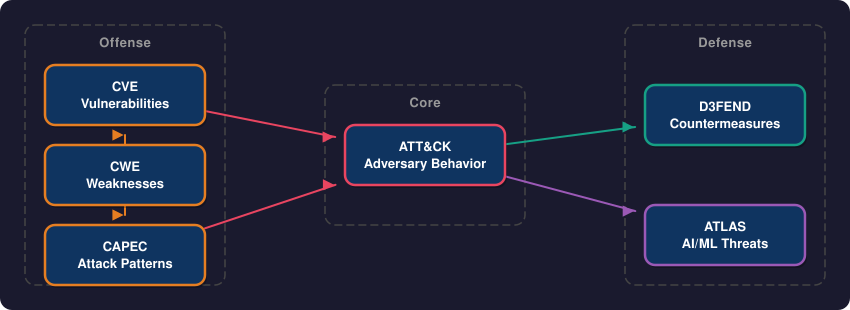
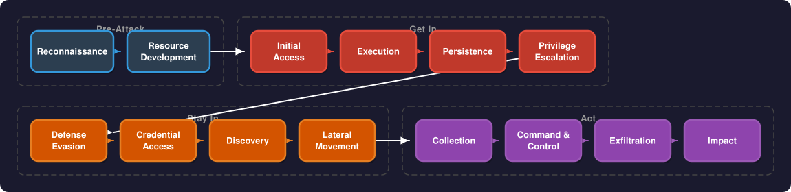
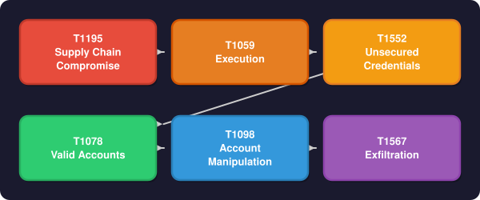
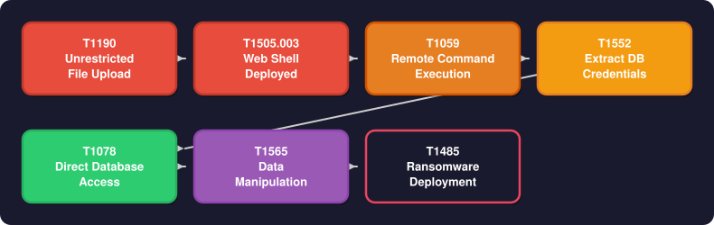
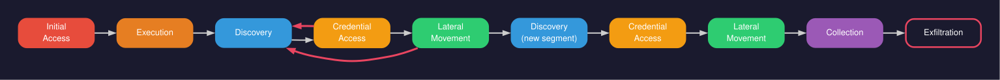
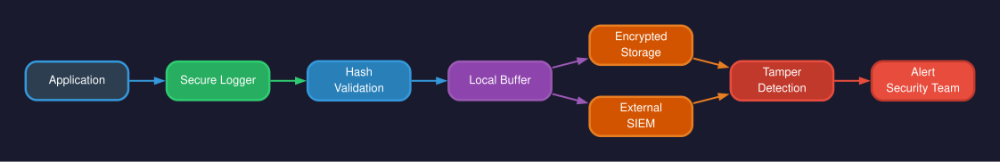
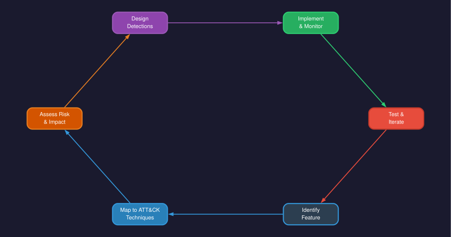
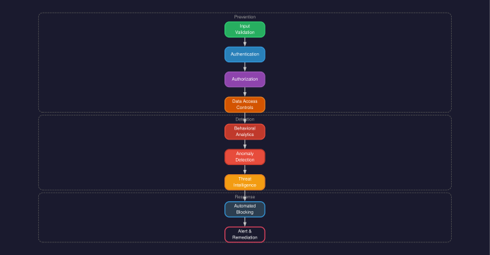
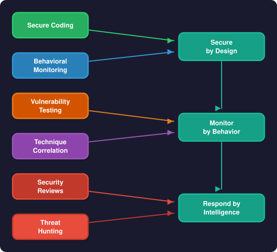

<!-- _footer: 'https://github.com/codebytes/mitre-attack-for-devs' -->

# MITRE ATT&CK for Developers

## Beyond OWASP

<!-- 
Welcome everyone! Today we're going beyond the traditional OWASP Top 10 approach to security. We'll explore how attackers actually operate using the MITRE ATT&CK framework. This isn't about replacing what you know—it's about adding a critical detection layer to your security toolkit. By the end, you'll think like an attacker and build defenses that actually catch real threats.
-->

---


## Chris Ayers

### Senior Software Engineer<br>Azure CXP AzRel<br>Microsoft

<i class="fa-brands fa-bluesky"></i> BlueSky: [@chris-ayers.com](https://bsky.app/profile/chris-ayers.com)
<i class="fa-brands fa-linkedin"></i> LinkedIn: - [chris\-l\-ayers](https://linkedin.com/in/chris-l-ayers/)
<i class="fa fa-window-maximize"></i> Blog: [https://chris-ayers\.com/](https://chris-ayers.com/)
<i class="fa-brands fa-github"></i> GitHub: [Codebytes](https://github.com/codebytes)
<i class="fa-brands fa-mastodon"></i> Mastodon: [@Chrisayers@hachyderm.io](https://hachyderm.io/@Chrisayers)
~~<i class="fa-brands fa-twitter"></i> Twitter: @Chris_L_Ayers~~

<!-- 
Let me introduce myself briefly. I'm Chris Ayers, Senior Software Engineer at Microsoft working on Azure reliability. I've spent years in the trenches building secure cloud-native applications, and I blog regularly about DevOps, security, and cloud architecture. You can connect with me on any of these platforms—I'm most active on BlueSky and LinkedIn these days. Let's dive in!
-->

---

## Agenda

- The Security Challenge for Developers
- Understanding OWASP vs MITRE ATT&CK
- ATT&CK Framework Deep Dive
- 13 Technique Categories Across the Kill Chain
- Practical Implementation Strategies
- Building ATT&CK-Aware Applications

<!-- 
Here's our roadmap for today. We'll start with the security challenge we all face, then compare OWASP and ATT&CK frameworks—they're complementary, not competitive. We'll do a deep dive into 13 tactic categories with real code examples in Python, C#, and JavaScript. This is going to be code-heavy and practical. We'll wrap up with implementation strategies you can use Monday morning. Expect about 60-75 minutes total, with demos interspersed throughout.
-->

---

## The Security Challenge

- **Growing attack surface**: APIs, microservices, cloud infrastructure
- **Sophisticated adversaries**: Nation-states, organized crime, insider threats
- **Complex attack chains**: Multiple techniques chained together
- **Traditional defenses**: Often focus on single points of failure
- **Reality**: Attackers adapt faster than our defenses

<!-- 
Let's level-set on the problem. Modern applications have massive attack surfaces—every microservice, every API endpoint, every cloud resource is a potential entry point. We're up against nation-states with unlimited budgets, organized crime syndicates, and yes, even insider threats. Attackers don't use single exploits anymore; they chain multiple techniques together. Traditional defenses like firewalls and AV catch the obvious stuff, but sophisticated attacks slip right through. The uncomfortable truth? Attackers are iterating faster than we are. That's what we're here to change.
-->

---

## What is OWASP?

- **Open Web Application Security Project** - community-driven security standards
- **OWASP Top 10 2025**: Broken Access Control, Cryptographic Failures, Injection, etc.
- **Strengths**: Vulnerability classification, remediation guidance, prevention focus
- **Approach**: "Here's what can break in your application"

<!-- 
OWASP is the industry standard most of you already know. It's a community-driven effort that catalogs common vulnerabilities—the 2025 Top 10 includes classics like SQL injection, broken access control, and cryptographic failures. OWASP's strength is prevention: it tells you what vulnerabilities exist and how to fix them. Think of it as defensive architecture—"build it so it doesn't break." And that's incredibly valuable! But it's only half the picture.
-->

---

## OWASP Top 10 — 2025

<div class="columns">
<div>

1. **A01** — Broken Access Control
2. **A02** — Cryptographic Failures
3. **A03** — Injection
4. **A04** — Insecure Design
5. **A05** — Security Misconfiguration

</div>
<div>

6. **A06** — Vulnerable & Outdated Components
7. **A07** — Identification & Authentication Failures
8. **A08** — Software & Data Integrity Failures
9. **A09** — Security Logging & Monitoring Failures
10. **A10** — Server-Side Request Forgery (SSRF)

</div>
</div>

<!-- 
This is the OWASP Top 10 for 2025 — the current list. It updates roughly every 3-4 years based on real-world vulnerability data. If you've been building web apps for a while, most of these should look familiar — broken access control has been near the top for years, injection is a perennial classic. Scan through these — you've probably patched or prevented most of them at some point. Now here's the shift we're going to make today: OWASP tells you *what can go wrong*. Next, we'll look at how MITRE tells you *how attackers actually exploit these* — the techniques, the chains, the full adversary playbook.
-->

---

## What is MITRE?

- **The MITRE Corporation**: Not-for-profit organization founded in **1958**
- **Mission**: Operates federally funded R&D centers (FFRDCs) for U.S. government
- **Scope**: National security, aviation, healthcare, cybersecurity, and emerging tech
- **Independence**: No commercial products — research-driven, vendor-neutral
- **Impact**: Manages critical standards used across the entire security industry

<!-- 
Before we dive into ATT&CK specifically, let's talk about MITRE the organization. MITRE was founded in 1958—originally spun out of MIT's Lincoln Laboratory. They're a not-for-profit that operates federally funded research and development centers, or FFRDCs. That means they work directly with government agencies but remain independent—no commercial products, no vendor bias. They work across national security, aviation, healthcare, and of course cybersecurity. Why does this matter? Because when MITRE publishes a framework, it's backed by decades of research and real-world threat intelligence, not a sales pitch.
-->

---

## MITRE's Cybersecurity Ecosystem



<!-- 
Here's the big picture—MITRE doesn't just maintain ATT&CK. They operate an entire ecosystem of cybersecurity frameworks that interlock. CVE catalogs specific vulnerabilities—the "this version of this library has this flaw" data you see in security advisories. CWE classifies the underlying weakness types—"what kind of coding mistake leads to vulnerabilities." CAPEC documents attack patterns at a higher abstraction level. ATT&CK is where we'll spend most of our time today—it maps adversary behavior. D3FEND is the defensive counterpart, cataloging countermeasures. And ATLAS extends the model into AI and machine learning threats. Notice the relationships: weaknesses lead to vulnerabilities, attack patterns map to ATT&CK techniques, and defenses counter those techniques. This ecosystem gives us a shared language across the entire security industry.
-->

---

## Why MITRE Matters for Developers

- **Shared vocabulary**: Security teams, SOCs, and developers speaking the same language
- **Threat-informed development**: Design defenses against real adversary behavior
- **CVE/CWE in your pipeline**: Dependency scanning tools already use MITRE standards
- **ATT&CK in detection**: Your logging and telemetry feed ATT&CK-based detection rules
- **Career impact**: Understanding MITRE frameworks bridges the dev ↔ security gap

<!-- 
So why should you, as a developer, care about all this? First, shared vocabulary. When your SOC team says "we detected T1190," you'll know they mean exploitation of a public-facing application—and you can immediately reason about which of your services might be affected. Second, the tools you already use—Dependabot, Snyk, Trivy—they all report CVEs and CWEs under the hood. You're already consuming MITRE data, you just might not realize it. Third, the logs and telemetry you emit from your applications feed directly into detection systems built on ATT&CK mappings. The better your observability, the faster threats get caught. And honestly? Understanding this ecosystem makes you dramatically more effective in cross-functional security conversations. It's a career differentiator.
-->

---

## What is MITRE ATT&CK?

- **Origin**: MITRE Corporation, 2013, FMX (Fort Meade Experiment)
- **Purpose**: Knowledge base of adversary tactics, techniques, and procedures (TTPs)
- **Enterprise Matrix**: 14 tactics, 200+ techniques, 400+ sub-techniques
- **Real-world basis**: Derived from actual cyber attacks and threat intelligence
- **Approach**: "Here's how attackers actually operate"

<!-- 
Enter MITRE ATT&CK—pronounced "attack," by the way. Born from a 2013 experiment at Fort Meade where MITRE emulated real-world adversaries in controlled environments. It's a living knowledge base of adversary behavior based on real attacks and threat intelligence feeds. The Enterprise Matrix has 14 tactics covering the full attack lifecycle, with over 200 techniques and 400 sub-techniques. This isn't theoretical—every technique is backed by actual threat actor procedures. ATT&CK tells you what attackers DO, not just what breaks. That's the key distinction.
-->

---

## ATT&CK Structure

- **Tactics**: The "why" of an attack (e.g., Initial Access, Persistence)
- **Techniques**: The "how" of an attack (e.g., Spear Phishing, Valid Accounts)
- **Sub-techniques**: Specific implementations (e.g., Spear Phishing via Email)
- **Procedures**: Real-world examples of technique usage by threat actors

<!-- 
Let's break down ATT&CK's hierarchy. Tactics are the goals—"why" an attacker does something, like "I need initial access" or "I need persistence." Techniques are the methods—"how" they achieve that goal, like using stolen credentials or exploiting a vulnerability. Sub-techniques get even more granular, specifying implementation details. Finally, Procedures are documented real-world examples: "APT29 used this exact technique in the SolarWinds breach." This structure helps us map defenses to attacker behavior systematically.
-->

---

## The 14 ATT&CK Tactics



<!-- 
This diagram shows the 14 ATT&CK tactics in the typical attack lifecycle. Pre-Attack: reconnaissance and resource development—scoping you out, setting up infrastructure. Get In: initial access, execution, persistence, privilege escalation—establishing a foothold. Stay In: evading defenses, stealing credentials, discovering the environment, moving laterally across systems. Act: collecting data, maintaining command and control, exfiltrating information, and causing impact. Today we'll focus on the tactics developers can directly influence—roughly 10 of these 14. Spend a moment here; this is the mental model for everything that follows.
-->

---

## CVEs and ATT&CK: The Connection

- **CVE (Common Vulnerabilities and Exposures)**: Specific flaws in specific software
- **ATT&CK Techniques**: How attackers *exploit* those flaws
- **The relationship**: One CVE can enable multiple techniques; one technique can leverage many CVEs
- **Example: Log4Shell (CVE-2021-44228)**
  - T1190 — Exploit Public-Facing Application *(the entry point)*
  - T1059 — Command and Scripting Interpreter *(arbitrary code execution)*
  - T1105 — Ingress Tool Transfer *(downloading payloads)*
- **For developers**: CVEs tell you *what to patch*; ATT&CK tells you *what attackers do next*

<!-- 
This is a critical distinction that trips people up. CVEs and ATT&CK live in different layers. A CVE is a specific flaw—"Log4j 2.x has a JNDI injection vulnerability." ATT&CK describes the *behavior* that flaw enables. Log4Shell is a single CVE, but it enabled at least three ATT&CK techniques: initial access through the vulnerable endpoint, code execution via JNDI callback, and tool transfer to download second-stage payloads. This is why patching alone isn't enough—you need to detect the *techniques* because the next CVE will enable the same attacker behaviors. Your Dependabot alerts give you CVEs; ATT&CK tells you what to monitor for when a zero-day drops before a patch exists.
-->

---

## Attack Chains: Techniques in Sequence

- Real attacks **chain multiple techniques** across tactics
- Each step enables the next — compromise compounds
- **Defenders must detect at every stage**, not just the entry point
- A single missed detection = full compromise



<!-- 
Here's where it gets real. Attackers don't use one technique and go home. This diagram shows a supply chain attack chain—based on actual threat intelligence. Step one: attacker publishes a malicious npm package with a typosquatted name. The post-install script executes a payload. That payload harvests AWS credentials from environment variables. Those stolen credentials give the attacker legitimate access to production. They create a backdoor IAM user for persistence. Then they exfiltrate customer data. Six techniques, six different tactics, one continuous attack. The key insight: if you only defend at the perimeter, you miss five out of six opportunities to detect this. Defense in depth means instrumenting detection at *every* stage.
-->

---

## Real-World Attack Chain: From Upload to Ransomware



<!-- 
Here's another chain that's devastatingly common. An unrestricted file upload vulnerability lets an attacker upload a PHP web shell disguised as an image. That web shell gives remote command execution on the server. The attacker reads config files to extract database credentials. Now they have direct database access, bypassing all application-level authorization. They modify records—maybe inject malicious content, maybe escalate privileges. Final act: ransomware targeting backups and production data. Seven steps. A file upload validation check at step one stops all of it. That's the power of understanding attack chains—you can identify the cheapest, most impactful place to break the chain.
-->

---

## The "Crooked Line" — How Attacks Really Move

<div class="columns">
<div>

### The Straight Line (Kill Chain)

Recon → Weaponize → Deliver → Exploit → Install → C2 → Act

*Linear. Predictable. Tidy.*

</div>
<div>

### The Crooked Line (Reality)

Attackers **loop**, **backtrack**, and **repeat** tactics as opportunities emerge.

*Non-linear. Adaptive. Messy.*

</div>
</div>

<!-- 
This is one of the most important mental model shifts in modern security. Lockheed Martin's Cyber Kill Chain from 2011 was groundbreaking—it gave us a linear model: reconnaissance, weaponization, delivery, exploitation, installation, command and control, actions on objectives. Clean, neat, seven steps in a straight line. The problem? Real attackers don't read the playbook. They loop back. They do discovery, find credentials, do more discovery, move laterally, find more credentials, move again. ATT&CK was designed to capture this reality. The matrix isn't a left-to-right flow—it's a map of possibilities that attackers navigate opportunistically.
-->

---

## The Crooked Line: A Real Attack Path



<!-- 
Here's the crooked line visualized. Look at those red arrows looping back—Discovery to Credential Access and back to Discovery, Lateral Movement looping back to Discovery again. The attacker compromises one machine, discovers the environment, steals credentials, uses those credentials to move laterally, discovers *more* of the environment, steals *more* credentials, moves again. It's a spiral, not a line. This is why ATT&CK uses a matrix instead of a linear chain—any tactic can follow any other tactic. Your detection strategy needs to account for this: don't just alert on initial access. Instrument discovery, credential access, and lateral movement patterns because attackers will cycle through them repeatedly before reaching their objective.
-->

---

## OWASP vs ATT&CK

<div class="columns">
<div>

### OWASP
- **Focus**: Vulnerabilities
- **Perspective**: "What breaks"
- **Approach**: Prevention-first
- **Scope**: Application layer

</div>
<div>

### MITRE ATT&CK
- **Focus**: Adversary behavior
- **Perspective**: "What attackers do"
- **Approach**: Detection-oriented
- **Scope**: Full attack lifecycle

</div>
</div>

<!-- 
Side-by-side comparison. OWASP focuses on vulnerabilities—what breaks in your code. ATT&CK focuses on adversary behavior—what attackers do when they're already inside. OWASP is prevention-first: build it secure. ATT&CK is detection-oriented: assume breach and detect anomalies. OWASP is scoped to the application layer. ATT&CK covers the full lifecycle from reconnaissance to impact. They're complementary, not competitive. You need both.
-->

---

## Why Both?

> "OWASP prevents vulnerabilities. ATT&CK detects adversary behavior."

- **Complementary approaches**: Prevention + Detection
- **Real-world attacks**: Use vulnerability chains, not single exploits
- **Defense in depth**: Multiple security perspectives
- **Complete coverage**: Technical vulnerabilities + adversary techniques

<!-- 
This quote sums it up perfectly. OWASP prevents vulnerabilities—you patch the hole. ATT&CK detects adversary behavior—you catch the intruder even if they find a way in. Real-world attacks chain multiple techniques together; a single OWASP vulnerability might enable five ATT&CK techniques. Defense in depth means layering multiple perspectives. You want complete coverage: fix technical vulnerabilities AND detect adversary techniques. That's how you build resilient systems.
-->

---

## Mapping OWASP to ATT&CK

| OWASP Category | ATT&CK Techniques |
|----------------|------------------|
| Broken Access Control | T1078 (Valid Accounts), T1098 (Account Manipulation), T1068 (Privilege Escalation) |
| Injection | T1190 (Exploit Public-Facing App), T1059 (Command Injection) |
| Security Misconfiguration | T1552 (Unsecured Credentials), T1082 (System Info Discovery) |
| Cryptographic Failures | T1555 (Credentials from Password Stores), T1565 (Data Manipulation) |
| Identification & Authentication Failures | T1087 (Account Discovery), T1110 (Brute Force) |
| Server-Side Request Forgery | T1190 (Exploit Public-Facing Application) |

> **Note**: OWASP categories describe *vulnerabilities* (weaknesses in code), while ATT&CK techniques describe *adversary behaviors* (what attackers do). A single vulnerability may enable multiple techniques, and a single technique may exploit multiple vulnerabilities.

<!-- 
Here's the bridge between the two frameworks. Each OWASP vulnerability category maps to multiple ATT&CK techniques. For example, Broken Access Control enables T1078 (using valid stolen accounts), T1098 (manipulating accounts for persistence), and T1068 (privilege escalation). SQL injection is both an OWASP vulnerability AND enables T1190 (exploiting public-facing apps). This mapping shows how fixing OWASP vulnerabilities disrupts multiple ATT&CK techniques. Keep this mental map as we go through code examples.
-->

---

# <!-- fit --> Let's Think Like Attackers

<!-- 
Time to switch mindsets. For the next hour, you're not a defender—you're the attacker. This is red team thinking. Understanding how adversaries operate makes you a better defender. Every technique we cover includes vulnerable code, defended code, and detection strategies. Let's go hunting.
-->

---

# <!-- fit --> Initial Access & Credential Attacks

<!-- 
First tactic: Initial Access. How do attackers get in? Through your front door—public-facing applications, stolen credentials, brute force attacks, and phishing. This is the most critical phase to defend because stopping them here prevents everything downstream. Let's look at the techniques.
-->

---

## Attacker Techniques

| Technique ID | Name | Description |
|--------------|------|-------------|
| T1190 | Exploit Public-Facing Application | Web app vulnerabilities |
| T1078 | Valid Accounts | Compromised legitimate credentials |
| T1110 | Brute Force | Password spraying, credential stuffing |
| T1566 | Phishing | Social engineering for credentials |

<!-- 
Here are the four main Initial Access techniques we'll address. T1190: exploiting web app vulnerabilities like SQL injection. T1078: using valid stolen credentials—the most common initial access vector. T1110: brute force attacks including password spraying and credential stuffing. T1566: phishing for credentials, though that's more social engineering than code-level defense. We'll focus on the first three with code examples.
-->

---

## Vulnerable Code: SQL Injection (T1190)

```python
# VULNERABLE - Direct string concatenation enables T1190
@app.route('/users')
def get_user():
    user_id = request.args.get('id')
    query = f"SELECT * FROM users WHERE id = {user_id}"
    cursor.execute(query)  # T1190: SQL Injection vulnerability
    return cursor.fetchall()

# Attack: /users?id=1 OR 1=1--
```

<!-- 
Classic SQL injection vulnerability. We're taking user input and directly concatenating it into a SQL query—no validation, no parameterization. The attack payload at the bottom shows how an attacker sends "1 OR 1=1--" to dump the entire users table. This enables T1190: Exploit Public-Facing Application. We've all seen this in training, but it's still the number one web app vulnerability in the wild. Let's see the fix.
-->

---

## Defended Code: Parameterized Queries

```python
# DEFENDED - Parameterized queries prevent T1190
@app.route('/users')
def get_user():
    user_id = request.args.get('id')
    
    # Input validation
    if not user_id.isdigit():
        return "Invalid input", 400
        
    # T1190 Prevention: Parameterized query
    query = "SELECT * FROM users WHERE id = ?"
    cursor.execute(query, (user_id,))
    
    # T1087 Prevention: Consistent responses
    result = cursor.fetchall()
    if not result:
        return "User not found", 404
    return result[0]
```

<!-- 
Much better. Three defenses here: input validation to reject non-numeric IDs, parameterized queries that prevent SQL injection by treating input as data not code, and consistent error responses to prevent account enumeration (T1087). Notice the ATT&CK technique IDs in the comments—this helps security teams correlate code defenses with detection rules. One code change prevents multiple techniques. That's the power of ATT&CK-informed development.
-->

---

## Credential Stuffing Detection (T1110.004)

```javascript
// T1110.004 Detection: Credential stuffing patterns
class CredentialStuffingDetector {
    detectSuspiciousLogin(loginData) {
        const { username, ip, userAgent, timestamp } = loginData;
        
        // Multiple accounts from same IP
        if (this.countAccountsFromIP(ip) > 10) {
            this.logTechnique("T1110.004", { ip, type: "multiple_accounts" });
            return true;
        }
        
        // Rapid login attempts across accounts  
        if (this.getRateFromIP(ip) > 100) {
            this.logTechnique("T1110.004", { ip, type: "high_velocity" });
            return true;
        }
        
        return false;
    }
}
```


---

# <!-- fit --> Execution & Code Injection

<!-- 
Next tactic: Execution. Once attackers are in, they need to run code—malicious scripts, system commands, arbitrary payloads. This includes command injection, unsafe deserialization, and process injection. These techniques let attackers pivot from a foothold to full system access. Let's see the code.
-->

---

## Attacker Techniques

| Technique ID | Name | Description |
|--------------|------|-------------|
| T1059 | Command & Scripting Interpreter | OS command injection |
| T1203 | Exploitation for Client Execution | Client-side code execution |
| T1055 | Process Injection | Injecting into legitimate processes |

<!-- 
Three execution techniques we'll cover. T1059: command injection where attackers inject OS commands into application logic. T1203: client-side code execution through unsafe deserialization or eval-style vulnerabilities. T1055: process injection, which is lower-level but relevant if you're building native code or containers. We'll focus on the first two with code examples.
-->

---

## Vulnerable Code: Command Injection (T1059)

```csharp
// VULNERABLE - Direct command execution enables T1059
[HttpPost]
public IActionResult ProcessFile(string filename)
{
    // T1059: Command injection vulnerability
    var command = $"convert {filename} output.pdf";
    var process = Process.Start("cmd.exe", $"/c {command}");
    process.WaitForExit();
    
    return Ok("File processed");
}

// Attack payload: file.jpg; rm -rf / --
```


---

## Defended Code: Command Allowlisting

```csharp
// DEFENDED - Strict input validation and allowlisting
[HttpPost]
public IActionResult ProcessFile(string filename)
{
    // T1059 Prevention: Input validation
    if (!IsValidFilename(filename))
        return BadRequest("Invalid filename");
        
    // T1059 Prevention: Command allowlisting
    var allowedCommands = new[] { "convert", "resize", "compress" };
    var safeArgs = new[] { filename, "output.pdf" };
    
    var processInfo = new ProcessStartInfo
    {
        FileName = "imagemagick.exe",
        Arguments = string.Join(" ", safeArgs.Select(EscapeArg)),
        UseShellExecute = false
    };
    
    using var process = Process.Start(processInfo);
    process?.WaitForExit();
    
    return Ok("File processed safely");
}
```

<!-- 
Much safer. We validate filenames against expected patterns, allowlist commands so only known-safe operations are permitted, escape all arguments to prevent injection, and critically—UseShellExecute is false, meaning we're calling the binary directly without invoking a shell. No shell means no command chaining. This is defense in depth: validation, allowlisting, escaping, and architectural constraints all working together.
-->

---

## Unsafe Deserialization (T1203)

```python
# VULNERABLE - Unsafe deserialization enables T1203
import pickle

@app.route('/api/data', methods=['POST'])
def process_data():
    data = request.data
    # T1203: Unsafe deserialization vulnerability
    obj = pickle.loads(data)  # Code execution risk
    return process_object(obj)

# DEFENDED - Safe deserialization
import json

@app.route('/api/data', methods=['POST'])  
def process_data():
    try:
        # T1203 Prevention: Safe JSON parsing
        data = json.loads(request.data)
        # Validate against schema
        if not validate_schema(data):
            return "Invalid data format", 400
        return process_object(data)
    except json.JSONDecodeError:
        return "Invalid JSON", 400
```

<!-- 
Unsafe deserialization—one of the most dangerous vulnerabilities. The top example uses Python's pickle library to deserialize untrusted data. Pickle can execute arbitrary code during deserialization. An attacker sends a malicious payload and boom—remote code execution. This is T1203. The defended version uses JSON, which is data-only, and validates against a schema. Never use pickle, Marshal, or native serialization on untrusted input. Use safe formats like JSON and validate rigorously.
-->

---

# <!-- fit --> Persistence & Session Hijacking

<!-- 
Tactic three: Persistence. Attackers want to maintain access even after reboots, password changes, or detection attempts. In web apps, this often means session hijacking, account manipulation, and web shells. Let's look at how they do it and how we stop them.
-->

---

## Attacker Techniques

| Technique ID | Name | Description |
|--------------|------|-------------|
| T1098 | Account Manipulation | Modifying user accounts for persistence |
| T1539 | Steal Web Session Cookie | Stealing and reusing session tokens |
| T1505.003 | Web Shell | Server-side persistence mechanisms |

<!-- 
Three persistence techniques. T1098: account manipulation where attackers create backdoor accounts or modify existing ones. T1539: stealing session cookies or tokens. T1505.003: web shells uploaded to the server for persistent remote access. We'll focus heavily on session security since it's directly in your control as a developer.
-->

---

## Vulnerable Session Management

```javascript
// VULNERABLE - Weak session security enables T1539
const express = require('express');
const session = require('express-session');

app.use(session({
    secret: 'hardcoded-secret',  // T1552: Hardcoded secret
    resave: false,
    saveUninitialized: false,
    cookie: {
        secure: false,        // T1539: No HTTPS requirement
        httpOnly: false,      // T1539: XSS vulnerable
        maxAge: 24 * 60 * 60 * 1000  // T1539: Long expiration
    }
}));

// No session validation or rotation
app.get('/api/data', (req, res) => {
    if (req.session.user) {
        return res.json(getData(req.session.user));
    }
    res.status(401).send('Unauthorized');
});
```

<!-- 
Terrible session management that enables multiple attacks. Hardcoded secret means anyone who reads the code can forge sessions. Secure: false allows session cookies over HTTP where they can be intercepted. HttpOnly: false means JavaScript can steal the cookie via XSS. 24-hour expiration gives attackers a huge window. And there's no session validation or rotation. This code is a session hijacking playground. Let's fix every single one of these issues. Spend 2-3 minutes here walking through each vulnerability.
-->

---

## Defended Session Management

```javascript
// DEFENDED - Secure session handling prevents T1539
const crypto = require('crypto');

app.use(session({
    secret: process.env.SESSION_SECRET,  // T1552 Prevention: Environment variable
    resave: false,
    saveUninitialized: false,
    rolling: true,  // T1539 Prevention: Session rotation
    cookie: {
        secure: true,     // T1539 Prevention: HTTPS only
        httpOnly: true,   // T1539 Prevention: XSS protection
        maxAge: 15 * 60 * 1000,  // T1539 Prevention: Short expiration
        sameSite: 'strict'       // CSRF protection
    }
}));

// T1539 Prevention: Session fingerprinting
function validateSession(req, res, next) {
    if (!req.session.user) return res.status(401).send('Unauthorized');
    
    const fingerprint = generateFingerprint(req);
    if (req.session.fingerprint !== fingerprint) {
        req.session.destroy();  // T1539 Detection: Session cookie replay
        return res.status(401).send('Session security violation');
    }
    next();
}
```

<!-- 
Now we're talking. Secret from environment variables, not code. Secure: true requires HTTPS. HttpOnly: true prevents XSS cookie theft. Short 15-minute expiration limits hijacking window. Rolling sessions regenerate IDs on activity. SameSite: strict blocks CSRF. And critically—session fingerprinting. We hash the user agent and IP at login, then validate it on every request. If the fingerprint changes, we destroy the session and alert. This is detection meeting prevention. Beautiful defense in depth.
-->

---

## Web Shell Detection (T1505.003)

```csharp
// T1505.003 Detection: Web shell upload monitoring
public class FileUploadValidator
{
    private readonly string[] _suspiciousPatterns = {
        "eval(", "exec(", "system(", "passthru(",
        "<?php", "<%", "<script", "cmd.exe"
    };

    public bool ValidateUpload(IFormFile file)
    {
        // T1505.003 Prevention: File extension validation
        var allowedExtensions = new[] { ".jpg", ".png", ".pdf", ".docx" };
        var extension = Path.GetExtension(file.FileName).ToLower();
        
        if (!allowedExtensions.Contains(extension))
        {
            LogSecurityEvent("T1505.003", $"Suspicious extension: {extension}");
            return false;
        }
        
        // T1505.003 Detection: Content scanning
        using var reader = new StreamReader(file.OpenReadStream());
        var content = reader.ReadToEnd();
        
        foreach (var pattern in _suspiciousPatterns)
        {
            if (content.Contains(pattern, StringComparison.OrdinalIgnoreCase))
            {
                LogSecurityEvent("T1505.003", $"Web shell pattern detected: {pattern}");
                return false;
            }
        }
        
        return true;
    }
}
```

<!-- 
Web shell prevention and detection. We're validating file extensions against an allowlist, but also scanning file contents for malicious patterns like eval, exec, PHP tags, and script tags. Web shells are common persistence mechanisms—attackers upload a backdoor file then use it for remote command execution. This code won't catch obfuscated shells, but it stops the easy stuff. For production, integrate with anti-malware scanning services. Log everything with technique IDs for threat intelligence.
-->

---

# <!-- fit --> Privilege Escalation

<!-- 
Tactic four: Privilege Escalation. Attackers rarely land with admin rights—they need to escalate. In web apps, this means exploiting broken access control, bypassing authorization checks, or manipulating tokens. Let's see how they climb the ladder and how we slam the door.
-->

---

## Attacker Techniques

| Technique ID | Name | Description |
|--------------|------|-------------|
| T1068 | Exploitation for Privilege Escalation | Exploiting broken access control (IDOR) |
| T1548 | Abuse Elevation Control Mechanism | Bypassing role/permission checks |
| T1134 | Access Token Manipulation | Modifying tokens to gain elevated access |

<!-- 
Three privilege escalation techniques. T1068: exploiting broken access control like Insecure Direct Object References. T1548: abusing elevation mechanisms by bypassing role checks. T1134: manipulating JWTs or other tokens to claim higher privileges. These are all variations on broken access control—OWASP's number one vulnerability. Let's see real code.
-->

---

## Vulnerable Code: IDOR (T1068)

```python
# VULNERABLE - No authorization check enables T1068
@app.route('/api/users/<user_id>/profile')
def get_profile(user_id):
    # T1068: Any authenticated user can access any profile
    profile = db.query("SELECT * FROM profiles WHERE user_id = ?", (user_id,))
    return jsonify(profile)

# Attack: GET /api/users/admin/profile (with any valid session)
```

<!-- 
Classic Insecure Direct Object Reference—IDOR. The endpoint checks if you're authenticated, but not if you're authorized to access that specific profile. Any logged-in user can read any other user's profile by changing the user_id in the URL. This is T1068. The attack example shows accessing the admin profile. IDOR is everywhere—think order histories, medical records, financial data. Let's fix it properly.
-->

---

## Defended Code: Authorization Checks

```python
# DEFENDED - Proper authorization prevents T1068
@app.route('/api/users/<user_id>/profile')
@login_required
def get_profile(user_id):
    current_user = get_current_user()
    
    # T1068 Prevention: Verify resource ownership
    if user_id != current_user.id and not current_user.has_role('admin'):
        log_technique('T1068', {'user': current_user.id, 'target': user_id})
        return jsonify({'error': 'Forbidden'}), 403
    
    # T1548 Prevention: Verify role hasn't been tampered
    if not verify_role_integrity(current_user):
        revoke_session(current_user)
        return jsonify({'error': 'Session invalidated'}), 401
        
    profile = db.query("SELECT * FROM profiles WHERE user_id = ?", (user_id,))
    return jsonify(profile)
```

<!-- 
Proper authorization. We check if the current user owns the resource or has admin privileges. If neither, we log the attempt with technique ID and return 403 Forbidden. We also verify role integrity against the database to prevent token manipulation attacks. Notice we log the technique ID—this feeds your SIEM. Authorization must be explicit and checked on every sensitive operation. Never trust the URL parameter or client-side state.
-->

---

## Token Manipulation Prevention (T1134)

```javascript
// T1134 Prevention: Secure JWT with claims validation
const jwt = require('jsonwebtoken');

function validateToken(token) {
    try {
        const decoded = jwt.verify(token, process.env.JWT_SECRET, {
            algorithms: ['HS256'],       // T1134: Prevent algorithm switching
            issuer: 'myapp',             // T1134: Validate issuer
            audience: 'myapp-api'        // T1134: Validate audience
        });
        
        // T1134 Prevention: Verify claims against database
        const dbUser = getUserFromDB(decoded.sub);
        if (dbUser.role !== decoded.role) {
            logTechnique('T1134', { user: decoded.sub, claimedRole: decoded.role });
            throw new Error('Token claims mismatch');
        }
        
        return decoded;
    } catch (err) {
        throw new Error('Invalid token');
    }
}
```

<!-- 
JWT security done right. We enforce the signing algorithm to prevent the "none" algorithm attack. We validate issuer and audience to prevent token reuse across services. And critically—we verify the role claim in the JWT against the database. JWTs are cryptographically signed but not encrypted; attackers can read the claims. So we validate claims server-side against authoritative sources. Don't trust the token alone; always verify against your database.
-->

---

# <!-- fit --> Credential Access & Secrets

<!-- 
Tactic five: Credential Access. Attackers hunt for secrets—passwords, API keys, database connection strings, tokens. If they find hardcoded credentials, game over. This tactic is about protecting secrets at rest and in transit, and detecting when they're accessed abnormally. Let's talk secrets management.
-->

---

## Attacker Techniques

| Technique ID | Name | Description |
|--------------|------|-------------|
| T1552 | Unsecured Credentials | Hardcoded secrets, config files |
| T1555 | Credentials from Password Stores | Browser/app credential extraction |
| T1528 | Steal Application Access Token | API tokens, OAuth tokens |

<!-- 
Three credential access techniques. T1552: unsecured credentials like hardcoded passwords or secrets in config files. T1555: extracting credentials from password stores, browser caches, or keychain services. T1528: stealing API tokens, OAuth tokens, or service principal credentials. We'll focus on T1552 since it's entirely preventable through good development practices.
-->

---

## Bad Secrets Management - All Languages

```python
# PYTHON - BAD: T1552 vulnerability
DATABASE_URL = "postgres://user:<YOUR_PASSWORD>@localhost/mydb"  # Hardcoded
API_KEY = "<YOUR_API_KEY>"  # In source code
```

```csharp
// C# - BAD: T1552 vulnerability  
public class Config
{
    public static string ConnectionString = "Server=.;Database=MyApp;User Id=sa;Password=<YOUR_PASSWORD>;";  // Hardcoded
    public static string ApiKey = "Bearer abc123def456";  // In source code
}
```

```javascript
// JAVASCRIPT - BAD: T1552 vulnerability
const config = {
    dbPassword: '<YOUR_PASSWORD>',  // Hardcoded
    jwtSecret: '<YOUR_JWT_SECRET>',  // In source code
    apiKey: '<YOUR_API_KEY>'  // Version controlled
};
```


---

## Good Secrets Management - Python & C\#

```python
# PYTHON: T1552 prevention with Azure Key Vault
import os
from azure.keyvault.secrets import SecretClient
from azure.identity import DefaultAzureCredential

credential = DefaultAzureCredential()
client = SecretClient(vault_url=os.environ['KEY_VAULT_URL'], credential=credential)
API_KEY = client.get_secret("api-key").value
```

```csharp
// C#: T1552 prevention with Azure Key Vault
public class SecureConfig
{
    private readonly IConfiguration _config;
    public SecureConfig(IConfiguration config) => _config = config;
    public string ConnectionString => _config["KeyVault:ConnectionString"];
    public string ApiKey => _config["KeyVault:ApiKey"];
}
```

<!-- 
Proper secrets management using Azure Key Vault. Python example uses DefaultAzureCredential which automatically handles managed identity or local credentials. C# example leverages ASP.NET Core configuration providers to fetch secrets from Key Vault. No secrets in code. No secrets in config files. Secrets live in a vault with access auditing, rotation policies, and encryption at rest. Use AWS Secrets Manager, HashiCorp Vault, Google Secret Manager—doesn't matter which, just use one.
-->

---

## Good Secrets Management - JavaScript

```javascript
// JAVASCRIPT - GOOD: T1552 prevention
require('dotenv').config();
const { SecretManagerServiceClient } = require('@google-cloud/secret-manager');

class SecureConfig {
    constructor() {
        this.secretClient = new SecretManagerServiceClient();
    }
    
    // T1552 Prevention: Google Secret Manager
    async getSecret(name) {
        const [version] = await this.secretClient.accessSecretVersion({
            name: `projects/${process.env.PROJECT_ID}/secrets/${name}/versions/latest`
        });
        return version.payload.data.toString();
    }
}
```

<!-- 
JavaScript example using Google Secret Manager. Pattern's the same: authenticate with a service account or workload identity, fetch secrets from a managed service at runtime. Notice the dotenv call at the top—that's for local development only with non-sensitive config. Never commit .env files with actual secrets. Add them to .gitignore immediately. Production should always use a secrets management service.
-->

---

## Secrets Scanner Implementation

```python
# T1552 Prevention: Automated secrets detection
import re
import os

class SecretsScanner:
    def __init__(self):
        self.patterns = [
            (r'password\s*=\s*["\'][^"\']{8,}["\']', 'Hardcoded Password'),
            (r'api[_-]?key\s*[=:]\s*["\'][^"\']{16,}["\']', 'API Key'),
            (r'sk-[a-zA-Z0-9]{32,}', 'Secret Key'),
            (r'pk_live_[a-zA-Z0-9]{24,}', 'Live API Key'),
            (r'-----BEGIN [A-Z ]+-----', 'Private Key')
        ]
    
    def scan_file(self, filepath):
        violations = []
        try:
            with open(filepath, 'r') as f:
                content = f.read()
                for pattern, description in self.patterns:
                    matches = re.finditer(pattern, content, re.IGNORECASE)
                    for match in matches:
                        violations.append({
                            'file': filepath,
                            'line': content[:match.start()].count('\n') + 1,
                            'type': description,
                            'technique': 'T1552'
                        })
        except Exception as e:
            print(f"Error scanning {filepath}: {e}")
        
        return violations
```

<!-- 
Automated secrets detection scanner you can integrate into CI/CD pipelines. It uses regex patterns to find common secret formats—passwords, API keys, private keys. When it finds a match, it logs the file, line number, and technique ID. Integrate this into pre-commit hooks or CI pipelines to block commits with secrets. In production, use tools like TruffleHog, GitGuardian, or GitHub Secret Scanning. Prevention is better than remediation.
-->

---

# <!-- fit --> Defense Evasion & Log Tampering

<!-- 
Tactic six: Defense Evasion. Attackers don't want to get caught, so they tamper with logs, obfuscate code, and masquerade as legitimate processes. For developers, the key defense is tamper-evident logging that can't be silently modified. Let's see how logs become a liability and how to fix it.
-->

---

## Attacker Techniques

| Technique ID | Name | Description |
|--------------|------|-------------|
| T1027 | Obfuscated Files/Information | Hiding malicious content |
| T1070 | Indicator Removal on Host | Log deletion/tampering |
| T1036 | Masquerading | Appearing legitimate |

<!-- 
Three defense evasion techniques. T1027: obfuscating malicious content to evade detection. T1070: deleting or tampering with logs to cover tracks. T1036: masquerading as legitimate processes or users. We'll focus on T1070 because logging is entirely in your control and critical for incident response. Without reliable logs, you're blind.
-->

---

## Log Injection Attack (T1070)

```python
# VULNERABLE - Log injection enables T1070
import logging

logger = logging.getLogger(__name__)

@app.route('/login', methods=['POST'])
def login():
    username = request.json.get('username')
    password = request.json.get('password')
    
    if not authenticate(username, password):
        # T1070: Log injection vulnerability
        logger.warning(f"Failed login for user: {username}")
        return "Invalid credentials", 401
    
    return "Login successful"

# Attack payload: "admin\n[INFO] Successful login for admin"
# Creates fake success log entry
```


---

## Tamper-Evident Logging (T1070 Prevention)

```csharp
// T1070 Prevention: Tamper-evident logging with hash chains
public class SecureLogger
{
    private string _lastHash = "genesis";
    private readonly IConfiguration _config;
    
    public void LogSecurityEvent(string technique, string details)
    {
        var logEntry = new SecurityLogEntry
        {
            Timestamp = DateTime.UtcNow,
            Technique = technique,
            Details = SanitizeInput(details),  // T1070 Prevention: Input sanitization
            PreviousHash = _lastHash
        };
        
        // T1070 Prevention: Cryptographic hash chain
        logEntry.Hash = ComputeHash($"{logEntry.Timestamp}{logEntry.Technique}{logEntry.Details}{_lastHash}");
        _lastHash = logEntry.Hash;
        
        // T1070 Prevention: Write to immutable storage
        WriteToImmutableStore(logEntry);
        
        // T1070 Prevention: Send to external SIEM
        await SendToSIEM(logEntry);
    }
    
    private string SanitizeInput(string input)
    {
        // Remove newlines and control characters that could enable log injection
        return Regex.Replace(input ?? "", @"[\r\n\t\f]", "_");
    }
}
```

<!-- 
Blockchain-inspired tamper-evident logging. Each log entry includes a hash of the previous entry, creating a chain. If an attacker deletes or modifies a log, the chain breaks and tampering is immediately detectable. We sanitize input to prevent log injection, write to immutable storage like S3 with object locking, and send to an external SIEM in real-time. Three layers of protection. This is how you build forensically sound logging systems.
-->

---

## Immutable Logging Architecture



<!-- 
Architecture diagram for immutable logging. Application logs flow through a secure logger that validates hashes, buffers locally for performance, writes to encrypted immutable storage, and sends to an external SIEM simultaneously. Tamper detection compares local and remote logs. If they diverge or the hash chain breaks, the security team is alerted immediately. This makes log tampering detectable and forensically recoverable. Spend a moment here—this is critical infrastructure for detection.
-->

---

# <!-- fit --> Discovery & Information Disclosure

<!-- 
Tactic seven: Discovery. Attackers need to understand their environment—who are the users? What APIs exist? What's the system architecture? Information disclosure vulnerabilities make this trivial. Verbose errors, different response codes for valid vs invalid users, exposed debug endpoints—all gifts to attackers. Let's plug those leaks.
-->

---

## Attacker Techniques

| Technique ID | Name | Description |
|--------------|------|-------------|
| T1087 | Account Discovery | Enumerating valid user accounts |
| T1046 | Network Service Discovery | Discovering exposed API endpoints |
| T1082 | System Information Discovery | Extracting system details from errors |

<!-- 
Three discovery techniques. T1087: account enumeration—figuring out which usernames are valid. T1046: API endpoint discovery through scanning and probing. T1082: system information disclosure through verbose error messages. All of these are preventable by giving attackers less information. Let's see user enumeration first.
-->

---

## Vulnerable Code: User Enumeration (T1087)

```python
# VULNERABLE - Different responses reveal valid accounts (T1087)
@app.route('/login', methods=['POST'])
def login():
    username = request.json['username']
    password = request.json['password']
    
    user = db.find_user(username)
    if not user:
        return jsonify({'error': 'User not found'}), 404   # T1087: Reveals valid usernames
    
    if not verify_password(password, user.password_hash):
        return jsonify({'error': 'Wrong password'}), 401   # T1087: Confirms user exists

# Attack: Enumerate users by checking 404 vs 401 responses
```


---

## Defended Code: Consistent Responses

```python
# DEFENDED - Consistent error responses prevent T1087
@app.route('/login', methods=['POST'])
def login():
    username = request.json['username']
    password = request.json['password']
    
    user = db.find_user(username)
    
    # T1087 Prevention: Same response for all failure cases
    if not user or not verify_password(password, user.password_hash):
        # T1087 Prevention: Constant-time comparison even when user doesn't exist
        if not user:
            verify_password(password, DUMMY_HASH)  # Prevent timing attacks
        
        log_failed_login(username)  # Log for detection, not exposed to user
        return jsonify({'error': 'Invalid credentials'}), 401
    
    return create_session(user)
```

<!-- 
Perfect. Same error message and status code for all failure cases—user not found or wrong password, doesn't matter. We even verify against a dummy hash when the user doesn't exist to prevent timing attacks. Attackers can't tell the difference between invalid user and wrong password. We log internally for detection but reveal nothing to the attacker. This is information hiding done right.
-->

---

## API Endpoint Discovery Prevention (T1046)

```javascript
// T1046 Prevention: Minimize information exposure
const express = require('express');
const app = express();

// T1046 Prevention: Remove server fingerprinting
app.disable('x-powered-by');

// T1082 Prevention: Custom error handler hides internals
app.use((err, req, res, next) => {
    // Log full details internally
    logger.error({ err, req: req.path, technique: 'T1082' });
    
    // T1082 Prevention: Generic error to client
    res.status(err.status || 500).json({
        error: 'An error occurred',
        requestId: generateRequestId()  // For support correlation only
    });
});

// T1046 Prevention: Rate limit API discovery
app.use('/api', rateLimit({
    windowMs: 15 * 60 * 1000,
    max: 100,
    message: { error: 'Too many requests' }
}));
```

<!-- 
Three defenses against API discovery and information disclosure. Disable x-powered-by header to prevent server fingerprinting. Use a global error handler that logs full details internally but returns generic messages to clients—no stack traces, no implementation details. Add rate limiting to slow down endpoint enumeration attempts. These are Express.js examples but the patterns apply to any framework. Don't help attackers map your attack surface.
-->

---

# <!-- fit --> Supply Chain Compromise

<!-- 
Tactic eight: Supply Chain Compromise. Attackers target your dependencies—npm packages, PyPI libraries, NuGet packages, Docker images. If they compromise an upstream dependency, they compromise everyone who uses it. This is a growing threat vector. We need dependency verification, vulnerability scanning, and integrity validation. Let's talk supply chain security.
-->

---

## Attacker Techniques

| Technique ID | Name | Description |
|--------------|------|-------------|
| T1195 | Supply Chain Compromise | Compromising upstream dependencies |
| T1195.001 | Compromise Software Dependencies | Malicious packages |

<!-- 
Two techniques: T1195 is the general supply chain compromise tactic, and T1195.001 specifically targets software dependencies. These attacks are incredibly effective because they scale automatically—compromise one popular package and you've compromised thousands of applications downstream. Let's look at real examples.
-->

---

## Supply Chain Attack Examples

- **NPM**: `event-stream` package (2018) - 8M downloads, Bitcoin wallet stealer
- **PyPI**: Typosquatting attacks - `urllib3` vs `urllib4`  
- **NuGet**: Dependency confusion - internal vs public packages
- **Docker**: Compromised base images with embedded malware

<!-- 
Real-world supply chain attacks. Event-stream had 8 million downloads before someone noticed malicious code stealing Bitcoin wallets. Typosquatting exploits typos—install urllib4 instead of urllib3 and you get malware. Dependency confusion tricks package managers into installing malicious public packages instead of internal ones. Compromised Docker images are everywhere. This isn't theoretical—these attacks happen constantly. Defense requires vigilance across every package manager.
-->

---

## Dependency Verification - All Ecosystems

```bash
# NPM - T1195.001 Prevention
npm audit --audit-level high
npm ci --only=production  # Use lockfile exactly
npm install --package-lock-only  # Generate lockfile without install

# Python - T1195.001 Prevention  
pip install --require-hashes -r requirements.txt
pip-audit  # Vulnerability scanning
bandit -r .  # Security static analysis

# .NET - T1195.001 Prevention
dotnet list package --vulnerable --include-transitive
dotnet nuget verify MyPackage.1.0.0.nupkg  # Package signature verification
```

<!-- 
Command-line tools for every major ecosystem. NPM: run audit regularly, use npm ci in CI/CD to enforce lockfiles. Python: require hashes to prevent substitution attacks, use pip-audit and bandit for vulnerability and code scanning. .NET: check for vulnerable packages including transitive dependencies, verify package signatures. These commands should be in your CI pipeline and run on every build. Automate supply chain security.
-->

---

## Package Integrity Validation

```python
# T1195.001 Prevention: Package integrity validation
import hashlib
import json

class PackageValidator:
    def __init__(self, lockfile_path):
        with open(lockfile_path) as f:
            self.lockfile = json.load(f)
    
    def validate_package(self, package_name, package_file):
        expected_hash = self.lockfile['packages'][package_name]['integrity']
        
        # T1195.001 Detection: Hash verification
        actual_hash = self.compute_package_hash(package_file)
        
        if actual_hash != expected_hash:
            self.log_security_event('T1195.001', {
                'package': package_name,
                'expected': expected_hash,
                'actual': actual_hash,
                'alert': 'Package integrity violation detected'
            })
            return False
            
        return True
    
    def compute_package_hash(self, package_file):
        hasher = hashlib.sha512()
        with open(package_file, 'rb') as f:
            hasher.update(f.read())
        return f"sha512-{hasher.hexdigest()}"
```

<!-- 
Custom package integrity validator. It reads the lockfile, computes hashes of installed packages, and compares them to expected values. If there's a mismatch, it logs a T1195.001 security event and rejects the package. This catches substitution attacks and tampered dependencies. Lockfiles are your friend—they pin exact versions and hashes. Always commit lockfiles and always validate against them.
-->

---

## Supply Chain Security Flow


<!-- 
Supply chain security workflow. Dependency request goes to the package registry, then through integrity checking. If the hash doesn't match the lockfile, block and log. If it passes, run vulnerability scanning. If vulnerabilities are found, block. Only clean, verified packages get installed, and we continue monitoring for newly discovered vulnerabilities. This is defense in depth for dependencies. Every gate is a chance to catch an attack.
-->

---

# <!-- fit --> Lateral Movement

<!-- 
Tactic nine: Lateral Movement. In microservices architectures, attackers don't stop at one service—they pivot to others using stolen tokens, weak inter-service authentication, or session hijacking. Zero-trust architecture is the answer: mutual TLS, scoped tokens, and short-lived credentials. Let's see vulnerable service-to-service communication.
-->

---

## Attacker Techniques

| Technique ID | Name | Description |
|--------------|------|-------------|
| T1021 | Remote Services | Abusing service-to-service communication |
| T1550 | Use Alternate Authentication Material | Reusing stolen tokens across services |
| T1563 | Remote Service Session Hijacking | Taking over inter-service sessions |

<!-- 
Three lateral movement techniques. T1021: abusing insecure service-to-service communication—no authentication between microservices. T1550: reusing stolen tokens across services because tokens aren't scoped properly. T1563: hijacking inter-service sessions that don't rotate or expire. These are microservices security failures that enable attackers to hop from compromised service to trusted service.
-->

---

## Vulnerable: Insecure Service-to-Service (T1021)

```python
# VULNERABLE - No inter-service authentication enables T1021
@app.route('/api/internal/user-data')
def get_user_data():
    user_id = request.args.get('user_id')
    # T1021: Any service (or attacker) can call this endpoint
    # T1550: No token scoping - one token works everywhere
    return jsonify(db.get_user(user_id))
```

```javascript
// VULNERABLE - Shared secret across all services
const response = await fetch('http://user-service/api/internal/user-data', {
    headers: { 'Authorization': `Bearer ${SHARED_API_KEY}` }  // T1550: Same key everywhere
});
```

<!-- 
Terrible service-to-service security. The Python service accepts requests from anyone with no authentication—any compromised service or attacker who reaches the internal network can call it. The JavaScript service uses a shared API key across all services. If one service is compromised, the key is stolen, and the attacker can impersonate any service. This is T1021 and T1550 in action. Let's implement zero-trust.
-->

---

## Defended: Zero-Trust Service Communication

```python
# DEFENDED - mTLS + scoped tokens prevent T1021/T1550
from flask import Flask
import jwt

@app.route('/api/internal/user-data')
def get_user_data():
    # T1021 Prevention: Verify mutual TLS client certificate
    client_cert = request.environ.get('SSL_CLIENT_CERT')
    if not verify_service_identity(client_cert, allowed=['order-service']):
        log_technique('T1021', {'source': request.remote_addr})
        return jsonify({'error': 'Unauthorized service'}), 403
    
    # T1550 Prevention: Validate scoped service token
    token = request.headers.get('X-Service-Token')
    claims = validate_service_token(token, required_scope='read:user-data')
    
    # T1563 Prevention: Short-lived tokens (5 min max)
    if claims['exp'] - claims['iat'] > 300:
        return jsonify({'error': 'Token lifetime too long'}), 403
    
    return jsonify(db.get_user(request.args.get('user_id')))
```

<!-- 
Zero-trust service communication. Mutual TLS verifies both sides of the connection with certificates—we allowlist which services can call this endpoint. Scoped tokens with specific permissions limit what a compromised service can do. Short-lived tokens expire after 5 minutes maximum, limiting the damage window. This is defense in depth: identity verification, authorization scoping, and time-bounding. Implement service meshes like Istio or Linkerd to enforce this automatically.
-->

---

# <!-- fit --> Collection & Exfiltration

<!-- 
Tactic ten: Collection and Exfiltration. The endgame—attackers collect sensitive data and exfiltrate it to external systems. This is where behavioral analytics shine: detecting unusual data access patterns, bulk transfers, and high-velocity API calls. Let's build data access monitoring into application code.
-->

---

## Attacker Techniques

| Technique ID | Name | Description |
|--------------|------|-------------|
| T1213 | Data from Information Repositories | Bulk data access |
| T1567 | Exfiltration Over Web Service | Cloud storage uploads |
| T1020 | Automated Exfiltration | Scripted data theft |

<!-- 
Three collection and exfiltration techniques. T1213: accessing bulk data from databases or repositories—think SELECT * or large result sets. T1567: exfiltrating data over web services like uploading to Dropbox or Pastebin. T1020: automated scripted theft where bots rapidly pull data. Detection requires behavioral analytics that understand normal vs anomalous access patterns. Let's see code.
-->

---

## Data Access Anomaly Detection

```python
# T1213 Detection: Unusual data access patterns
class DataAccessMonitor:
    def __init__(self):
        self.user_baselines = {}
        
    def check_access_pattern(self, user_id, query, context):
        baseline = self.get_user_baseline(user_id)
        current_access = {
            'records_accessed': query.estimated_rows,
            'tables_accessed': len(query.tables),
            'time_of_day': context.timestamp.hour,
            'data_sensitivity': self.classify_sensitivity(query.tables)
        }
        
        # T1213 Detection: Statistical anomaly detection
        anomaly_score = self.calculate_anomaly_score(baseline, current_access)
        
        if anomaly_score > 0.8:  # High anomaly
            self.log_technique('T1213', {
                'user': user_id,
                'anomaly_score': anomaly_score,
                'query': query.sanitized_sql,
                'risk_factors': self.identify_risk_factors(current_access, baseline)
            })
            
            # T1213 Response: Require additional authentication
            return self.require_step_up_auth(user_id)
            
        return True
        
    def calculate_anomaly_score(self, baseline, current):
        # Z-score based anomaly detection
        scores = []
        for metric in ['records_accessed', 'tables_accessed']:
            z_score = abs((current[metric] - baseline[metric]['mean']) / baseline[metric]['std'])
            scores.append(min(z_score / 3.0, 1.0))  # Normalize to 0-1
        return max(scores)
```

<!-- 
Behavioral anomaly detection for data access. We build baselines for each user—how many records do they typically access? Which tables? At what time of day? Then we calculate anomaly scores using Z-scores for statistical deviation. High anomaly score triggers logging and step-up authentication—ask for MFA before allowing the query. This catches insider threats and compromised accounts trying to exfiltrate data. Spend 2-3 minutes here; this is advanced detection logic.
-->

---

## API Rate Limiting with Exfil Detection

```javascript
// T1567/T1020 Prevention: Exfiltration-aware rate limiting
class ExfiltrationDetector {
    constructor() {
        this.userTransferTracking = new Map();
    }
    
    async checkDataTransfer(userId, requestSize, responseSize) {
        const now = Date.now();
        const windowMs = 60 * 60 * 1000; // 1 hour window
        
        if (!this.userTransferTracking.has(userId)) {
            this.userTransferTracking.set(userId, []);
        }
        
        const transfers = this.userTransferTracking.get(userId);
        
        // Clean old transfers outside window
        const recentTransfers = transfers.filter(t => now - t.timestamp < windowMs);
        
        // Add current transfer
        recentTransfers.push({
            timestamp: now,
            responseSize,
            endpoint: request.path
        });
        
        this.userTransferTracking.set(userId, recentTransfers);
        
        // T1567/T1020 Detection: Bulk transfer analysis
        const totalTransferred = recentTransfers.reduce((sum, t) => sum + t.responseSize, 0);
        const transferRate = totalTransferred / (windowMs / 1000); // bytes per second
        
        if (totalTransferred > 100 * 1024 * 1024) { // 100MB in 1 hour
            await this.logSecurityEvent('T1567', {
                userId,
                totalTransferred,
                transferRate,
                requestCount: recentTransfers.length,
                timeWindow: '1h'
            });
            
            return false; // Block request
        }
        
        return true;
    }
}
```

<!-- 
Exfiltration detection through data transfer monitoring. We track response sizes per user over a sliding one-hour window. If a user transfers more than 100MB in an hour, we log a T1567 event and block further requests. This catches automated exfiltration scripts that rapidly pull data. Adjust the threshold based on your application's normal behavior—for a file sharing app, 100MB might be normal; for a CRM, it's highly suspicious.
-->

---

## Data Flow Monitoring


---

# <!-- fit --> Impact & Denial of Service

<!-- 
Final attack tactic: Impact. This includes denial of service, data manipulation, encryption for ransom, and data destruction. Attackers want to cause damage—either for financial gain, disruption, or destruction. Prevention focuses on input validation, rate limiting, integrity checks, and resilient architecture. Let's dive into code-level DoS and integrity protection.
-->

---

## Attacker Techniques

| Technique ID | Name | Description |
|--------------|------|-------------|
| T1499 | Endpoint Denial of Service | Application-level DoS attacks |
| T1565 | Data Manipulation | Tampering with data integrity |
| T1486 | Data Encrypted for Impact | Ransomware-style encryption |
| T1485 | Data Destruction | Deleting or corrupting data |

<!-- 
Four impact techniques. T1499: application-layer DoS like regular expression attacks or resource exhaustion. T1565: data manipulation where attackers tamper with records. T1486: encryption for impact, ransomware-style attacks. T1485: outright data destruction. We'll focus on T1499 and T1565 since they have direct code-level defenses.
-->

---

## Vulnerable Code: ReDoS (T1499.004)

```javascript
// VULNERABLE - Regular expression DoS enables T1499.004
app.post('/api/validate-email', (req, res) => {
    const email = req.body.email;
    // T1499.004: Catastrophic backtracking with crafted input
    const emailRegex = /^([a-zA-Z0-9]+\.)*[a-zA-Z0-9]+@([a-zA-Z0-9]+\.)+[a-zA-Z]{2,}$/;
    
    if (emailRegex.test(email)) {  // Can hang for minutes with malicious input
        return res.json({ valid: true });
    }
    return res.json({ valid: false });
});

// Attack payload: "aaaaaaaaaaaaaaaaaaaaaaaa@" (causes exponential backtracking)
```


---

## Defended Code: Input Limits & Safe Patterns

```javascript
// DEFENDED - Input validation and safe regex prevent T1499.004
app.post('/api/validate-email', (req, res) => {
    const email = req.body.email;
    
    // T1499 Prevention: Input length limit
    if (!email || email.length > 254) {
        return res.status(400).json({ error: 'Invalid input' });
    }
    
    // T1499.004 Prevention: Non-backtracking validation
    const safeEmailRegex = /^[^\s@]+@[^\s@]+\.[^\s@]+$/;
    if (!safeEmailRegex.test(email)) {
        return res.status(400).json({ valid: false });
    }
    
    // T1499 Prevention: Timeout wrapper for complex validation
    const result = runWithTimeout(() => additionalValidation(email), 100);
    return res.json({ valid: result });
});
```

<!-- 
Perfect defense against ReDoS. Input length validation rejects inputs over 254 characters, the RFC maximum for email addresses. The regex is simple with no nested quantifiers—no catastrophic backtracking possible. And we wrap any additional validation in a timeout function that kills execution after 100ms. Three layers of protection against denial of service. Always audit your regexes for backtracking vulnerabilities, and always enforce input limits.
-->

---

## Data Integrity Protection (T1565)

```csharp
// T1565 Prevention: Data integrity verification
public class DataIntegrityService
{
    // T1565 Prevention: HMAC-based integrity verification
    public string ComputeIntegrityHash(string data)
    {
        using var hmac = new HMACSHA256(GetIntegrityKey());
        var hash = hmac.ComputeHash(Encoding.UTF8.GetBytes(data));
        return Convert.ToBase64String(hash);
    }
    
    public bool VerifyIntegrity(string data, string expectedHash)
    {
        var actualHash = ComputeIntegrityHash(data);
        // T1565 Detection: Timing-safe comparison
        return CryptographicOperations.FixedTimeEquals(
            Encoding.UTF8.GetBytes(actualHash),
            Encoding.UTF8.GetBytes(expectedHash));
    }
    
    // T1485 Prevention: Soft delete with audit trail
    public async Task DeleteRecord(string id, string userId)
    {
        await _db.ExecuteAsync(
            "UPDATE records SET deleted=1, deleted_by=@user, deleted_at=@time WHERE id=@id",
            new { id, user = userId, time = DateTime.UtcNow });
        
        LogSecurityEvent("T1485", $"Record {id} soft-deleted by {userId}");
    }
}
```

<!-- 
Data integrity protection against manipulation and destruction. HMAC hashes prove data hasn't been tampered with—store the hash alongside the data and verify on every read. Use timing-safe comparison to prevent timing attacks. For deletion, use soft deletes with full audit trails instead of hard deletes. This prevents T1485 data destruction and provides forensic evidence. If attackers manipulate or delete data, you'll know who, when, and what. This is critical for regulated industries and incident response.
-->

---

# <!-- fit --> Reconnaissance

<!-- 
Tactic eleven: Reconnaissance. Before attacking, adversaries gather information about your systems. Verbose error messages, exposed metadata, debug endpoints, and misconfigured headers all leak valuable data. As developers, you control how much information your application reveals. Let's see what attackers look for and how to minimize your exposure.
-->

---

## Attacker Techniques

| Technique ID | Name | Description |
|--------------|------|-------------|
| T1592 | Gather Victim Host Info | Extracting server versions, frameworks from headers/errors |
| T1595 | Active Scanning | Probing APIs for endpoints, versions, and misconfigurations |
| T1589 | Gather Victim Identity Info | Harvesting usernames from login error messages |

<!-- 
Three reconnaissance techniques. T1592: gathering host info from verbose error pages that expose stack traces, framework versions, and server configurations. T1595: actively scanning your APIs to discover endpoints, parameter patterns, and version numbers. T1589: harvesting usernames from login pages that reveal whether an account exists—"invalid password" versus "user not found" tells attackers which accounts are real. All of this is information you're giving away for free.
-->

---

## Vulnerable: Information Leakage (T1592)

```python
# VULNERABLE - Verbose errors enable T1592 reconnaissance
@app.errorhandler(Exception)
def handle_error(error):
    # T1592: Exposes framework, version, file paths, and stack trace
    return jsonify({
        'error': str(error),
        'type': type(error).__name__,
        'traceback': traceback.format_exc(),
        'server': f'Flask/{flask.__version__}',
        'python': sys.version
    }), 500

# T1589: Password reset reveals whether account exists
@app.route('/reset-password', methods=['POST'])
def reset_password():
    email = request.json['email']
    user = db.find_user_by_email(email)
    if not user:
        return jsonify({'error': 'No account found for this email'}), 404  # Reveals valid emails!
    send_reset_link(user)
    return jsonify({'message': 'We sent a reset link to your email'}), 200  # Confirms account exists!
```

<!-- 
Two vulnerable patterns. The error handler exposes everything: stack traces, framework version, Python version, file paths—attackers love this. It's a T1592 goldmine. The password reset form is worse for T1589: "No account found" versus "We sent a reset link" lets attackers enumerate valid email addresses before even attempting credential attacks. These are easy fixes with high security impact.
-->

---

## Defended: Minimal Information Disclosure

```python
# DEFENDED - Generic errors prevent T1592 reconnaissance
@app.errorhandler(Exception)
def handle_error(error):
    error_id = uuid.uuid4().hex[:8]
    # Log full details internally, return nothing to attacker
    app.logger.error(f"[{error_id}] {type(error).__name__}: {error}",
                     exc_info=True)
    return jsonify({
        'error': 'An unexpected error occurred',
        'reference': error_id  # For support, not debugging
    }), 500

# T1589 Prevention: Identical responses prevent email enumeration
@app.route('/reset-password', methods=['POST'])
def reset_password():
    email = request.json.get('email', '')
    user = db.find_user_by_email(email)
    if user:
        send_reset_link(user)
    time.sleep(random.uniform(0.2, 0.5))  # Timing attack prevention
    # T1589 Prevention: Same response whether account exists or not
    return jsonify({'message': 'If an account exists, a reset link has been sent'}), 200
```

<!-- 
Defended versions. The error handler logs everything internally with a reference ID but returns only a generic message and the reference. Attackers get nothing useful. The password reset endpoint returns the same "If an account exists" message regardless of whether the email is registered—no enumeration possible. The random delay prevents timing attacks where attackers measure response time to distinguish existing from non-existing accounts. Simple changes, massive security improvement.
-->

---

# <!-- fit --> Resource Development

<!-- 
Tactic twelve: Resource Development. Attackers build infrastructure before striking—registering domains, creating phishing kits, compromising legitimate services for hosting. While mostly outside your direct control, you can validate external integrations, verify webhook sources, and implement domain verification for email communications. Let's focus on what you can control.
-->

---

## Defended: Webhook Source Verification (T1583/T1584)

```javascript
// DEFENDED - Verify webhook sources to prevent T1583/T1584 abuse
const crypto = require('crypto');

class WebhookVerifier {
    constructor(secrets) {
        this.secrets = secrets; // { 'github': 'whsec_...', 'stripe': 'whsec_...' }
    }
    
    verify(source, payload, signature, timestamp) {
        // T1584 Prevention: Reject old webhooks (replay attack prevention)
        const age = Date.now() / 1000 - parseInt(timestamp);
        if (age > 300) { // 5 minute tolerance
            this.logTechnique('T1584', { source, reason: 'stale_webhook', age });
            return false;
        }
        
        // T1583 Prevention: Verify HMAC signature from known source
        const secret = this.secrets[source];
        if (!secret) return false;
        
        const expected = crypto.createHmac('sha256', secret)
            .update(`${timestamp}.${payload}`)
            .digest('hex');
            
        // Timing-safe comparison prevents T1592 timing attacks
        return crypto.timingSafeEqual(
            Buffer.from(signature), Buffer.from(expected)
        );
    }
}
```

<!-- 
Webhook verification prevents attackers from using compromised infrastructure to inject malicious data into your systems. We check timestamp freshness to prevent replay attacks—reject anything older than 5 minutes. Then verify HMAC signatures using pre-shared secrets specific to each source. Timing-safe comparison prevents attackers from using response timing to guess valid signatures. Always verify webhook sources: GitHub, Stripe, Twilio—they all support signature verification. If they don't support it, don't trust it.
-->

---

# <!-- fit --> Command & Control

<!-- 
Tactic thirteen: Command and Control. Once inside, attackers need to communicate with their infrastructure. They'll use your application's legitimate protocols—HTTP, WebSockets, DNS—to blend in with normal traffic. Your code can detect anomalous outbound connections, unusual protocol usage, and beaconing patterns. Let's build C2 detection into application code.
-->

---

## Defended: C2 Beaconing Detection (T1071/T1572)

```python
# DEFENDED - Detect C2 beaconing patterns (T1071/T1572)
import statistics
from collections import defaultdict

class BeaconDetector:
    def __init__(self, jitter_threshold=0.15):
        self.connections = defaultdict(list)
        self.jitter_threshold = jitter_threshold
    
    def record_outbound(self, destination, timestamp):
        self.connections[destination].append(timestamp)
        
        intervals = self.connections[destination]
        if len(intervals) >= 5:
            # Calculate interval regularity (C2 hallmark)
            deltas = [intervals[i+1] - intervals[i] 
                      for i in range(len(intervals)-1)]
            
            if len(deltas) >= 4:
                mean_delta = statistics.mean(deltas)
                if mean_delta > 0:
                    # T1071 Detection: Low jitter = likely beaconing
                    cv = statistics.stdev(deltas) / mean_delta
                    if cv < self.jitter_threshold:
                        self.alert_c2({
                            'technique': 'T1071',
                            'destination': destination,
                            'beacon_interval': mean_delta,
                            'jitter': cv,
                            'confidence': 1 - cv
                        })
    
    def alert_c2(self, details):
        log_security_event('C2_BEACON_DETECTED', details)
        block_outbound(details['destination'])
```

<!-- 
C2 beaconing detection using statistical analysis. Malware calls home at regular intervals—even with jitter, the timing pattern is detectably regular compared to human behavior. We calculate the coefficient of variation of connection intervals. Low CV—below 15%—indicates highly regular timing, which is a C2 hallmark. Real users are chaotic and random; bots are predictable. When detected, we log the event with ATT&CK technique ID and block the destination. Deploy this on your application's outbound connection monitoring. Adjust the jitter threshold based on your false positive tolerance.
-->

---

# <!-- fit --> Live Demo

<!-- 
If time permits, demonstrate: SQL injection (T1190) against the vulnerable Python endpoint, then show the parameterized query defense. Follow with a credential stuffing simulation using the JavaScript detector, and a web shell upload attempt blocked by the C# file validator. Each demo reinforces the vulnerable-to-defended arc from the slides. If running short on time, skip ahead to Practical Implementation—the code samples are on GitHub for attendees to try on their own.
-->

---

# <!-- fit --> Practical Implementation

<!-- 
Now let's talk about actually doing this in your organization. You've seen the techniques and the code—how do you operationalize ATT&CK-informed development? This section covers threat modeling, implementation roadmaps, team adoption, and starting small with high-impact techniques. This is the actionable takeaway section.
-->

---

## ATT&CK-Informed Threat Modeling

<!-- 
Threat modeling with ATT&CK is systematic and repeatable. You map features to techniques, assess risk, design detections, implement controls, and continuously test and iterate. This cycle never ends—new techniques emerge, your application evolves, and your defenses must adapt. This is the process loop for building security into your SDLC.
-->




---

## Map Features to Techniques

| Application Feature | ATT&CK Techniques | Risk Level |
|---------------------|------------------|------------|
| User Login | T1078, T1110, T1566, T1087 | High |
| Password Reset | T1566, T1078, T1087 | High |
| Session Management | T1539, T1098, T1134 | High |
| File Upload | T1505.003, T1190 | High |
| API Endpoints | T1087, T1046, T1213, T1499 | Medium |
| Data Export | T1567, T1020, T1030 | High |
| Data Storage | T1565, T1485, T1486 | High |
| Logging System | T1070, T1027 | Medium |
| Dependencies | T1195, T1195.001 | Medium |
| Service-to-Service | T1021, T1550, T1563 | High |

<!-- 
Feature-to-technique mapping exercise. Every application feature potentially enables multiple ATT&CK techniques. User login? Enables four techniques. File upload? Two high-risk techniques. This table is your starting point for threat modeling—map your features, identify which techniques they enable, assess risk, then prioritize defenses. Notice most features are high risk. That's intentional—focus your security budget on the features that attackers target most.
-->

---

## Building Detection Into Code

### Key Patterns:

- **Behavioral Analytics**: Monitor user patterns vs baselines
- **Technique Logging**: Tag events with ATT&CK IDs for correlation
- **Adaptive Controls**: Risk-based authentication and authorization  
- **Honey Tokens**: Fake data/accounts to detect unauthorized access
- **Immutable Auditing**: Tamper-evident logging and monitoring

<!-- 
Five key patterns for building detection into code. Behavioral analytics understand normal vs anomalous behavior. Technique logging tags every security event with ATT&CK IDs so your SIEM can correlate. Adaptive controls escalate security requirements based on risk—high anomaly score? Require MFA. Honey tokens are canaries that alert when touched. Immutable auditing prevents log tampering. These aren't infrastructure concerns—they're code-level responsibilities.
-->

---

## Defense in Depth Architecture



<!-- 
Defense in depth visualized as layers. Prevention layers on the left: input validation, authentication, authorization, data access controls. Detection layers in the middle: behavioral analytics, anomaly detection, threat intelligence correlation. Response layers on the right: automated blocking and alerting. Each layer provides redundancy. If one layer fails, others catch the attack. This is how resilient systems are built—multiple independent defenses working together.
-->

---

## OWASP + ATT&CK Integration



<!-- 
Integrating OWASP and ATT&CK practices. OWASP secure coding plus ATT&CK behavioral monitoring equals secure by design. OWASP vulnerability testing plus technique correlation equals behavior-based monitoring. Security reviews plus threat hunting equals intelligence-driven response. These frameworks complement each other perfectly. Use both and you get complete coverage from prevention through detection to response.
-->

---

## Integration Points

| Tool/Practice | OWASP Integration | ATT&CK Integration |
|---------------|------------------|-------------------|
| SAST/DAST | Vulnerability scanning | Code pattern analysis for technique enablers |
| SIEM/Logging | Security event logging | ATT&CK technique ID correlation |
| Threat Modeling | Risk assessment | Adversary technique mapping |
| Code Review | Vulnerability checklist | Technique resistance validation |
| Penetration Testing | Vulnerability exploitation | Technique simulation |
| Incident Response | Vulnerability remediation | ATT&CK-based investigation |

<!-- 
How to integrate both frameworks into your existing tools and practices. Your SAST/DAST tools scan for vulnerabilities but should also analyze code patterns that enable techniques. Your SIEM logs events but should correlate them by technique ID. Threat modeling assesses risk but should map adversary techniques. Code reviews check for vulnerabilities but should validate technique resistance. Penetration tests exploit vulnerabilities but should simulate realistic attack chains. Incident response fixes vulnerabilities but should investigate using ATT&CK navigation. This table is your integration checklist.
-->

---

## Implementation Roadmap

<div class="columns3">
<div>

### Phase 1: Foundation
- Map features to ATT&CK techniques
- Secure logging with technique IDs
- Basic behavioral analytics

</div>
<div>

### Phase 2: Detection
- Anomaly detection for high-risk techniques
- Automated response workflows
- SIEM integration

</div>
<div>

### Phase 3: Advanced
- Honey tokens and deception
- Threat intelligence correlation
- Security dashboards

</div>
</div>

<!-- 
Three-phase implementation roadmap. Phase 1 Foundation: Map your features, add technique IDs to logs, implement basic behavioral tracking—this is the minimum viable ATT&CK integration. Phase 2 Detection: Build anomaly detection, automate responses, integrate with your SIEM—now you're operationalizing threat detection. Phase 3 Advanced: Deploy deception technologies, correlate with threat intelligence feeds, build executive dashboards—full maturity. Start with Phase 1, measure success, then expand. This takes months to years, not weeks.
-->

---

## Team Adoption Strategies

- **Training**: ATT&CK workshops for development teams
- **Process**: Include technique IDs in security requirements  
- **Tools**: Use ATT&CK Navigator for coverage visualization
- **Culture**: "Red team thinking" in design reviews
- **Metrics**: Track technique coverage and detection rates
- **Collaboration**: Regular sync between dev and security teams

<!-- 
Adoption is cultural, not just technical. Train your developers on ATT&CK through workshops and lunch-and-learns. Embed technique IDs in security requirements and acceptance criteria. Use ATT&CK Navigator to visualize coverage and communicate gaps. Cultivate red team thinking where developers actively try to break their own designs. Track metrics—which techniques are you defending against? What's your detection rate? And critically—sync regularly with security teams. They know threat intelligence; you know code. Together you're unstoppable.
-->

---

## ATT&CK Navigator

- **Tool**: [mitre-attack.github.io/attack-navigator/](https://mitre-attack.github.io/attack-navigator/)
- **Purpose**: Visualize technique coverage and gaps
- **Use Cases**: 
  - Map application defenses to techniques
  - Track security control effectiveness
  - Plan security improvements
  - Communicate risk to stakeholders

<!-- 
ATT&CK Navigator is your visualization tool. It's a web-based heatmap of the entire ATT&CK matrix where you can color-code which techniques you're defending against. Use it to map application defenses, identify gaps, plan roadmap priorities, and communicate with non-technical stakeholders. It's free, open-source, and absolutely essential for operationalizing ATT&CK. Spend time after this talk exploring the Navigator—it's incredibly powerful.
-->

---

## What We Covered

| Tactic | Techniques | Key Defense |
|--------|-----------|-------------|
| Initial Access | T1078, T1110, T1190 | Input validation, credential monitoring |
| Execution | T1059, T1203 | Command allowlisting, safe deserialization |
| Persistence | T1505.003, T1098 | File integrity, account monitoring |
| Privilege Escalation | T1068, T1134 | Least privilege, token validation |
| Defense Evasion | T1070, T1027 | Tamper-evident logging |
| Credential Access | T1552, T1555 | Secrets management, vault integration |
| Discovery | T1087, T1082, T1046 | Minimal metadata exposure |
| Lateral Movement | T1021, T1550, T1563 | Zero-trust, mTLS, scoped tokens |
| Collection & Exfil | T1213, T1567, T1020 | Behavioral analytics, rate limiting |
| Impact | T1499, T1565, T1486 | Input limits, integrity checks |
| Reconnaissance | T1592, T1595, T1589 | Generic errors, no info leakage |
| Supply Chain | T1195, T1195.001 | Dependency verification, integrity validation |
| Resource Dev | T1583, T1584 | Webhook verification |
| Command & Control | T1071, T1572 | Beaconing detection, egress filtering |

<!-- 
Coverage summary—look how much ground we covered. All 14 ATT&CK tactics with real code examples across Python, C#, and JavaScript. 35+ techniques with both vulnerable and defended patterns. Use this table as your reference guide. Map your application features to these techniques and start building detections. You now have the knowledge to make your applications significantly more resilient against real-world attacks.
-->

---

## What We Didn't Cover

- **Mobile ATT&CK**: Separate matrix for mobile platforms
- **ICS ATT&CK**: Industrial control systems techniques
- **Cloud-Specific Techniques**: AWS/Azure/GCP-specific sub-techniques
- **Threat Intelligence Platforms**: STIX/TAXII integration
- **Purple Teaming**: Coordinated red/blue team exercises
- **ATT&CK Evaluations**: Vendor product testing methodology

> 💡 **Next Steps**: Explore [attack.mitre.org](https://attack.mitre.org) and the [ATT&CK Navigator](https://mitre-attack.github.io/attack-navigator/) to continue your journey.

<!-- 
Transparency about scope. We focused on Enterprise ATT&CK for application developers—there's much more. Mobile ATT&CK covers iOS and Android. ICS ATT&CK covers industrial systems. Cloud sub-techniques go deeper into specific cloud provider attacks. Threat intelligence platforms automate ATT&CK data sharing. Purple teaming combines red and blue teams using ATT&CK as a common language. And ATT&CK Evaluations test vendor products against real adversary emulations. Each of these deserves its own deep dive. For today, you have a solid foundation to build on.
-->

---

## Start Small - Pick Your Top 3

### Recommendation for most applications:
1. **T1078 (Valid Accounts)** - Authentication monitoring
2. **T1539 (Steal Web Session Cookie)** - Session security  
3. **T1213 (Data Collection)** - Data access anomalies

### Why these first:
- **High impact** on most attack chains
- **Relatively easy** to implement
- **Immediate value** for detection
- **Foundation** for expanding coverage

<!-- 
Don't try to implement all 200+ techniques at once. Start with these three: T1078 Valid Accounts monitoring, T1539 Steal Web Session Cookie prevention, and T1213 Data Collection anomaly detection. Why? They appear in almost every successful breach. They're relatively straightforward to implement with the patterns we've shown today. They provide immediate detection value. And they build the foundation—logging infrastructure, behavioral baselines, response workflows—that you'll reuse for other techniques. Master these three, then expand systematically based on your threat model.
-->

---

# <!-- fit --> Key Takeaways

<!-- 
Let's wrap up with the key takeaways. These are the six principles you should remember and evangelize back at your organizations. This is what changes culture and builds more secure systems.
-->

---

## Key Takeaways

- ✅ **OWASP + ATT&CK = Complete Security** - Prevention + Detection
- ✅ **Think Like an Attacker** - Understand adversary behavior patterns  
- ✅ **Build Detection Into Code** - Monitoring isn't just ops responsibility
- ✅ **Log ATT&CK Technique IDs** - Enable security team correlation
- ✅ **Use Behavioral Analytics** - Go beyond simple rule-based detection
- ✅ **Start Small, Iterate** - Pick 3 techniques and expand coverage

<!-- 
Six core takeaways. One: OWASP and ATT&CK together give you complete security—prevention plus detection. Two: Think like an attacker to build better defenses—understand their goals, techniques, and procedures. Three: Build detection into your code, not just infrastructure—you're instrumenting threat sensors. Four: Log ATT&CK technique IDs so security teams can correlate events across systems. Five: Use behavioral analytics to catch sophisticated attacks that evade rules. Six: Start small with three high-impact techniques and iterate based on results. These six principles are your foundation. Now go apply them.
-->

---

<div class="columns">
<div>

## Links

- **[MITRE ATT&CK Framework](https://attack.mitre.org/)** - Main knowledge base
- **[ATT&CK Enterprise Matrix](https://attack.mitre.org/matrices/enterprise/)** - Technique matrix
- **[ATT&CK Navigator](https://mitre-attack.github.io/attack-navigator/)** - Coverage visualization
- **[OWASP Developer Guide](https://owasp.org/www-project-developer-guide/)** - Secure development
- **[D3FEND](https://d3fend.mitre.org/)** - Defensive countermeasures

</div>
<div>

## Chris Ayers

<i class="fa-brands fa-bluesky"></i> BlueSky: [@chris-ayers.com](https://bsky.app/profile/chris-ayers.com)
<i class="fa-brands fa-linkedin"></i> LinkedIn: - [chris\-l\-ayers](https://linkedin.com/in/chris-l-ayers/)
<i class="fa fa-window-maximize"></i> Blog: [https://chris-ayers\.com/](https://chris-ayers.com/)
<i class="fa-brands fa-github"></i> GitHub: [Codebytes](https://github.com/codebytes)
<i class="fa-brands fa-mastodon"></i> Mastodon: [@Chrisayers@hachyderm.io](https://hachyderm.io/@Chrisayers)
~~<i class="fa-brands fa-twitter"></i> Twitter: @Chris_L_Ayers~~

</div>
</div>

<!-- 
Resources and contact info. The MITRE ATT&CK site is your primary reference—bookmark it. Navigator is essential for visualization. OWASP Developer Guide covers secure coding practices. D3FEND is MITRE's defensive counterpart to ATT&CK—highly recommended. And you can reach me on any of these platforms. The code samples from today are on my GitHub. I blog regularly about security, DevOps, and cloud architecture. Connect with me—I love talking about this stuff!
-->

---

# Questions?


<!-- 
That's it! Let's open it up for questions. Ask about anything—specific techniques, implementation challenges, how to convince your security team, tooling recommendations, whatever's on your mind. And thank you for your time and attention. Building secure systems is hard work, but it's some of the most important work we do. You're making the internet safer. Keep at it!
-->

<!-- Diagrams are now .drawio.svg files in slides/img/ -->
